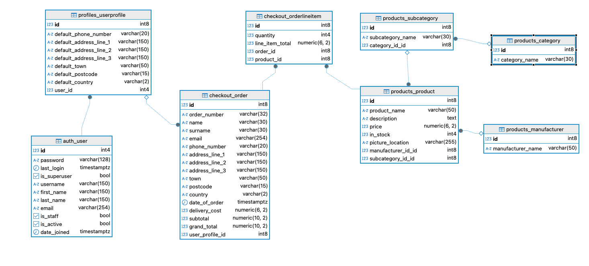
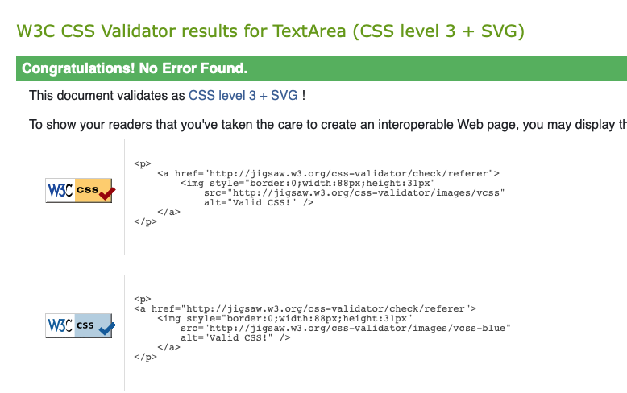

# Overview

The BB Dental website was designed to facilitate the online sale of dental products for B2B traders. As a digital platform, it allows customers to browse and purchase products directly over the internet. The website displays a comprehensive listing of items available for purchase, organized into categories and subcategories for easy navigation. Each product subpage includes a detailed description, product image, price and stock count. 
To purchase the products, the customer will be prompted to log in or register first. Upon registration, the customer will be able to add products to the chart, update products in the chart, save contact details and complete the payment. Furthermore, a listing of previous orders and their details will be available to view on the Profile page. The personal details provided during the registration can also be amended there. 
The administrator profile has CRUD functionality, i.e. the administrator has the option to create, view, amend, and delete products. This is particularly useful for updating the number of products in the stock. Additionally, the stock quantity will be updated automatically every time an order is completed. 

Linkt to the live application can be found [here](https://bbdental-4f6c524824c2.herokuapp.com/)

# User stories 
### User register and login
As a user I can log in securely so that it will allow me to do shopping

**Acceptance criteria**

- Users can register a new account using an email, username, and password

- Users can log in using either their username or email along with their password

- User must be able to reset their own password

### Browsing Products
As a user I can browse products so that I can familiarise myself with what is available in the shop

**Acceptance criteria**

- Users should be able to view products categorised by type

- Users should be able to filter products based on specific criteria, such as category, subcategory or manufacturer

- Users should be able to sort products by price, alphabetically, or by manufacturer

### Individual product display
As a user I can view indivudual product details so that I can make purchasing decision based on the product's specifications, availability, and price

**Acceptance criteria**

- I can see the product name, description, price, manufacturer, and available stock

- If the product has an image, it needs to be displayed

- There is "Add to Bag" button that allows me to add the selected quantity to my cart. I cannot add more than the available stock. Also, "Add to Bag" should be available for logged in users only.

- There are three additional buttons: "Keep Shopping" to return to the product list, "Shopping Bag" and "Go to Checkout" to proceed with the purchase. Same as above, this should be available for logged in users only.

### Search Functionality
As a user I can search for products globally so that I can quickly find items for faster shopping experience

**Acceptance criteria**

- Search button must be clearly visible, ideally on every page and in the header

- Given search results should be possible to sort and filter by manufacturer

- Search term should be case-insensitive for better results

### Shopping bag
As a logged-in user I can view my shopping bag so that I can easily review my selected items, check my order summary, and make any necessary adjustments before completing my purchase

**Acceptance criteria**

- The shopping bag should easly accessible, allowing the user to review items they’ve added.

- Users must be able to update item quantities or remove products from the bag as needed

- The order summary should clearly display item details, prices, and the total cost

- If the user’s order qualifies for free delivery, a message should be displayed encouraging them to take advantage of the offer

- There should be an easy way to continue shopping and add more products to the order

### Making a Purchase
As a logged-in user I can complete my purchase through a smooth checkout so that I can securely finalise my order

**Acceptance criteria**

- The checkout page should display a summary of the order, including product names, total cost, and any applicable delivery charges.

- Before confirming payment, users must be able to enter their shipping information

- Payments should be securely processed using Stripe

- After a successful payment, users should be redirected to an order confirmation page and receive a confirmation email

### User's Profile
As a user I can manage and review my order hostory so that I can keep track of my purchases and enhance my overal shopping experience

**Acceptance criteria**

- There needs to be a page where users can easly access and view all their past and current orders

- User's shopping data needs to be stored in users profile to facilitate smoother and faster shooping experince

- The stored users data should be used to autopopulate checkout form

### Product Management
As a staff member I can manage all products so that the store's inventory stays current and accurate

**Acceptance criteria**

- Staff members must have the ability to view, edit, add, and delete products

- The number of items in stock should be manageable to reflect actual availability

- When user makes a purchase, the system should automatically reduce the available stock

- The product management section should be easily accessible, ideally through the navbar menu

- Only authorised staff should have access to this section, and it should be hidden from shoppers

- If there are many products, they should be split across multiple pages to make navigation easier

User stories were managed via Kanban Board on github:

# Design 

## Wireframes
### Login

### Register

### Password Reset

### Landing Page

### Display Page of the All Products

### Product Details Page

### Shopping bag page

### Checkout

### Purchase order

### User Profile

### Product Management - Staff Only

### Adding Product

### Edititng Product

### Product Deletion

# Database Schema Diagram and Model

# Typography
Font - https://fonts.googleapis.com/css2?family=Gantari:ital,wght@0,100..900;1,100..900&display=swap 

Font Awesome, used on many pages accross the whole website.

# Graphics side

Photo used for purpose creation of Facebook Business Page https://www.istockphoto.com/photos/dental-equipment

 - image pleaceholder used across all web page, will show as deafault when there was no image uploaded in first place

https://unsplash.com/photos/text-TtJ0CLjLi6w - used on page 'terms of service'

https://www.pexels.com/photo/close-up-photo-of-a-paper-on-a-vintage-typewriter-4152513/ - used on page 'privacy policy'

[Fotor](https://www.fotor.com/) - to enhance bad image quality

[Cloudinary mage-to-web](https://cloudinary.com/tools/image-to-webp) - for image conversion to web

[Emojipedia](https://emojipedia.org/) - used to populate number of flags which are present on the website.

There are 198 images used across the product section, but I don’t remember where they came from. I downloaded them a long time ago with the idea of using them for a project like this, but only now got the chance to put everything together. Since it’s just a college project, I don’t think using them is an issue, especially since the original shop doesn’t seem to exist anymore. The images weren’t great quality, but Fotor was a lifesaver for fixing them up.

# Features 

### Navigation Bar
The navigation bar appears on all pages, with different links displayed depending on the page and the user. It allows the user to easily navigate between pages across all devices without the need to use the "back" button to return to the previous page.
The navigation bar includes various links depending on the page and user:
To the Home Page, Login, and Register for users who have not signed in.
To the Home Page, Products, My Profile, Shopping Chart and Logout for signed-in customers.
To the Home Page, All Products and Logout for signed-in administrator.

### The Footer
The footer bar appears on all pages, allowing the user to easily access the company's Terms of Services, Privacy Policy and Contact Details. The relevant documents are available to view and download in a PDF format. The Contact Details Page includes interactive phone and email address links. 

### The Landing Page - Welcome Page
The landing page displays the navigation bar, the footer, the advertising materials and a listing of shipping destinations. The link to the listing of products is positioned in multiple locations to encourage customers to click the link. 

### Product Listing Page
The product listing page includes a navigation bar at the top of the page and search functions. The search menu is very advanced, offering various search and sorting options, including:
- sort by name (A to Z) and (Z to A),
- sort by price (Low to High) and (High to Low)
- sort by manufacturer name (A to Z) and (Z to A)
- search by manufacturer.
The page also includes a side menu which displays the main groups of products and subgroups, giving the customer a clear listing of the main product categories. Upon clicking on a main category bar, the subcategory listing is displayed. Then, upon clicking on the subcategory line, the relevant products within that subcategory are displayed on the page. The side menu is responsive and will adjust to various displays. For example, the subcategories listing will be scaled down for easier browsing. 
If the client wants to return to the main page showing all products, he can click on the Home button or the Products button. Furthermore, if the client wants to go back to the previous group of products, he/she can click on the desired group in the heading breadcrumb trail.  
The products are displayed in separate boxes and a photo and a brief description of the product is given. The customer can view further details by clicking the "View Details" button.
There is a standard footer at the bottom of the page. When the products are displayed on more than one page, a listing of pages with links to particular page numbers is displayed above the footer (pagination function).

### Product Page
Each product displayed in the shop has a link to its own page. Upon clicking the "View Details" button, the product page will open. The page displays the photo, description, price, stock quantity and the manufacturer information. If the customer is not logged in, a warning will be displayed prompting the customer to log in to continue with the purchase. 
There is a standard navigation bar and a standard footer. 

### Login Page
Upon opening, the sign-in form is displayed. The customer or administrator is required to provide their username and password to sign in. An error message will be displayed if an incorrect username or password is entered. Upon signing in, a small green confirmation box will appear in the top right corner, confirming the successful sign-in. Additionally, there is an option to click the "Remember Me" box for future sign-ins and a link to open the Registration page.
The navigation bar includes links to the Home Page, Log In and Register.  The footer includes links to the company's Terms of Services, Privacy Policy and Contact Details.

### Registration Page
The sign-up form is displayed. A reminder to sign in for clients who are already registered is shown at the top of the form. Fields highlighted with an asterisk are mandatory, and a warning will appear if they are left blank. There is additional information regarding password requirements at the bottom of the form. Once all fields are completed correctly and the "Sign Up" box is ticked, the system will send an account verification email to the address provided by the customer. To access the account, the customer must first confirm the email address.
The navigation bar includes links to the Home Page, Login, and Register. The footer includes links to the company's Terms of Services, Privacy Policy and Contact Details.

### Customer Login 
Landing Page – a listing of all products is displayed. Customers can navigate through the products using the search and sort functions at the top of the page and the side menu is on the left side of the page.
Upon clicking on a desired product, a product page will be displayed, giving the customer an option to add the product to the shopping basket. The customer can amend the quantity before adding the product to the basket. The system will limit the amount available to add to the basket to the number of products in stock. An orange warning box will appear on the screen if the client tries to add an excessive amount of products (i.e. more than is available in the stock) or enter a negative amount in the quantity box. A green box will appear confirming that the desired quantity was added to the basket. 
Three additional links are displayed on the bottom part of the product page, allowing the client to easily navigate through the website:
- Keep Shopping - will take the user one step back,
- Shopping Bag - will open the Shopping Bag Page and 
- Go to Checkout - will open the Checkout Page
The navigation bar includes links to the Home Page, Products, Shopping Bag and Logout. The Footer is standard.  
The Shopping Bag Page - the listing of products in the basket is displayed. A photo, name, quantity and price are displayed for each product in the basket. The customer has an option to update the quantity and remove the entire product. Subtotal and the delivery cost is displayed under the products listing. If the subtotal is below the "Free delivery" threshold, a message is displayed encouraging the client to add some products to be eligible for a free delivery. There is a link to add more items or proceed to Checkout. 
The Checkout Page - The order form is displayed. Fields highlighted with an asterisk are mandatory, and a warning will appear if they are left blank. Once all fields are completed correctly and the "Complete Order" box is ticked, the Order Confirmation Page will be displayed. There is an option to save the client details, so those are pre-filled automatically the next time an order is completed. 
If the Shopping Bag is empty, the system will prevent the user from accessing the Checkout Page. There will be a small red dot and amount displayed next to the Shopping Bag icon once an item is placed in the Shopping Bag.
The Order Confirmation Page - the order confirmation summary will display the order details, the delivery address, the items purchased and the total cost.  Additionally, a small green confirmation box will be displayed in the top right corner of the page. 
Logout Page - Upon clicking the "Logout" link, a sign-out window will appear, and the client will be prompted to confirm if they wish to log out

### Administrator Login 
All Products Page – a listing of all products is displayed in a working table. The administrator can create, update and delete products in the table. Upon clicking on the Home Page button, a listing of products is displayed in the same way as the one visible to the client. 
Add New Product - the new product form is displayed. Fields highlighted with an asterisk are mandatory, and a warning will appear if they are left blank. There is an option to add a photo of a product, but it's not mandatory. If a photo was not added, a default "No Image Available" image will be displayed. Once all fields are completed correctly and the "Add Product" box is ticked, the new product will be added to the database. A green confirmation box will appear in the top right corner. 
The navigation bar includes links to the Home Page, All Products working table and Logout. There is a standard footer and the pagination functionality at the bottom of the All Products Page. 

## Technologies Used

- **Django** - A free and open-source Python web framework following the MTV pattern.  
- **Python** - A versatile, high-level programming language.  
- **Bootstrap 5** - A front-end framework for responsive web development.  
- **HTML** - The standard markup language for structuring web pages.  
- **CSS** - A stylesheet language for styling and designing web content.  
- **JavaScript** - A lightweight programming language for interactivity.  
- **jQuery** - A JavaScript library that simplifies DOM manipulation.  
- **Balsamiq** - A tool for creating wireframes and UI mockups.  
- **GitHub** - A platform for version control and collaborative coding.  
- **PostgreSQL from Code Institute** - A cloud-hosted relational database system.  
- **Heroku** - A cloud platform for deploying and managing applications. 
- **SendGrid** - A cloud-based email service used for sending transactional and marketing emails.  
- **Cloudinary** - A cloud-based service for managing and optimizing images and videos.  

## E-commerce business model 
The business will operate on a Business to Business model (B2B).  
The online shop will sale dental products (such as tools, equipment, consumables, and other related items) directly to other businesses, typically dental practices, clinics and hospitals. It is not foreseen that any Business to Customer (B2C) sale will occur. The company will focus on building strong, long-term relationships with clients, providing competitive pricing, consistent product quality, and reliable customer service.
Key features of this model include:
- Product Catalog - the online shop provides a comprehensive range of dental products that can be browsed and promptly ordered online.
- Account Management - in order to place orders, the customers are required to  create an accounts by registering on the shop website. The personalized features such as order history is available on the website. 
- Payment methods - currently the shop offers payment by card at the time of placing the order. Going forward, the business will introduce an option to buy on credit for registered and verified clients. 
- Customer Support -  dedicated support is ready to  answer any queries or to provide technical assistance and product recommendations. Contact details are accessible through the link in the footer. 
- Shipping - the business engaged fast and reliable logistic partner. Additionally, a free standard shipping is available for customers who place orders with a net value over €50.

# Newsletter Subscription
The company started small but has grown fast, focusing on simple and effective ways to reach customers. That’s why a business page was launched on Facebook, along with a newsletter – to share updates, offers, and important news more easily.
## Mailchimp
- Banner installed:
  
- Subscription overview:
- 

## Facebook Business Page

## Optimized Keyword List for B2B Dental Supply Website
### Mix of short-tail and long-tail keywords optimized for search volume, relevance, and purchasing intent

#### Short-Tail Keywords (Broad, High Volume):
1. Dental supplies
2. Dental equipment supplier
3. Wholesale dental products
4. Dental instruments distributor
5. Dental shop

#### Long-Tail Keywords (Higher Intent, More Targeted):
1. Wholesale dental supplies
2. Buy dental equpment
3. Professional dental products supplier
4. Best dental practice supplies
5. Top-rated dental suppliers for clinics
6. B2B dental equipment distributor
7. Fast shipping dental supplies

- Keywords That Were Removed:
  - "Best electric toothbrush supplier" - More relevant to retailers & supermarkets
  - Buy toothpaste in bulk" - Dental practices don’t typically buy toothpaste in bulk
  - "Home dental care products" - Clinics buy professional materials
  - "Dental floss wholesale supplier" - More relevant to supermarkets
  - "Local dentist supply store" - Most B2B dental buyers prefer wholesale suppliers

# Testing & debugging

### Python code: issues found

The issue above has been resolved.

### stripe_element.js - no issues found 

### script.js in products app - issues found 

Issue resolved:

### script.js in static - issues found 

Issue resolved:

### checkout.css in checkout folder - no issues found

### management.css in products app - no issues found 

### base.css main stylesheet - no issues found

### html - landing page - issue found

Issue has been fixed

# **Testing Summary – Automatic & Manual Checks**  

## **Landing Page**  
The **Jumbotron** contains two buttons: one navigates to the content below the screen, while the other directs to the product page. Both buttons function correctly, and the entire page renders well on both large and small screens.  

At the footer of each page, there are links to **Terms of Service, Privacy Policy, Contact, and Facebook**. All links open their intended pages, and the Facebook button correctly opens a new window in the browser.  

At the top of the page, there are buttons for **Products, Profile, Shopping Cart, Logout, "Shop Now," and Search**. Just like before, all links navigate to the correct pages, and the search button properly processes queries and renders search results accordingly.  

## **Products Page**  
The page displays correctly on both large and small screens. **Pagination** at the bottom works as expected, ensuring smooth navigation. No visible or obvious errors were found. 

The **left-side menu expands and collapses** when clicking the header.  
- **Sorting options** display all data from the database and sort correctly when a selection is made.  
- **Filtering by Manufacturer** functions as expected.  
- Clicking **"View Details"** correctly redirects to the detailed product page.  

## **Product Details Page**  
All displayed information corresponds correctly to the selected product, and all product data matches the database records. The **image on the left side renders correctly**, and in cases where a product has no image in the database, a **placeholder image is displayed** instead.  

### **Functional Buttons:**
- **"Add to Bag"**  
- **"Keep Shopping"**  
- **"Shopping Bag"**  
- **"Go to Checkout"**  

Additionally, all navigation links at the top of the page, including **"Products," "My Profile," "Cart," and "Logout,"** work as intended.  

## **Shopping Bag**  
The shopping bag should be **not accessible when a user is not logged in** and when there are **no items in the cart**—this condition is correctly met.  

Only after adding at least one product does the user gain access to the **checkout process**, ensuring correct functionality.  

## **Checkout**  
If a **logged-in user** previously **saved their details**, the system attempts to pre-fill the checkout form. This works correctly—users who have stored their information in their profiles see the form **auto-filled with accurate data**.  

The **payment system functions properly**, and after a successful transaction, a **confirmation message** is displayed as per the project’s design. All links on this page work correctly.  

## **Order Confirmation**  
After payment, an **order summary** is displayed, and the order details correctly match the actual purchase.  

All buttons on this page function properly, and clicking **"Order History"** correctly redirects the user to their profile page.  

## **User Profile**  
User profile information is displayed **accurately in the form**, matching the stored user details.  

If a user updates their information and clicks **"Update Profile,"** the new details are correctly saved and updated in the system.  

Clicking **"View Order Details"** displays the **correct order details** as expected.  

## **Logout**  
The logout process functions correctly, requiring **confirmation** as per the project's intended design.  

# **For Store Employees:**  

## **Landing Page**  
The landing page is **almost identical** to that of regular users, with the difference that **employees** see additional menu options:  
- **"All Products"**  
- **"Log Out"**  

## **All Products**  
All **CRUD (Create, Read, Update, Delete) operations** work flawlessly.  
Employees can:  
- **View product data**  
- **Edit product information**  
- **Delete products from the database**  

## **Add New Product**  
- The **form renders correctly** and **validation works as expected**.  
- After entering all required details and submitting the form, the new product is **saved in the database in the correct format**.  
- A **confirmation message** is displayed upon successful product entry.  

## **Edit Product**  
- The **edit page correctly displays** the product’s existing details within the form.  
- Submitting changes **updates the database successfully**.  

## **404 Error Page**  
Entering an **invalid URL** correctly triggers a **404 error message**, ensuring proper error handling.  

## **Summary**  
All tested functionalities work as expected, ensuring a **smooth user experience** for both regular users and store employees. Minor **UI/UX improvements** could be considered, but **no critical issues** were found.  

# Credits
1. https://docs.djangoproject.com/en/5.1/ref/contrib/messages/
2. https://css-tricks.com/almanac/properties/t/transition/
3. https://developer.mozilla.org/en-US/docs/Web/CSS/transform-function/translateY
4. https://medium.com/python-in-my-pajamas/3.using-os-environ-to-manage-your-django-settings-the-easy-way-d2db96e73ab9#4c79
5. https://www.twilio.com/docs/sendgrid/for-developers/sending-email/django
6. https://medium.com/@verdyevantyo/authentication-system-using-django-allauth-121f47a6641e
7. https://getbootstrap.com/docs/5.3/components/card/#images
8. https://docs.djangoproject.com/en/5.1/ref/templates/builtins/
9. https://docs.djangoproject.com/en/5.1/ref/models/fields/#imagefield
10. https://medium.com/@iamalisaleh/how-to-get-the-current-url-within-a-django-template-8270b977f280
11. https://simpleisbetterthancomplex.com/tips/2016/07/20/django-tip-7-how-to-get-the-current-url-within-a-django-template.html
12. https://docs.djangoproject.com/en/5.1/ref/templates/builtins/
13. https://docs.djangoproject.com/en/5.1/topics/db/queries/
14. https://docs.djangoproject.com/en/5.1/topics/db/optimization/
15. https://docs.djangoproject.com/en/5.1/topics/db/optimization/#use-queryset-select-related-and-prefetch-related
16. https://www.w3.org/WAI/ARIA/apg/patterns/breadcrumb/examples/breadcrumb/
17. https://docs.djangoproject.com/en/5.1/topics/pagination/
18. https://docs.djangoproject.com/en/5.1/ref/paginator/#django.core.paginator.Paginator
19. https://www.w3schools.com/bootstrap5/bootstrap_tooltip.php
20. https://developer.mozilla.org/en-US/docs/Web/API/Document/querySelectorAll
21. https://developer.mozilla.org/en-US/docs/Web/API/Window/innerWidth
22. https://developer.mozilla.org/en-US/docs/Web/API/EventTarget/addEventListener
23. https://developer.mozilla.org/en-US/docs/Web/API/Window/resize_event
24. https://stackoverflow.com/questions/5150363/onchange-open-url-via-select-jquery
25. https://docs.djangoproject.com/en/5.1/ref/models/database-functions/
26. https://docs.djangoproject.com/en/5.1/topics/db/queries/
27. https://docs.djangoproject.com/en/5.1/ref/templates/builtins/#urlencode
28. https://www.youtube.com/watch?v=65RVPDOhRIc&t=73s
29. https://www.w3schools.com/django/ref_filters_default.php
30. https://www.youtube.com/watch?v=rqYXCuXbs2s&t=3s
31. https://www.youtube.com/watch?v=2G9j34jz42Q&t=5s
32. https://docs.djangoproject.com/en/5.1/topics/http/sessions/
33. https://docs.djangoproject.com/en/5.1/ref/validators/#:~:text=MinValueValidator
34. https://docs.djangoproject.com/en/5.1/ref/models/fields/#:~:text=MinValueValidator%20and
35. https://studygyaan.com/django/how-to-implement-validators-in-django-models
36. https://www.w3schools.com/jsref/obj_inputevent.asp
37. https://www.w3schools.com/tags/att_inputmode.asp
38. https://sklep.andan.com.pl/
39. https://molarr.pl/
40. https://pypi.org/project/django-countries/
41. https://www.youtube.com/watch?v=0cGRqIHvSf8&t=109s
42. https://www.youtube.com/watch?v=l1Z9Aau0V08&t=296s
43. https://www.youtube.com/watch?v=eAja_pKhiCM&t=376s
44. https://developer.mozilla.org/en-US/docs/Web/API/Element/scrollIntoView
45. https://developer.mozilla.org/en-US/docs/Web/API/Document/DOMContentLoaded_event
46. https://developer.mozilla.org/en-US/docs/Web/HTML/Element/script
47. https://www.youtube.com/watch?v=eUcMh5s_27I&t=327s
48. https://developer.mozilla.org/en-US/docs/Web/API/Node/textContent
49. https://www.w3schools.com/python/ref_func_round.asp
50. https://www.youtube.com/watch?v=AU0F2wnrbEs&t=2s
51. https://www.youtube.com/watch?v=lg8p1vD9-Bs
52. https://www.youtube.com/watch?v=j9mLOyjd_KY
53. https://www.twilio.com/docs/sendgrid/for-developers/sending-email/django
54. https://www.pythontutorial.net/django-tutorial/django-exists/
55. https://www.programiz.com/python-programming/datetime/strftime
56. https://docs.djangoproject.com/en/5.1/ref/forms/fields/
57. https://docs.djangoproject.com/en/5.1/ref/forms/fields/#django.forms.ModelChoiceField
58. [ChatGPT](https://openai.com/index/chatgpt/) - used for transtranslation mainly but great companion in explaing errors
59. https://docs.djangoproject.com/en/5.1/topics/http/file-uploads/
60. https://docs.djangoproject.com/en/5.1/topics/i18n/timezones/
61. https://www.geeksforgeeks.org/how-to-set-the-timezone-in-django/
62. https://docs.djangoproject.com/en/5.1/ref/contrib/admin/

I came across many resources while working on this project, but the study materials from Code Institute played the biggest role. Huge thanks for the high-quality content and hands-on practical lessons – they made a real difference!