# Overview

BBdental is an educational B2B e-commerce project created to show how an online shop for dental businesses could work. It is intended for dental practices, dental laboratories and other businesses that use professional dental products. The project brings together the main parts of an online shop, including product browsing, user accounts, a shopping bag, checkout and order management.

Users can browse products organised into categories and subcategories. They can also search for products and filter or sort the results. Each product page includes a description, image, price, manufacturer and current stock level, helping users find the product information they need.

After creating an account, users can add products to their bag, change quantities and continue to checkout. They can enter delivery and billing details, save selected information to their profile and place a test order using Stripe. Users can also view their previous orders and check their current status. Stripe runs in test mode, so no real payments are taken and no physical products are delivered.

Staff members have access to separate product and order management pages. They can add, edit and delete products, manage stock levels, view customer orders and update their status. Product stock is reduced automatically when a test order is completed. The project is designed for learning and demonstration purposes and does not operate as a real dental supplier.

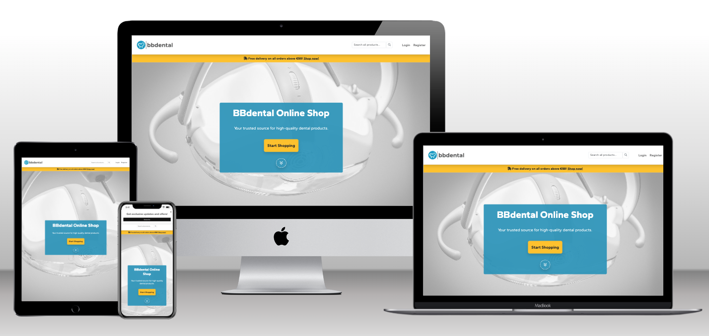

A link to the live application can be found [here](https://bbdental-4f6c524824c2.herokuapp.com/)

# User stories 
### User registration and login
As a user I can log in securely so that it will allow me to do shopping

**Acceptance criteria**

- Users can register a new account using an email, username, and password

- Users can log in using either their username or email along with their password

- User must be able to reset their own password

### Browsing Products
As a user I can browse products so that I can familiarise myself with what is available in the shop

**Acceptance criteria**

- Users should be able to view products categorised by type

- Users should be able to filter products based on specific criteria, such as category, subcategory or manufacturer

- Users should be able to sort products by price, alphabetically, or by manufacturer

### Individual product display
As a user I can view indivudual product details so that I can make purchasing decision based on the product's specifications, availability, and price

**Acceptance criteria**

- I can see the product name, description, price, manufacturer, and available stock

- If the product has an image, it needs to be displayed

- There is "Add to Bag" button that allows me to add the selected quantity to my bag. I cannot add more than the available stock. Also, "Add to Bag" should be available for logged in users only.

- There are three additional buttons: "Keep Shopping" to return to the product list, "Shopping Bag" and "Go to Checkout" to proceed with the purchase. Same as above, this should be available for logged in users only.

### Search Functionality
As a user I can search for products globally so that I can quickly find items for faster shopping experience

**Acceptance criteria**

- Search button must be clearly visible, ideally on every page and in the header

- Given search results should be possible to sort and filter by manufacturer

- Search term should be case-insensitive for better results

### Shopping bag
As a logged-in user I can view my shopping bag so that I can easily review my selected items, check my order summary, and make any necessary adjustments before completing my purchase

**Acceptance criteria**

- The shopping bag should easly accessible, allowing the user to review items they’ve added.

- Users must be able to update item quantities or remove products from the bag as needed

- The order summary should clearly display item details, prices, and the total cost

- If the order total is below the free delivery threshold, a message should show how much more the user needs to spend to qualify for free delivery

- There should be an easy way to continue shopping and add more products to the order

### Making a Purchase
As a logged-in user I can complete my purchase through a smooth checkout so that I can securely finalise my order

**Acceptance criteria**

- The checkout page should display a summary of the order, including product names, total cost, and any applicable delivery charges.

- Before confirming payment, users must be able to enter their shipping information

- Payments should be securely processed using Stripe

- After a successful payment, users should be redirected to an order confirmation page and receive a confirmation email

### User's Profile
As a user I can manage and review my order hostory so that I can keep track of my purchases and enhance my overal shopping experience

**Acceptance criteria**

- There needs to be a page where users can easly access and view all their past and current orders

- User's shopping data needs to be stored in users profile to facilitate smoother and faster shooping experince

- The stored users data should be used to autopopulate checkout form

### Product Management
As a staff member I can manage all products so that the store's inventory stays current and accurate

**Acceptance criteria**

- Staff members must have the ability to view, edit, add, and delete products

- The number of items in stock should be manageable to reflect actual availability

- When user makes a purchase, the system should automatically reduce the available stock

- The product management section should be easily accessible, ideally through the navbar menu

- Only authorised staff should have access to this section, and it should be hidden from shoppers

- If there are many products, they should be split across multiple pages to make navigation easier

User stories were managed via Kanban Board on github:

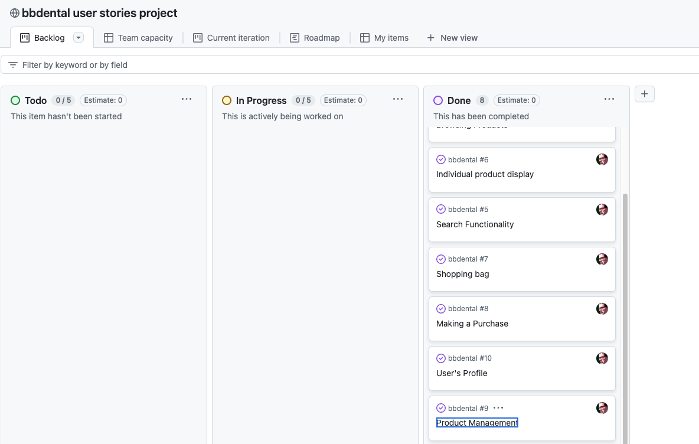

# Design 

## Wireframes
### Login

### Register

### Password Reset

### Landing Page

### Display Page of the all Products

### Product Details Page

### Shopping bag page

### Checkout

### Purchase order

### User Profile

### Product Management - Staff Only

### Adding Product

### Edititng Product

### Product Deletion


# Database Schema Diagram
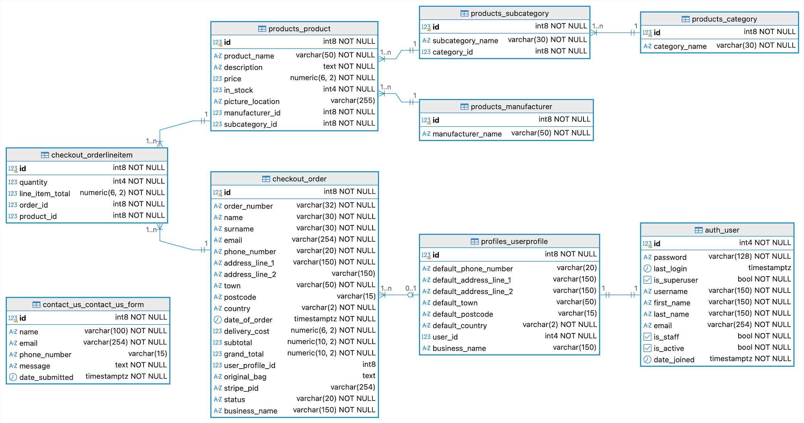

The diagram uses Crow's Foot notation. A single line represents one record, while the crow's foot symbol represents multiple related records.

# Typography
Font - https://fonts.googleapis.com/css2?family=Gantari:ital,wght@0,100..900;1,100..900&display=swap 

Font Awesome, used on many pages accross the whole website.

# Graphics side

Photo used for purpose creation of Facebook Business Page https://www.istockphoto.com/photos/dental-equipment

[](https://www.pngaaa.com/detail/1887013) - placeholder image displayed when a product does not have an uploaded image

https://unsplash.com/photos/text-TtJ0CLjLi6w - used on page 'Terms and Conditions'

https://www.pexels.com/photo/close-up-photo-of-a-paper-on-a-vintage-typewriter-4152513/ - used on page 'Privacy and Cookies Policy'

[Fotor](https://www.fotor.com/) - to enhance bad image quality

[Cloudinary Image to WebP](https://cloudinary.com/tools/image-to-webp) - for image conversion to web

[Emojipedia](https://emojipedia.org/) - used to populate number of flags which are present on the website.

**I collected the product images before starting this project and can no longer confirm where all of them came from. They are only used to show how the product pages work and are not intended for commercial use. If the website is ever used outside this college project, the images should be replaced with ones that have clear licences!**

# Features 

### Navigation Bar
The navigation bar appears on all pages, with different links displayed depending on the page and the user. It allows the user to easily navigate between pages across all devices without the need to use the "back" button to return to the previous page.
The navigation bar includes various links depending on the page and user:
To the Home Page, Login, and Register for users who have not signed in.
To the Home Page, Products, My Profile, the shopping bag total and Logout for signed-in customers.
To the Home Page, Products, Manage Products, Orders and Logout for signed-in staff members.

### The Footer
The footer bar appears on all pages, allowing the user to easily access the company's Terms and Conditions, Privacy and Cookies Policy and Contact Details. The relevant documents are available to view and download in a PDF format. The Contact page displays the business email address, address, working hours and a link to the contact form. 

### The Landing Page - Welcome Page
The landing page displays the navigation bar, the footer, the advertising materials and a listing of shipping destinations. The link to the listing of products is positioned in multiple locations to encourage customers to click the link. 

### Product Listing Page
The product listing page includes a navigation bar at the top of the page and search functions. The product listing page includes several options for finding and organising products:
- sort by name (A to Z) and (Z to A),
- sort by price (Low to High) and (High to Low)
- sort by manufacturer name (A to Z) and (Z to A)
- search by manufacturer.
The page also includes a side menu which displays the main groups of products and subgroups, giving the customer a clear listing of the main product categories. Upon clicking on a main category bar, the subcategory listing is displayed. Then, upon clicking on the subcategory line, the relevant products within that subcategory are displayed on the page. The side menu is responsive and will adjust to various displays. For example, the subcategories listing will be scaled down for easier browsing. 
Users can return to the full product list by clicking Products in the navigation bar or the house icon in the breadcrumbs. The other breadcrumb links can be used to go back to the selected category. 
The products are displayed in separate boxes and a photo and a brief description of the product is given. The customer can view further details by clicking the "View Details" button.
There is a standard footer at the bottom of the page. When the products are displayed on more than one page, a listing of pages with links to particular page numbers is displayed above the footer (pagination function).

### Product Page
Each product displayed in the shop has a link to its own page. Upon clicking the "View Details" button, the product page will open. The page displays the photo, description, price, stock quantity and the manufacturer information. If the customer is not logged in, a warning will be displayed prompting the customer to log in to continue with the purchase. 
There is a standard navigation bar and a standard footer. 

### Login Page
Upon opening, the sign-in form is displayed. Customers and staff members are required to provide their username or email address and password to sign in. An error message will be displayed if an incorrect username or password is entered. Upon signing in, a small green confirmation box will appear in the top right corner, confirming the successful sign-in. Additionally, there is an option to click the "Remember Me" box for future sign-ins and a link to open the Registration page.
The navigation bar includes links to the Home Page, Log In and Register.  The footer includes links to the company's Terms and Conditions, Privacy and Cookies Policy and Contact Details.

### Registration Page
The sign-up form is displayed together with information that BBdental is an educational B2B project intended for dental practices, dental laboratories and other dental businesses. Users are informed that accounts are for professional use only and are provided with links to the Terms and Conditions and Privacy and Cookies Policy.
A reminder to sign in for clients who are already registered is shown above the form. The form requires an email address, username, business name and password, including the relevant confirmation fields. Fields highlighted with an asterisk are mandatory, and a warning will appear if they are left blank. There is additional information regarding password requirements at the bottom of the form. Once all fields are completed correctly and the "Sign Up" button is clicked, the system sends a verification email to the address provided by the user. To access the account, the user must first confirm the email address.
The navigation bar includes links to the Home Page, Login and Register. The footer includes links to the company's Terms and Conditions, Privacy and Cookies Policy and Contact Details.

### Customer Account 
After signing in, customers can open the Products page and browse the catalogue using the search, sorting and category options.
Upon clicking on a desired product, a product page will be displayed, giving the customer an option to add the product to the shopping bag. The customer can amend the quantity before adding the product to the basket. The system will limit the amount available to add to the basket to the number of products in stock. An orange warning box will appear on the screen if the client tries to add an excessive amount of products (i.e. more than is available in the stock) or enter a negative amount in the quantity box. A green box will appear confirming that the desired quantity was added to the basket. 
Three additional links are displayed on the bottom part of the product page, allowing the client to easily navigate through the website:
- Keep Shopping - will take the user one step back,
- Shopping Bag - will open the Shopping Bag Page and 
- Go to Checkout - will open the Checkout Page
The navigation bar includes links to the Home Page, Products, My Profile, the shopping bag total and Logout. The Footer is standard.  
The Shopping Bag Page - the listing of products in the basket is displayed. A photo, name, quantity and price are displayed for each product in the basket. The customer has an option to update the quantity and remove the entire product. Subtotal and the delivery cost is displayed under the products listing. If the subtotal is below the "Free delivery" threshold, a message is displayed encouraging the client to add some products to be eligible for a free delivery. There is a link to add more items or proceed to Checkout. 
The Checkout Page - The page displays the delivery form, payment details and an order summary. Required fields are marked with an asterisk and must be completed before the order can be submitted. Users can confirm that their billing address is the same as their delivery address or enter a separate billing address. They can also choose to save their delivery details to their profile for future orders. After a successful test payment, the user is redirected to the Order Confirmation Page.
If the Shopping Bag is empty, the system will prevent the user from accessing the Checkout Page. There will be a small red dot and amount displayed next to the Shopping Bag icon once an item is placed in the Shopping Bag.
The Order Confirmation Page - the order confirmation summary will display the order details, the delivery address, the items purchased and the total cost.  Additionally, a small green confirmation box will be displayed in the top right corner of the page. 
Logout Page - Upon clicking the "Logout" link, a sign-out window will appear, and the client will be prompted to confirm if they wish to log out

### Staff Account

Staff members can browse the product catalogue using the Products page, but they cannot add products to a bag or place orders.
The Manage Products page displays products in a table. Staff members can search, sort and filter products, as well as add, edit or delete them.
The Orders page displays customer orders. Staff members can open an order to view its details and update its status.
The navigation bar includes links to the Home Page, Products, Manage Products, Orders and Logout. The Manage Products and Orders pages use pagination when there are many records.

## Technologies Used

- **Django** - A free and open-source Python web framework following the MTV pattern.  
- **Python** - A versatile, high-level programming language.  
- **Bootstrap 5** - A front-end framework for responsive web development.  
- **HTML** - The standard markup language for structuring web pages.  
- **CSS** - A stylesheet language for styling and designing web content.  
- **JavaScript** - A lightweight programming language for interactivity.  
- **jQuery** - A JavaScript library that simplifies DOM manipulation.  
- **Balsamiq** - A tool for creating wireframes and UI mockups.  
- **GitHub** - A platform for version control and collaborative coding.  
- **PostgreSQL from Code Institute** - A cloud-hosted relational database system.  
- **Heroku** - A cloud platform for deploying and managing applications. 
- **Gmail SMTP** - Used to send account, contact form and order confirmation emails.
- **Cloudinary** - A cloud-based service used to store and manage product images.
- **Django Allauth** - Used for user registration, login and account management.
- **Stripe** - Used in test mode to demonstrate secure online payments.  

## E-commerce business model 

BBdental represents a Business-to-Business (B2B) online shop intended for dental practices, dental laboratories and other dental businesses. It is not intended for consumer or personal purchases. 

The project demonstrates the following parts of a B2B e-commerce website:

- **Product Catalogue** - users can browse professional dental products organised by category, subcategory and manufacturer.
- **Business Accounts** - users must create an account before placing a test order. Their profile can store delivery details and provide access to their order history.
- **Test Payments** - Stripe operates in test mode, so no real money is taken.
- **Contact** - users can send questions through the contact form or use the project email address.
- **Simulated Delivery** - a €15 delivery charge is added to orders below €50, while orders of €50 or more qualify for free delivery. No products are physically dispatched.

BBdental is an educational project and does not operate as a real dental supplier.

## Facebook Business Page


## Optimized Keyword List for B2B Dental Supply Website
### Mix of short-tail and long-tail keywords optimized for search volume, relevance, and purchasing intent

#### Short-Tail Keywords (Broad, High Volume):
1. Dental supplies
2. Dental equipment supplier
3. Wholesale dental products
4. Dental instruments distributor
5. Dental shop

#### Long-Tail Keywords (Higher Intent, More Targeted):
1. Wholesale dental supplies
2. Buy dental equipment
3. Professional dental products supplier
4. Best dental practice supplies
5. Top-rated dental suppliers for clinics
6. B2B dental equipment distributor
7. Fast shipping dental supplies

- Keywords That Were Removed:
  - "Best electric toothbrush supplier" - More relevant to retailers & supermarkets
  - Buy toothpaste in bulk" - Dental practices don’t typically buy toothpaste in bulk
  - "Home dental care products" - Clinics buy professional materials
  - "Dental floss wholesale supplier" - More relevant to supermarkets
  - "Local dentist supply store" - Most B2B dental buyers prefer wholesale suppliers

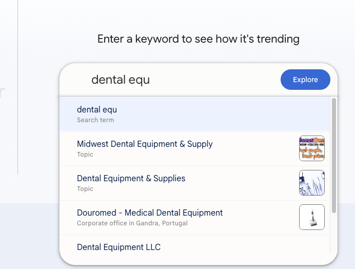
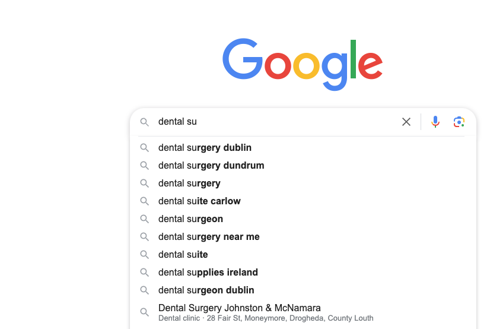
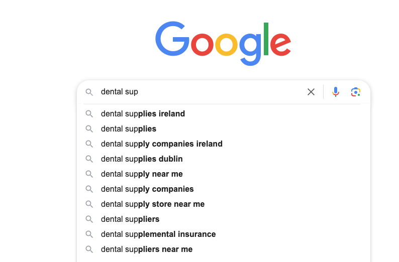
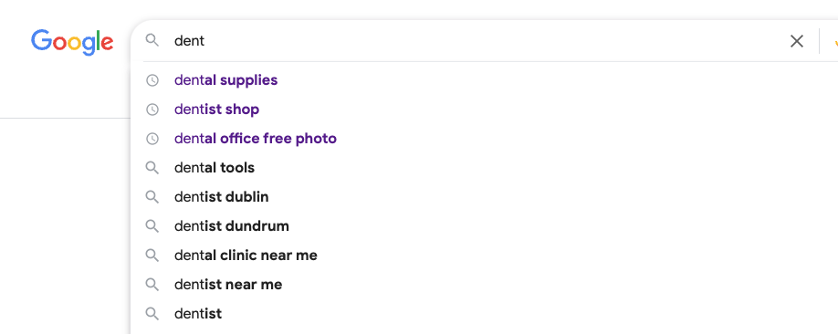


# Testing & debugging

## Django Automated Tests

Django's built-in testing tools were used throughout development. The tests cover product models and forms, shopping bag operations, profiles, checkout, Stripe webhooks, order emails, customer order access and staff order management.

To run the complete test suite, use:

```bash
python manage.py test
```

The latest complete test run included 93 tests, and all tests passed successfully.

### Python code: issues found

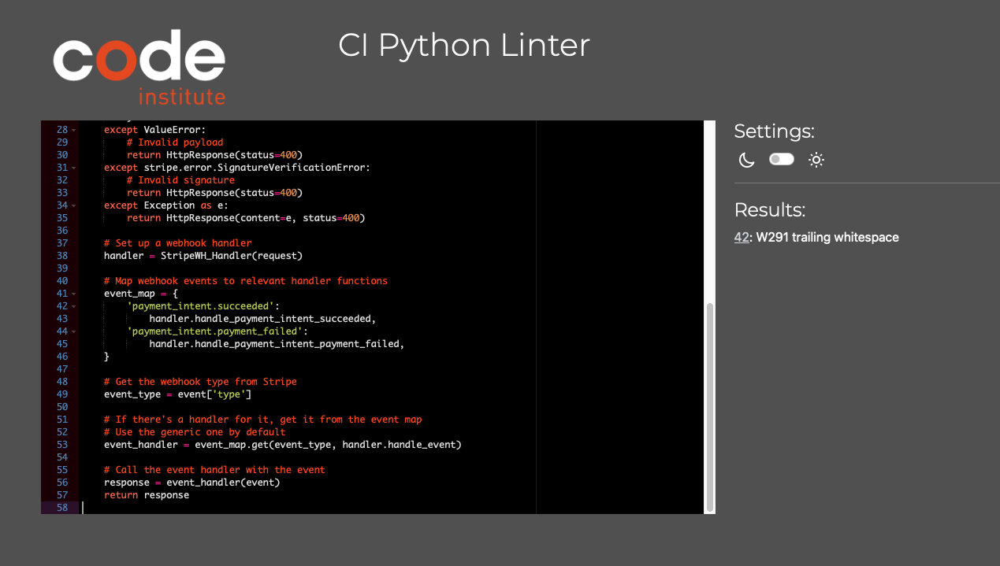

The issue above has been resolved.

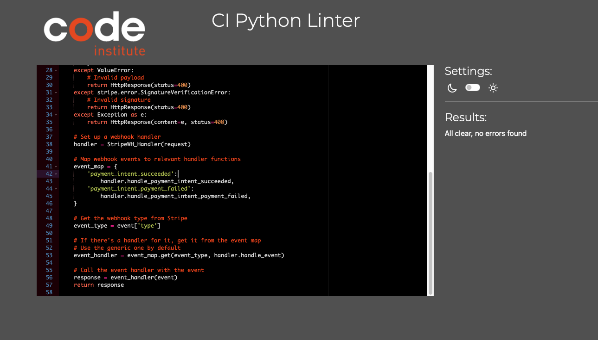

### stripe_element.js - no issues found 

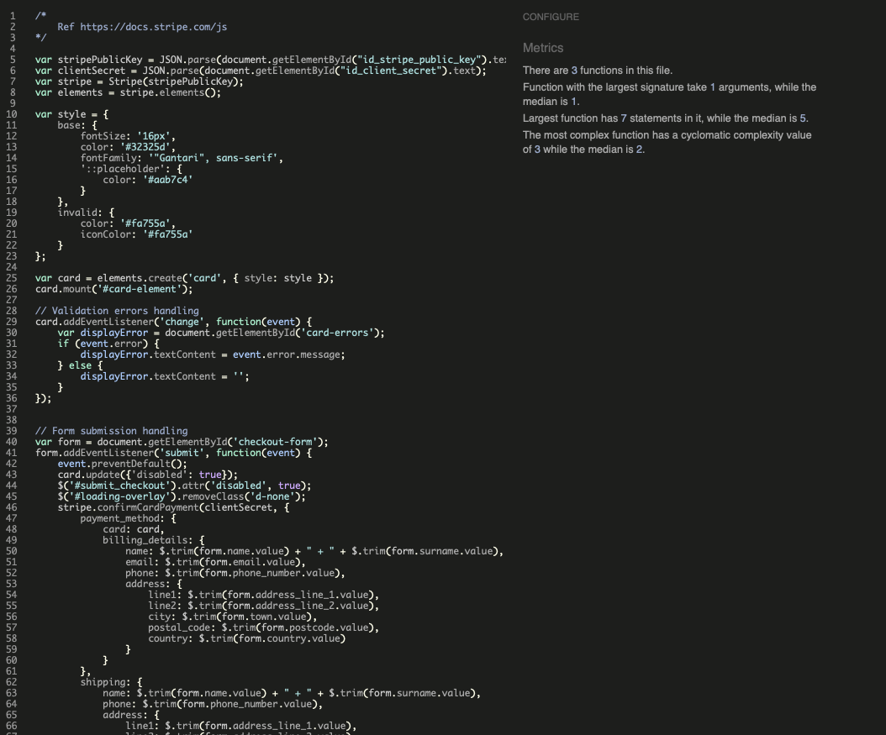


### script.js in products app - issues found 

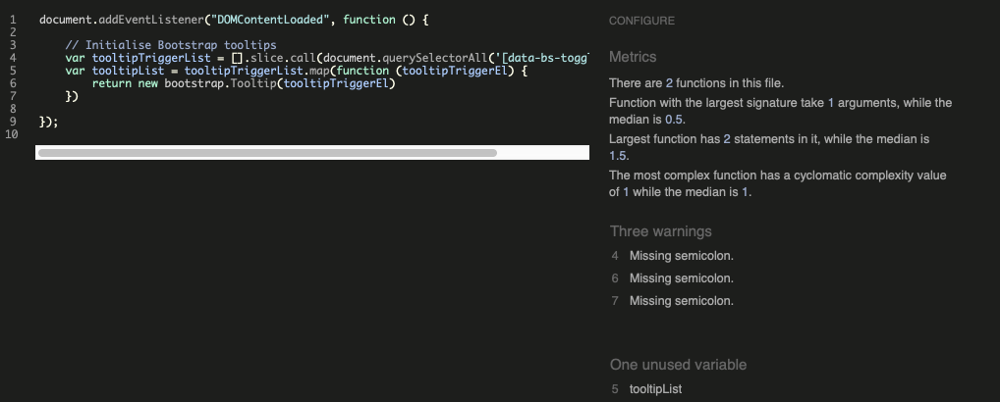

Issue resolved:
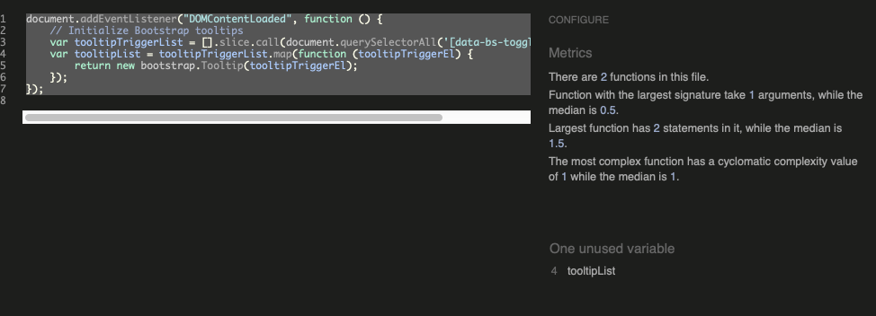


### script.js in static - issues found 

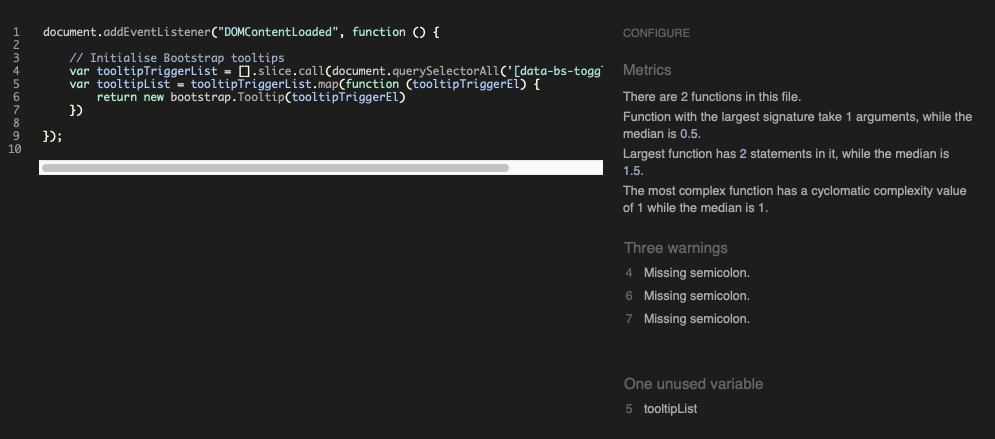

Issue resolved:
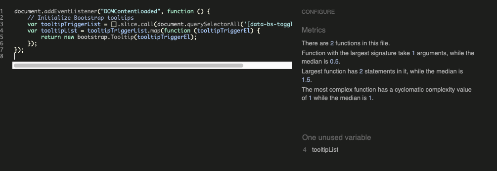

### checkout.css in checkout folder - no issues found
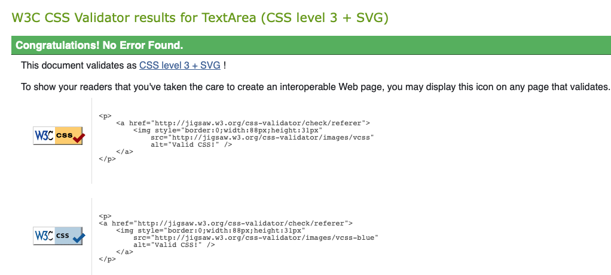


### management.css in products app - no issues found 

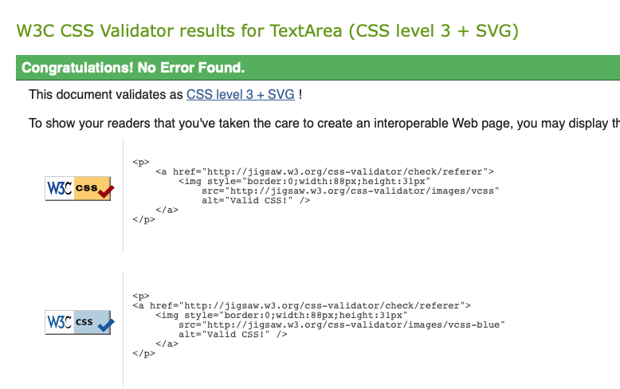

### base.css main stylesheet - no issues found

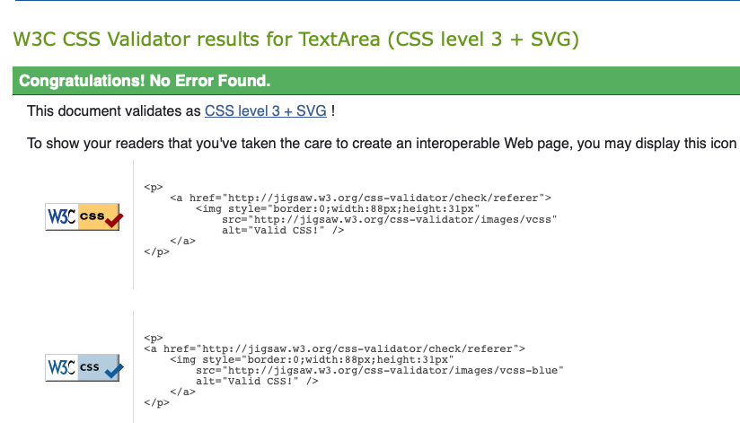

### html - landing page - issue found

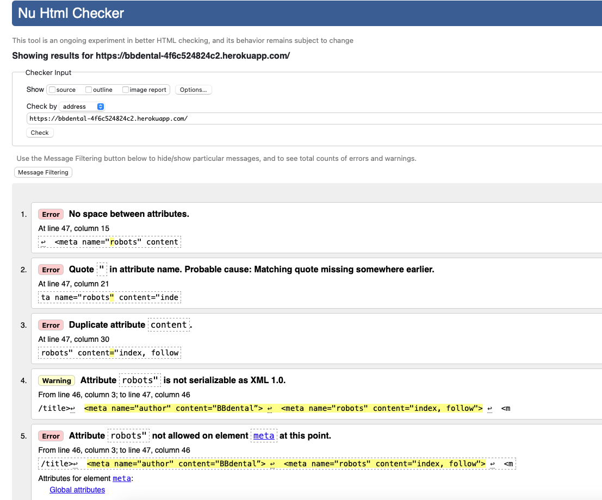

Issue has been fixed

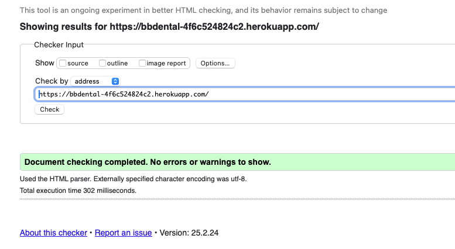

# **Testing Summary – Automatic & Manual Checks**  

## **Landing Page**  
The **Jumbotron** contains two buttons: one navigates to the content below the screen, while the other directs to the product page. All buttons and links on this page function correctly, and the entire page renders well on both large and small screens. At the bottom of the page, there is a list of Shipping Destinations and the footer.

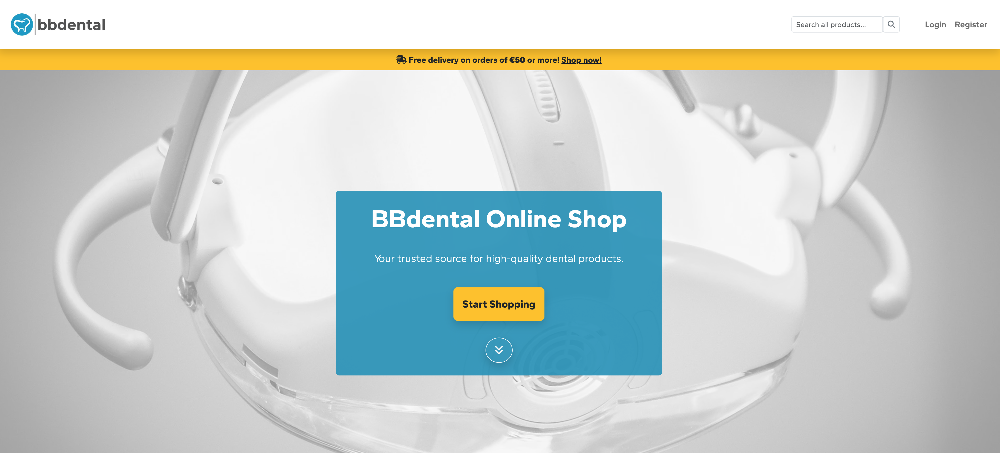

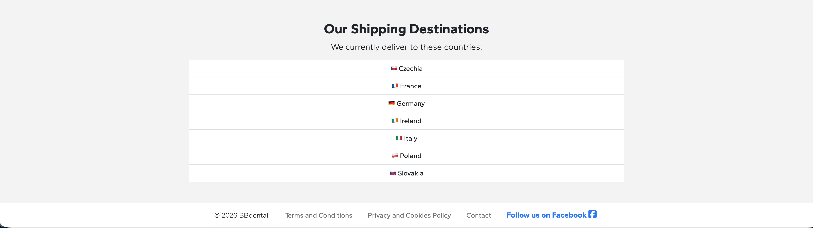

| Manual test case - 1 | Start Shopping button on Jumbotron |
|----------------------|------------------------------------|
| **Expected** | When the "Start Shopping" button is clicked on the Jumbotron, it should open the Products page (`https://bbdental-4f6c524824c2.herokuapp.com/products/all/`) in the same tab. |
| **Testing**  | Clicked the "Start Shopping" button to see if it takes me to the correct page without opening a new tab. |
| **Result**   | The browser loaded the correct products page in the same browser's tab, just as expected. |
| **Fix**      | No changes needed – everything works as it should. |

<br>

| Manual test case - 2 | Angles Down button on Jumbotron |
|----------------------|------------------------------------|
| **Expected** | When the Angles Down button is clicked on the Jumbotron, it should scroll down to Shipping Destinations section on the bottom of the page|
| **Testing**  | Clicked the Angles Down button to see if it takes me to the Shipping Destination section of the page |
| **Result**   | The page scrolled down to the Shipping Destination section, just as expected. |
| **Fix**      | No changes needed – everything works as it should. |

<br>

| Manual test case - 3 | 'Terms and Conditions' link in the footer |
|----------------------|------------------------------------|
| **Expected** | When the 'Terms and Conditions' link is clicked, it should open the 'Terms and Conditions' page (`https://bbdental-4f6c524824c2.herokuapp.com/terms-of-service/`) in the same tab.  |
| **Testing**  | Clicked the 'Terms and Conditions' link to see if it takes me to the correct page without opening a new tab. |
| **Result**   | The browser loaded the correct 'Terms and Conditions' page in the same browser's tab, just as expected. |
| **Fix**      | No changes needed – everything works as it should. |

<br>

| Manual test case - 4 | 'Privacy and Cookies Policy' link in the footer |
|----------------------|------------------------------------|
| **Expected** | When the 'Privacy and Cookies Policy' link is clicked, it should open the 'Privacy and Cookies Policy' page (`https://bbdental-4f6c524824c2.herokuapp.com/privacy-policy/`) in the same tab.  |
| **Testing**  | Clicked the 'Privacy and Cookies Policy' link to see if it takes me to the correct page without opening a new tab. |
| **Result**   | The browser loaded the correct 'Privacy and Cookies Policy' page in the same browser's tab, just as expected. |
| **Fix**      | No changes needed – everything works as it should. |

<br>

| Manual test case - 5 | Contact link in the footer |
|----------------------|------------------------------------|
| **Expected** | When the Contact link is clicked, it should open the Contact page (`https://bbdental-4f6c524824c2.herokuapp.com/contact/`) in the same tab.  |
| **Testing**  | Clicked the Contact link to see if it takes me to the correct page without opening a new tab. |
| **Result**   | The browser loaded the correct Contact page in the same browser's tab, just as expected. |
| **Fix**      | No changes needed – everything works as it should. |

<br>

| Manual test case - 5a | "Fill out our contact form" button |
|----------------------|------------------------------------|
| **Expected**         | When the "Fill out our contact form" button is clicked, it should open the Contact Us form page (`https://bbdental-4f6c524824c2.herokuapp.com/contact_us/`) in the same browser tab. |
| **Testing**          | Clicked the "Fill out our contact form" button and checked whether the browser navigates to the correct Contact Us page without opening a new tab. |
| **Result**           | The browser loaded the correct Contact Us form page in the same tab, just as expected. |
| **Fix**              | No changes needed – everything works as it should. |

<br>

| Manual test case - 5b | Contact Us form submission |
|----------------------|----------------------------|
| **Expected**         | When the Contact Us form is filled with valid data (name, email, message), it should submit successfully, show a confirmation message ('Thank you for your message! A confirmation email has been sent.'), and store the data in the database. A confirmation email should also be sent to the user and to the default email address which is admin. |
| **Testing**          | Filled in the form with a valid name, email, and message. Clicked the submit button. Checked for confirmation message on screen, checked inbox for confirmation email, and verified in the admin panel that the data was saved. |
| **Result**           | The form submitted successfully, confirmation message appeared, both emails were received, and the form data appeared in the admin panel under Contact Form entries. |
| **Fix**              | No issues found – everything functions as intended. |


<br>

| Manual test case - 5c | Contact Us form with blank fields |
|----------------------|----------------------------------|
| **Expected**         | If all fields are left blank, the form should display validation errors for each required field (name, email, and message). The form should not submit until all required fields are filled in. |
| **Testing**          | Left all fields blank and attempted to submit the form. Checked for error messages next to each required field (name, email, message). |
| **Result**           | Correct validation messages appeared for each blank required field. The form didn not submit, as expected. |
| **Fix**              | No fixes needed. The form is correctly validating empty fields. |

<br>

| Manual test case - 5d | Invalid email format in Contact Us form |
|----------------------|-----------------------------------------|
| **Expected**         | If an invalid email is entered (e.g., missing '@' or domain), the form should display a validation error message indicating that the email format is incorrect. The form should not submit until a valid email is provided. |
| **Testing**          | Entered an invalid email (e.g., "invalidemail.com") in the email field and tried submitting the form. Checked for error message next to the email field. |
| **Result**           | The form displayed an error message: "Enter an email address." The form did not submit, as expected. |
| **Fix**              | No fixes needed. The form is correctly validating the email format. |

<br>

| Manual test case - 5e | Invalid phone number format in Contact Us form |
|-----------------------|-------------------------------------------------|
| **Expected**          | If an invalid phone number is entered (e.g., incorrect format or non-numeric characters), the form should display a validation error message indicating that the phone number is not valid. The form should not submit until a valid phone number is provided. |
| **Testing**           | Entered an invalid phone number (e.g., "123-abc-456") in the phone number field and tried submitting the form. Checked for error message next to the phone number field. |
| **Result**            | The form did not display the error message expected: "Enter a valid phone number." The form was submitted, and succesful insert message displayed. |
| **Fix**               | Fix applied - Additional phone number validation implement to solve the issue. |

<br>

| Manual test case - 5f | Valid phone number format in Contact Us form |
|-----------------------|-------------------------------------------------|
| **Expected**          | When a valid phone number is entered (e.g., correct format with numbers and proper delimiters), the form should accept it without showing any error message. It should submit successfully. |
| **Testing**           | I entered a valid phone number (like "+355 86 267856") and tried to submit the form. I checked that no error appeared next to the phone number field, and the form was successfully submitted. |
| **Result**            | The form accepted the phone number without any issues, no validation error was shown, and the submission went through as expected. |
| **Fix**               | Everything worked correctly – no changes needed. |

<br>

| Manual test case - 5g | Valid message length in Contact Us form |
|-----------------------|-------------------------------------------|
| **Expected**          | The message field should accept and allow submission when the message is at least 10 characters long. |
| **Testing**           | I entered a message with 10 characters or more (e.g., "Great service!") with required valid fields filled in and tried submitting the form. Checked that the form was successfully submitted without any validation errors. |
| **Result**            | The form accepted the message, and the submission went through without any errors. The message length was validated correctly. |
| **Fix**               | Everything worked as expected – no changes needed. |

<br>

| Manual test case - 5h | Invalid message length in Contact Us form |
|-----------------------|---------------------------------------------|
| **Expected**          | If the message is shorter than 10 characters, the form should display a validation error message indicating that the message is too short. The form should not submit until a valid message is provided. |
| **Testing**           | I entered a message with less than 10 characters (e.g., "Hi!") and tried submitting the form. Checked for an error message next to the message field. |
| **Result**            | The form displayed the expected error message: "Use at least 10 characters" The form was not submitted until a valid message was provided. |
| **Fix**               | The validation worked correctly – no changes needed. |

<br>

| Manual test case - 6 | 'Follow us on Facebook' link in the footer |
|----------------------|------------------------------------|
| **Expected** | When the 'Follow us on Facebook' link is clicked, it should open a Facebook page (`https://www.facebook.com/StomatologiaSpecjalistycznaPawelZimny`) in the new tab.  |
| **Testing**  | Clicked the 'Follow us on Facebook' link to see if it takes me to the correct page and it opened in a new tab. |
| **Result**   | The browser loaded the correct Facebook page in the new browser's tab, just as expected. |
| **Fix**      | No changes needed – everything works as it should. |

<br>

| Manual test case - 7 | 'Products' link in the navigation menu |
|----------------------|------------------------------------|
| **Expected** | When the 'Products' link is clicked, it should open the Products page (`https://bbdental-4f6c524824c2.herokuapp.com/products/all/`) in the same tab.  |
| **Testing**  | Clicked the 'Products' link to see if it takes me to the correct page without opening a new tab. |
| **Result**   | The browser loaded the correct 'Products' page in the same browser's tab, just as expected. |
| **Fix**      | No changes needed – everything works as it should. |

<br>

| Manual test case - 8 | 'My Profile' link in the navigation menu |
|----------------------|------------------------------------|
| **Expected** | When the 'My Profile' link is clicked, it should open the 'My Profile' page (`https://bbdental-4f6c524824c2.herokuapp.com/profile/`) in the same tab.  |
| **Testing**  | Clicked the 'My Profile' link to see if it takes me to the correct page without opening a new tab. |
| **Result**   | The browser loaded the correct 'My Profile' page in the same browser's tab, just as expected. |
| **Fix**      | No changes needed – everything works as it should. |

<br>

| Manual test case - 9 | Shopping Bag link in the navigation menu |
|----------------------|------------------------------------|
| **Expected** | When the Shopping Bag link is clicked, it should open the Shopping Bag page (`https://bbdental-4f6c524824c2.herokuapp.com/bag/`) in the same tab.  |
| **Testing**  | Clicked the Shopping Bag link to see if it takes me to the correct page without opening a new tab. |
| **Result**   | The browser loaded the correct Shopping Bag page in the same browser's tab, just as expected. |
| **Fix**      | No changes needed – everything works as it should. |

<br>

| Manual test case - 10 | 'Logout' link in the navigation menu |
|----------------------|------------------------------------|
| **Expected** | When the 'Logout' link is clicked, it should load page (`https://bbdental-4f6c524824c2.herokuapp.com/accounts/logout/`) with the message 'Are you sure you want to sign out?'.  |
| **Testing**  | Clicked the 'Logout' link to see if it takes me to the correct page and that it is displaying 'Are you sure you want to sign out?' message. |
| **Result**   | The browser loaded the correct page in the same browser's tab with expected 'Are you sure you want to sign out?' message |
| **Fix**      | No changes needed – everything works as it should. |

<br>

| Manual test case - 11 | 'Logout' link in the navigation menu |
|----------------------|------------------------------------|
| **Expected** | When the 'Logout' link is clicked, it should load page (`https://bbdental-4f6c524824c2.herokuapp.com/accounts/logout/`) with the message 'Are you sure you want to sign out?'.  |
| **Testing**  | Clicked the 'Logout' link to see if it takes me to the correct page and that it is displaying 'Are you sure you want to sign out?' message. |
| **Result**   | The browser loaded the correct page in the same browser's tab with expected 'Are you sure you want to sign out?' message |
| **Fix**      | No changes needed – everything works as it should. |

<br>

| Manual test case - 12 | Sign out confirmation (as result of test case 11 above) |
|----------------------|------------------------------------|
| **Expected** | When the 'Sign Out' button is clicked, it should load landing page (`https://bbdental-4f6c524824c2.herokuapp.com`) and sign out the logged in user.  |
| **Testing**  | Clicked the 'Sign Out' button to see if it takes me to the correct page and that the currently log in user has been sign out. |
| **Result**   | The browser loaded the correct page in the same browser's tab with expected result |
| **Fix**      | No changes needed – everything works as it should. |

<br>

| Manual test case - 13 | Search all product feature |
|------------------------|--------------------------------------------------------------|
| **Expected** | When the search criteria is entered and the search button is clicked, the page should load to show all matching products. The results should include products where the search phrase appears in either the title or description. |
| **Testing**  | Entered the word “water” in the search bar and pressed the search button to check if it filters and displays only relevant products. |
| **Result**   | The page updated correctly, showing a list of products that matched the search term either in their titles or descriptions. |
| **Fix**      | No changes needed – everything works as it should. |

<br>

| Manual test case - 14 | Search all product feature |
|------------------------|--------------------------------------------------------------|
| **Expected** | When the search criteria is entered and the search button is clicked, the page should load to show all matching products. The results should include products where the search phrase appears in either the title or description. |
| **Testing**  | Entered the word “Gutta-percha” in the search bar and pressed the search button to check if it filters and displays only relevant products. |
| **Result**   | The page updated correctly, showing a list of products that matched the search term either in their titles or descriptions. |
| **Fix**      | No changes needed – everything works as it should. |

<br>

| Manual test case - 15 | Search all product feature |
|------------------------|--------------------------------------------------------------|
| **Expected** | If the search field is left empty and the search button is clicked, the page should display all products. Additionally, a message should appear stating: 'Search field empty. Showing all products.' |
| **Testing**  | I left the search bar empty and clicked the search button to verify that all products were displayed and the message appeared. |
| **Result**   | The page loaded all available products, and the correct message ('Search field empty. Showing all products.') appeared as expected. |
| **Fix**      | No changes needed – the feature works as intended. |

<br>

| Manual test case - 16 | Search for a non-existent product (using $ as search criteria) |
|------------------------|---------------------------------------------------------------|
| **Expected**           | When the search field contains a symbol like "$" that isn't found in any product details, the page should show a message saying no results were found. |
| **Testing**            | I entered "$" in the search bar and pressed the search button to see if the system would display the "No results found" message. |
| **Result**             | The page didn't show the expected "No results found" message. Instead, it just displayed an empty results page. |
| **Fix**                | The issue was fixed by updating the `all_products` method in the products app to display the correct "No results found" message. |

## **Products Page**  
The page displays correctly on both large and small screens. **Pagination** at the bottom works as expected, ensuring smooth navigation. No visible or obvious errors were found. 

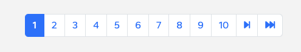

| Manual test case - 17 | Pagination at the bottom of product results |
|------------------------|---------------------------------------------------------------|
| **Expected**           | When there are more than 20 products, pagination links should appear at the bottom of the page. Clicking on the next page link should show the next set of products, with each page displaying 20 products. |
| **Testing**            | I navigated to the products page which display results for all 195 items. I confirmed that pagination links appeared, then clicked the "next" button to ensure the next set of 20 products loaded correctly. |
| **Result**             | Pagination links appeared as expected, and clicking "next" successfully displayed the next set of 20 products. |
| **Fix**                | No changes needed – everything works as it should. |

<br>

| Manual test case - 18 | Clicking on pagination button number 5 |
|------------------------|---------------------------------------------------------------|
| **Expected** | When the the pagination button for page number 5 is clicked while displaying all products, it should show the next set of 20 products, since pagination is set to 20 per page. |
| **Testing**  | I clicked on the "5" button in the pagination at the bottom of the all product list to check if the system correctly navigates to page 5 and displays the appropriate products. |
| **Result**   | The system successfully displayed the products for page 5, showing the next 20 items as expected. |
| **Fix**      | No changes needed – everything works as it should. |

<br>

| Manual test case - 19 | Clicking on the "Last Page" pagination button |
|------------------------|---------------------------------------------------------------|
| **Expected** | When the "Last Page" button is clicked, it should navigate to the last page of the product list. The button should not be displayed if the user is already on the last page. |
| **Testing**  | I clicked on the "Last Page" button to check if it navigated to the final page of the product list. I also checked that the "Last Page" button was hidden if I was already on the last page. |
| **Result**   | The "Last Page" button worked as expected, navigating to the final page. When I was already on the last page, the button was hidden as expected. |
| **Fix**      | No changes needed – everything works as it should. |

<br>

| Manual test case - 20 | Clicking on the "First Page" pagination button |
|------------------------|---------------------------------------------------------------|
| **Expected** | When the "First Page" button is clicked, it should navigate to the first page of the product list. The button should not be displayed if the user is already on the first page. |
| **Testing**  | I clicked on the "First Page" button to check if it navigated to the first page of the product list. I also checked that the "First Page" button was hidden if I was already on the very first page. |
| **Result**   | The "First Page" button worked as expected, navigating to the first page. When I was already on the first page, the button was hidden as expected. |
| **Fix**      | No changes needed – everything works as it should. |


The **left-side menu expands and collapses** when clicking the header.  
- **Sorting options** display all data from the database and sort correctly when a selection is made.  
- **Filtering by Manufacturer** functions as expected.  
- Clicking **"View Details"** correctly redirects to the detailed product page.  

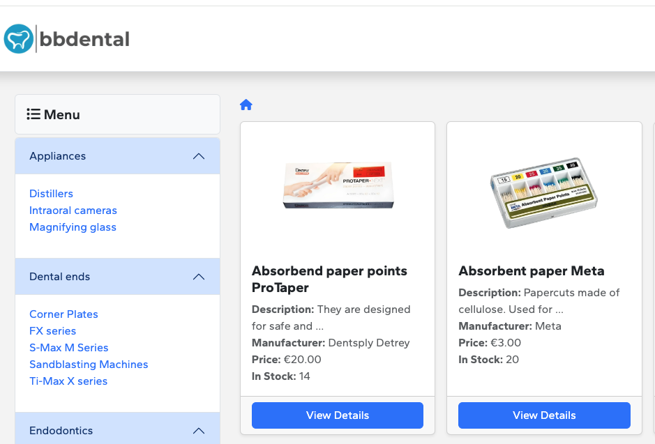

| Manual test case - 21 | Left-side menu expands and collapses when clicking the header |
|------------------------|-------------------------------------------------------------------|
| **Expected** | Clicking the header or menu toggle should either expand the left-side menu if it’s collapsed, or collapse it if it’s expanded. |
| **Testing**  | I clicked the header/menu toggle to test the expand/collapse feature of the left-side menu. I verified that the menu expanded when collapsed and collapsed when expanded. |
| **Result**   | The left-side menu expanded when I clicked it while collapsed, and collapsed when clicked again. The feature worked as expected. |
| **Fix**      | No changes needed – everything works as it should. |

<br>

| Manual test case - 22 | Left-side menu is not expanded by default on mobile devices |
|------------------------|----------------------------------------------------------------|
| **Expected** | On mobile devices, the left-side menu should be collapsed by default when the page loads. It should expand only when the menu toggle button is clicked. |
| **Testing**  | I accessed the page on a mobile device and confirmed that the menu was collapsed by default. I clicked the toggle button to verify that the menu could expand and collapse as expected. |
| **Result**   | The menu was collapsed by default on mobile devices, and it expanded/collapsed correctly when the toggle button was clicked. |
| **Fix**      | No changes needed – everything works as it should. |

<br>

| Manual test case - 23 | Sorting products by Name (A-Z) |
|------------------------|---------------------------------|
| **Expected** | When the "Name (A-Z)" option is selected, the product list should be sorted alphabetically from A to Z by product name. |
| **Testing**  | I selected "Name (A-Z)" from the sorting options and confirmed that the products are listed in alphabetical order from A to Z by product name. |
| **Result**   | The products were sorted correctly in alphabetical order from A to Z by product name. |
| **Fix**      | No changes needed – everything works as it should. |

<br>

| Manual test case - 24 | Sorting products by Name (Z-A) |
|------------------------|---------------------------------|
| **Expected** | When the "Name (Z-A)" option is selected, the product list should be sorted alphabetically from Z to A by product name. |
| **Testing**  | I selected "Name (Z-A)" from the sorting options and confirmed that the products are listed in reverse alphabetical order from Z to A by product name. |
| **Result**   | The products were sorted correctly in reverse alphabetical order from Z to A by product name. |
| **Fix**      | No changes needed – everything works as it should. |

<br>

| Manual test case - 25 | Sorting products by Price (Low to High) |
|------------------------|-------------------------------------------|
| **Expected** | When the "Price (Low to High)" option is selected, the product list should be sorted from the lowest price to the highest price. |
| **Testing**  | I selected "Price (Low to High)" from the sorting options and confirmed that the products were listed in order from the lowest price to the highest price. |
| **Result**   | The products were sorted correctly from the lowest price to the highest price. |
| **Fix**      | No changes needed – everything works as it should. |

<br>

| Manual test case - 26 | Sorting products by Price (High to Low) |
|------------------------|--------------------------------------------|
| **Expected** | When the "Price (High to Low)" option is selected, the product list should be sorted from the highest price to the lowest price. |
| **Testing**  | I selected "Price (High to Low)" from the sorting options and confirmed that the products were listed in order from the highest price to the lowest price. |
| **Result**   | The products were sorted correctly from the highest price to the lowest price. |
| **Fix**      | No changes needed – everything works as it should. |

<br>

| Manual test case - 27 | Sorting products by Manufacturer (A-Z) |
|------------------------|-------------------------------------------|
| **Expected** | When the "Manufacturer (A-Z)" option is selected, the product list should be sorted alphabetically from A to Z by manufacturer name. |
| **Testing**  | I selected "Manufacturer (A-Z)" from the sorting options and confirmed that the products were listed in alphabetical order from A to Z by manufacturer name. |
| **Result**   | The products were sorted correctly in alphabetical order from A to Z by manufacturer name. |
| **Fix**      | No changes needed – everything works as it should. |

<br>

| Manual test case - 28 | Sorting products by Manufacturer (Z-A) |
|------------------------|-------------------------------------------|
| **Expected** | When the "Manufacturer (Z-A)" option is selected, the product list should be sorted in reverse alphabetical order from Z to A by manufacturer name. |
| **Testing**  | I selected "Manufacturer (Z-A)" from the sorting options and confirmed that the products were listed in reverse alphabetical order from Z to A by manufacturer name. |
| **Result**   | The products were sorted correctly in reverse alphabetical order from Z to A by manufacturer name. |
| **Fix**      | No changes needed – everything works as it should. |

<br>

| Manual test case - 29 | Filter products by '3M' manufacturer |
|---------------------------|----------------------------------------------|
| **Expected** | When the "3M" manufacturer is selected from the filter options, only the products made by "3M" should be displayed on the page. |
| **Testing**  | I chose "3M" from the manufacturer filter and confirmed that the list only showed products from that manufacturer. |
| **Result**   | After applying the "3M" filter, all listed products were from "3M." No products from other manufacturers appeared in the list. |
| **Fix**      | No changes needed – everything works as it should. |

<br>

| Manual test case - 30 | Filter products by 'All Manufacturers' |
|---------------------------|--------------------------------------------|
| **Expected** | When the "All Manufacturers" option is selected, the product list should display products from all available manufacturers without any filtering applied. |
| **Testing**  | I selected the "All Manufacturers" option from the filter menu to ensure the page displayed all available products, regardless of manufacturer. |
| **Result**   | After selecting "All Manufacturers," the page showed a complete list of products from various manufacturers, as expected. |
| **Fix**      | No changes needed – everything works as it should. |

<br>

| Manual test case - 31 | Clicking "View Details" button on product card |
|---------------------------|------------------------------------|
| **Expected** | When the "View Details" button is clicked, the user should be redirected to the product's detailed page, displaying more information about the selected product. |
| **Testing**  | I clicked on the "View Details" button for a specific product ('Adhesor') to check if it opened the correct product details page. |
| **Result**   | Upon clicking the "View Details" button, the product detail page opened correctly with all relevant product information displayed. |
| **Fix**      | No changes needed – everything works as it should. |

<br>

## **Product Details Page**  
All displayed information corresponds correctly to the selected product, and all product data matches the database records. The **image on the left side renders correctly**, and in cases where a product has no image in the database, a **placeholder image is displayed** instead.  

### **Functional Buttons:**
- **"Add to Bag"**  
- **"Keep Shopping"**  
- **"Shopping Bag"**  
- **"Go to Checkout"**  


Additionally, all navigation links at the top of the page, including **"Products," "My Profile," "Shopping Bag," and "Logout"** work as intended.  

<br>

| Manual test case - 32 | Product Details Page – Default Image Display |
|------------------------|-------------------------------------------------|
| **Expected** | When no image is uploaded for a product, the product details page should display a default "No Image Available" placeholder. |
| **Testing**  | I navigated to the product details page of a product that does not have an image uploaded and checked if the default placeholder image appeared in place of the missing product image. |
| **Result**   | The product details page displayed the default "No Image Available" placeholder as expected for a product without an image. |
| **Fix**      | No changes needed – everything works as it should. |

<br>

| Manual test case - 33 | Add to Bag Button |
|---------------------------|----------------------------------------|
| Expected | When the "Add to Bag" button is clicked, the selected product should be added to the shopping bag, and a confirmation message should be displayed. |
| Testing | I clicked the "Add to Bag" button for a product ('Adaper Single Bond 2 6ml') to check if the product was successfully added to the shopping bag. I also verified if the confirmation message appeared. |
| Result | The "Add to Bag" button added the product to the shopping bag, and the confirmation message ('Adaper Single Bond 2 6ml has been added to the shopping bag.') was displayed correctly. |
| Fix | No changes needed – everything works as it should. |

<br>

| Manual test case - 34 | Keep Shopping Button  |
|---------------------------|----------------------------------------|
| Expected | When the "Keep Shopping" button is clicked, the user should be taken back to the product list page without losing any added items in the shopping bag. |
| Testing | I clicked on the "Keep Shopping" button after adding an item to the bag to confirm that the user was redirected back to the product list, and the items were still in the shopping bag. |
| Result | The "Keep Shopping" button worked as expected. The user was returned to the product list, and the items remained in the shopping bag. |
| Fix | No fix required – everything works as it should. |

<br>

| Manual test case - 35 | Shopping Bag Button
|---------------------------|----------------------------------------|
| Expected | When the "Shopping Bag" button is clicked, the user should be taken to the shopping bag page (`https://bbdental-4f6c524824c2.herokuapp.com/bag/`) where they can review the products added to the bag. |
| Testing | I clicked the "Shopping Bag" button to ensure that it redirected to the shopping bag page with the correct products. |
| Result | The "Shopping Bag" button worked correctly, redirecting to the shopping bag page, displaying all the items added to the bag. |
| Fix | No fix required – everything works as it should. |

<br>

| Manual test case - 36 | Go to Checkout Button |
|---------------------------|----------------------------------------|
| Expected | When the "Go to Checkout" button is clicked, the user should be redirected to the checkout page where they can review their order and proceed with payment. |
| Testing | I clicked the "Go to Checkout" button to check if it redirected to the checkout page. I also verified that the items in the shopping bag were displayed on the checkout page. |
| Result | The "Go to Checkout" button worked as expected, taking the user to the checkout page with the correct order details. |
| Fix | No fix required – everything works as it should. |

<br>

## **Shopping Bag**  
The shopping bag should be **not accessible when a user is not logged in** and when there are **no items in the cart**—this condition is correctly met.  

Only after adding at least one product does the user gain access to the **checkout process**, ensuring correct functionality.  

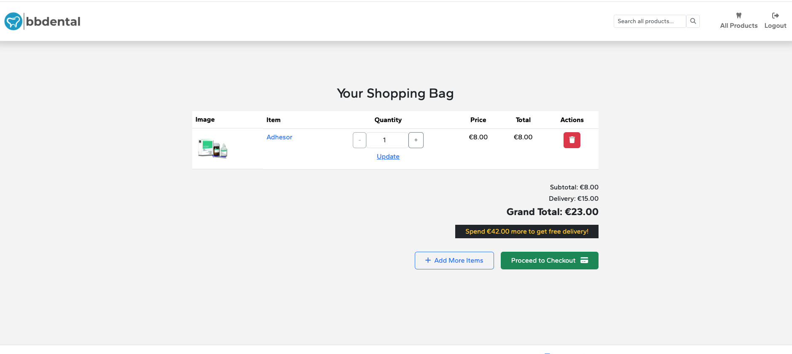

| Manual test case - 37 | Shopping Bag Accessibility for Unauthenticated Users |
|-----------------------|---------------------------------------------------------|
| **Expected**          | When the user is not logged in, attempting to access the shopping bag should redirect to the login page. The user should be redirected to the login page with the appropriate URL path (e.g., https://bbdental-4f6c524824c2.herokuapp.com/accounts/login/?next=/bag/). |
| **Testing**           | I opened the shopping bag page (https://bbdental-4f6c524824c2.herokuapp.com/bag/) without being logged in to verify that it correctly redirects to the login page. |
| **Result**            | The page redirected to the login page as expected, with the correct URL: https://bbdental-4f6c524824c2.herokuapp.com/accounts/login/?next=/bag/. |
| **Fix**               | No fix needed – everything works as it should. |

<br>

| Manual test case - 38 | Shopping Bag Accessibility with Empty Cart and logged in user |
|-----------------------|-----------------------------------------------|
| **Expected**          | When the shopping bag is accessed without any items in the cart and user is logged in, the page should open with the content 'Your shopping bag is empty.' Even if the URL (https://bbdental-4f6c524824c2.herokuapp.com/bag/) is directly accessed, the user should be able to see this message. |
| **Testing**           | I added no products to the shopping bag and opened the shopping bag page (https://bbdental-4f6c524824c2.herokuapp.com/bag/). I verified that the message 'Your shopping bag is empty.' was displayed on the page. |
| **Result**            | The shopping bag page opened successfully with the message 'Your shopping bag is empty. Browse Products.' displayed correctly when no items were in the cart. |
| **Fix**               | No fix needed – everything works as it should. |

<br>

| Manual test case - 39 | Verify if product details, subtotal, delivery, grand total, and free delivery information are displayed correctly |
|-----------------------|---------------------------------------------------------------------------------------------------------|
| **Expected**          | All relevant figures should be displayed on the shopping bag page, including:                                                                                             |
|                       | - Product Details: Image, Item name, Quantity, Price, and Total for each product                                                                                                    |
|                       | - Subtotal (correct total based on selected products)                                                                                                               |
|                       | - Delivery (should display standard delivery cost, typically €15 - subject to Subtotal)                                                                                                                 |
|                       | - Grand Total (subtotal + delivery)                                                                                                                                |
|                       | - Additional Information: "Spend €X more to get free delivery!" should be shown when the total is less than €50.   |
| **Testing**           | I navigated to the shopping bag page, verified the correct display of product details (Image, Item, Quantity, Price, and Total), subtotal, delivery, grand total, and the free delivery message. |
| **Result**            | All information was displayed correctly:                                                                                                                              |
|                       | - Each product displayed correct image, item name, quantity, price, and total.                                                                                                            |
|                       | - Subtotal matched the sum of the selected products.                                                                                                               |
|                       | - Delivery cost was calculated and shown as expected.                                                                                                                               |
|                       | - Grand total was the sum of the subtotal and delivery.                                                                                                           |
|                       | - When bag total was less than €50, the message "Spend €X more to get free delivery!" was displayed. |
| **Fix**               | No changes needed – correct details appear as they should.         

<br>

## **Checkout**  
If a **logged-in user** previously **saved their details**, the system attempts to pre-fill the checkout form. This works correctly—users who have stored their information in their profiles see the form **auto-filled with accurate data**.  

The **payment system functions properly**, and after a successful test payment, a **confirmation message** is displayed as per the project’s design. All links on this page work correctly.  

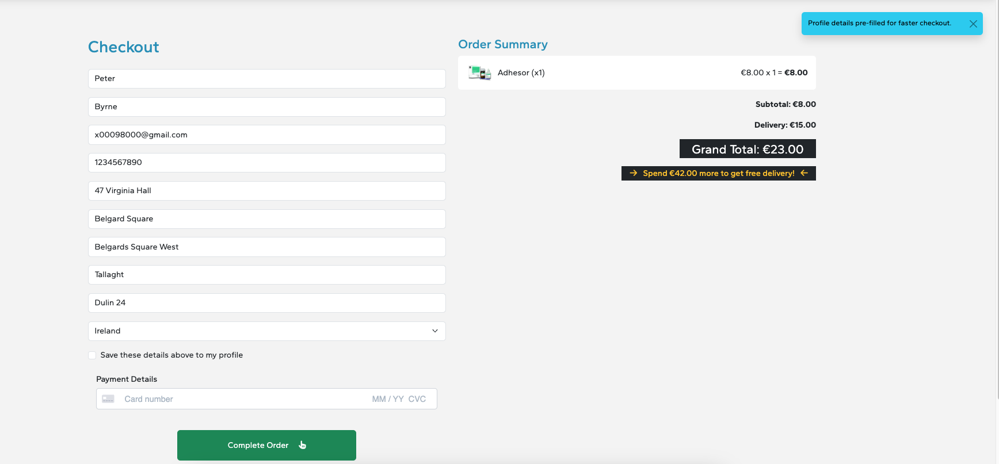

<br>

| Manual test case - 40 | Pre-filled Checkout Form for Logged-In Users |
|------------------------|---------------------------------------------------------------|
| **Expected** | If a user is logged in and has previously saved their details, the checkout form should be automatically pre-filled with accurate information (such as name, address, email, and phone number). Additionally, a popup should appear with the message “Profile details pre-filled for faster checkout.” |
| **Testing**  | I logged in with an account that has saved details, then navigated to the checkout page to check if the system auto-filled the checkout form with the correct information stored in the user's profile. I also checked if the popup with the correct message appeared. |
| **Result**   | The checkout form was correctly pre-filled with the user's saved details, including name, address, email, and phone number. The popup “Profile details pre-filled for faster checkout.” appeared as expected. |
| **Fix**      | No changes needed – everything works as it should. |

<br>

| Manual test case - 41 | Checkout Form for Users Without Saved Details |
|------------------------|------------------------------------------------|
| **Expected** | If a user is logged in but hasn’t saved their details to their profile, the checkout form should only have the email field pre-filled. All other fields like name, address, and phone number should be blank. Additionally, a popup should appear with the message “Profile details pre-filled for faster checkout.” |
| **Testing**  | I logged in with a test account that doesn't have saved profile info. After going to the checkout page, I checked if only the email was auto-filled and the rest of the form was empty. |
| **Result**   | The email field was pre-filled correctly, and all other fields were blank. The popup “Profile details pre-filled for faster checkout.” appeared as expected. |
| **Fix**      | No changes needed – everything works as it should. |

<br>

| Manual test case - 42 | Submitting Checkout Form with Blank Required Fields |
|------------------------|--------------------------------------------------------------|
| **Expected** | If any of the required fields (like full name, address, phone number, etc.) are left blank, the form should not submit. Instead, it should show clear validation messages indicating which fields need to be filled in. |
| **Testing**  | I left the payment details, full name, phone and address fields empty on the checkout form and tried to place the order to see how the form responds. |
| **Result**   | The form didn’t submit and displayed message above the empty fields saying they are required. In case of payment details it displayed 'Your card number is incomplete.'|
| **Fix**      | No changes needed – the form validation worked as intended. |

<br>

| Manual test case - 42a | Submitting Checkout Form with Invalid Phone Number |
|------------------------|--------------------------------------------------------------|
| **Expected** | If the phone number entered in the checkout form is not valid (e.g. contains letters, too short, or uses an incorrect format), the form should not submit and a validation message should be shown next to the phone number field. |
| **Testing**  | Entered an invalid phone number like “123-abc-456” in the checkout form and attempted to place the order to see if the form catches the error. |
| **Result**   | The form did submit and displayed a succesful message. This was not expected” |
| **Fix**      | Fix applied – phone number validation is now working correctly. |

<br>

| Manual test case - 43 | Saving Checkout Details to User Profile |
|------------------------|--------------------------------------------------------------|
| **Expected** | When the "Save these details above to my profile" checkbox is ticked while placing the order, the system should store the entered delivery details (like full name, address, phone number, email) to the logged-in user's profile. These details should be available and auto-filled next time the user visits the checkout page. |
| **Testing**  | I filled out the checkout form with my shipping information, ticked the "Save these details above to my profile" checkbox, and completed the order. Then, I logged out and back in, added a new product to the bag, and went to the checkout page again to see if the form was auto-filled with the previously saved details. |
| **Result**   | The checkout form was automatically filled with the exact same information I had submitted earlier, confirming that the details were correctly saved to my profile. |
| **Fix**      | No changes needed – the feature worked like it should. |

<br>

| Manual test case - 44 | Payment Processing During Checkout |
|------------------------|--------------------------------------------------------------|
| **Expected** | After completing the checkout form and clicking the "Complete Order" button, the payment should be processed securely. If the card details are valid, the order should be confirmed, and a success message should appear. If the details are invalid or incomplete, the payment should be declined with a clear error message. |
| **Testing**  | I filled out all required fields on the checkout form with valid delivery details. Then I entered test card information (Stripe test card: 4242 4242 4242 4242 with a valid future expiry and CVC) and submitted the order. I also tested with invalid card details to see if an error would be returned. |
| **Result**   | With valid Stripe test card details, the payment went through, and I was redirected to a confirmation page showing the order summary and order placement success message. With invalid card details, the system showed an error without proceeding. |
| **Fix**      | No changes needed – the test payment system is functioning as expected. |

<br>

## **Order Confirmation**  
After payment, an **order summary** is displayed, and the order details correctly match the actual purchase.  

All buttons on this page function properly, and clicking **"Order History"** correctly redirects the user to their profile page.  

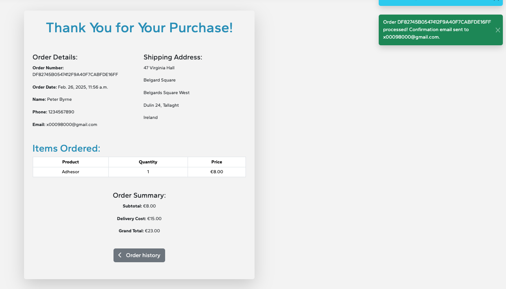

<br>

| Manual test case - 45 | Order Confirmation Page Displays Accurate Details |
|------------------------|-------------------------------------------------------------------------------------------|
| **Expected** | After completing the checkout and payment, the confirmation page should display a unique order number. It should also show all delivery and contact details exactly as entered during checkout. The "Items Ordered" section should list the correct products, quantities, and prices. Additionally, the breakdown of Subtotal, Delivery Cost, and Grand Total should reflect what was shown on the checkout page. |
| **Testing**  | I placed an order by filling out the checkout form with test data and proceeded with payment using valid test card info. Once redirected to the confirmation page, I reviewed all displayed information and compared it to what I entered during checkout. I also verified that an order number was generated and that all product details matched the order. |
| **Result**   | Everything on the confirmation page matched the data entered during checkout. The correct order number was generated, delivery info was accurate, and all items, quantities, and prices were displayed properly. The totals were also correctly calculated and matched the checkout page. |
| **Fix**      | No fixes needed – the confirmation page reflects the order correctly. |

<br>

| Manual test case - 46 | "Order History" Button on Order Confirmation Page |
|------------------------|-------------------------------------------------------------------------------------------|
| **Expected** | Clicking the "Order History" button on the Order Confirmation page should take the user to their profile page at: https://bbdental-4f6c524824c2.herokuapp.com/profile/ where they can view their past orders. |
| **Testing**  | After completing a test order and landing on the Order Confirmation page, I clicked the "Order History" button to check if it redirected me to the profile page showing the full order history. |
| **Result**   | The button worked correctly—it redirected to the profile page and displayed the full order history for the logged-in user. |
| **Fix**      | No fixes needed – the button works as expected. |

<br>

## **User Profile**  
User profile information is displayed **accurately in the form**, matching the stored user details.  

If a user updates their information and clicks **"Update Profile,"** the new details are correctly saved and updated in the system.  

Clicking **"View Order Details"** displays the **correct order details** as expected.  

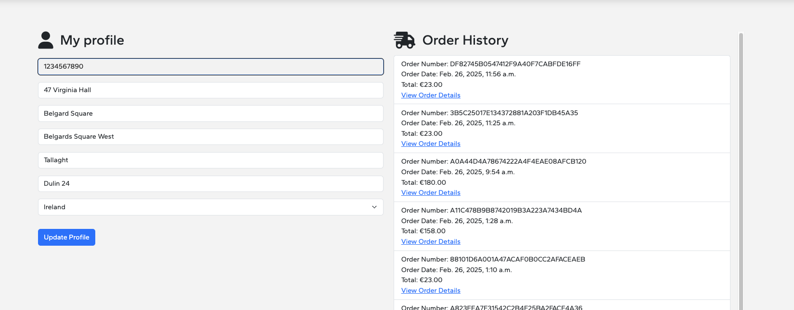

| Manual test case - 47 | Order History Lists All Placed Orders |
|------------------------|---------------------------------------------------------------------------------------------|
| **Expected** | The profile page at https://bbdental-4f6c524824c2.herokuapp.com/profile/ should list all previous orders made by the logged-in user. Each order should include basic info like order number, date, total amount, and a link to view order details. |
| **Testing**  | I logged in to a user account that had multiple past orders. Then I visited the profile page and checked whether each order I placed previously was shown in the order history list. |
| **Result**   | All previously placed orders appeared in the list with the correct details and links to their individual order confirmation pages. |
| **Fix**      | No fix needed – the order history displays correctly. |

<br>

| Manual test case - 48 | Profile Details Match Last Saved Checkout Info |
|------------------------|---------------------------------------------------------------------------------------------|
| **Expected** | When the "Save these details above to my profile" checkbox is ticked during checkout, the provided information (full address, phone number details) should be saved and  visible in the profile section. On returning to the profile, these saved details should appear exactly as they were entered during the last checkout. |
| **Testing**  | I placed an order and ticked the "Save these details above to my profile" checkbox on the checkout page, entering updated contact and address info. After completing the checkout, I navigated to the profile page to verify that the updated details were saved correctly. |
| **Result**   | The profile section reflected the latest data I entered at checkout, confirming it was saved properly when the checkbox was ticked. |
| **Fix**      | No fix needed – the profile updated as expected based on the most recent saved checkout data. |

<br>

## **Logout**  
The logout process functions correctly, requiring **confirmation** as per the project's intended design.  

<br>

| Manual test case - 49 | Logout Button Functionality |
|------------------------|------------------------------------------------------------------|
| **Expected** | Clicking the "Logout" button should log the user out of the session and redirect them to the [logout](https://bbdental-4f6c524824c2.herokuapp.com/accounts/logout/) page. The user should no longer have access to any authenticated pages such as the profile, bag or checkout. |
| **Testing**  | I clicked the "Logout" button from the navigation menu while logged in. After that, I tried to access the profile, bag and checkout pages by entering the URLs directly. |
| **Result**   | After logging out, I was redirected to the landing page, and any attempts to access authenticated pages also brought me back to the login screen. |
| **Fix**      | No fix necessary – logout functionality works correctly. |

<br>

# **For Store Employees:**  

## **Landing Page**
The landing page is **almost identical** to the customer view, but **staff members** have different navigation options:
- **Products**
- **Manage Products**
- **Orders**
- **Logout**

The navigation bar also includes the product search field.

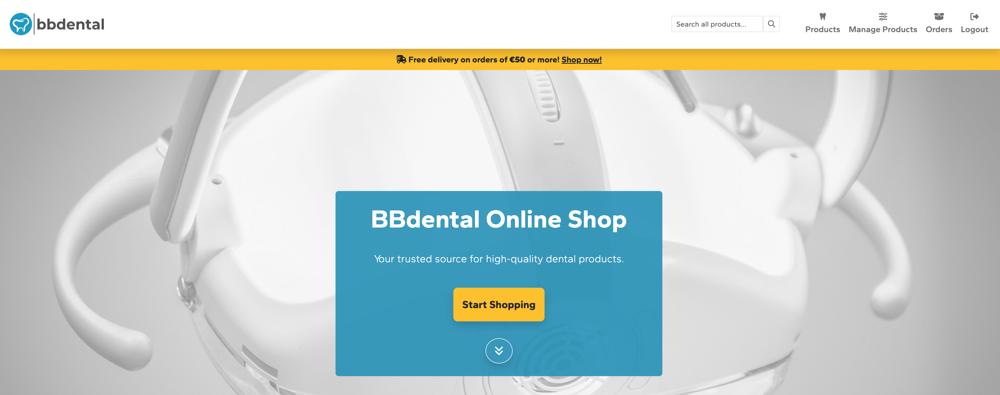

<br>

| Manual test case - 50 | Menu Bar Options for Staff Account |
|------------------------|----------------------------------------------------------|
| **Expected** | When logged in with a staff account, the menu bar should display only these options: "Products", "Manage Products", "Orders" and "Logout". |
| **Testing**  | I logged in with a staff account and checked the links displayed in the navigation bar. |
| **Result**   | The menu bar correctly displayed only the four options: "Products", "Manage Products", "Orders" and "Logout" as expected. |
| **Fix**      | No changes needed – the menu bar worked correctly for the staff account. |

<br>

| Manual test case - 51 | Clicking the "Manage Products" link |
|------------------------|---------------------------------------------------------------|
| **Expected** | When the "Manage Products" link is clicked, it should open the product management page at https://bbdental-4f6c524824c2.herokuapp.com/products/manage/. |
| **Testing**  | I clicked on the "Manage Products" link in the menu bar and checked if it redirected to the correct page. |
| **Result**   | The page correctly opened https://bbdental-4f6c524824c2.herokuapp.com/products/manage/ as expected. |
| **Fix**      | No changes needed – everything worked as expected. |

<br>

## **Manage Products**
All **CRUD (Create, Read, Update, Delete) operations** work flawlessly.  
Employees can:  
- **View product data**
- **Add new products**
- **Edit product information**
- **Delete products from the database**

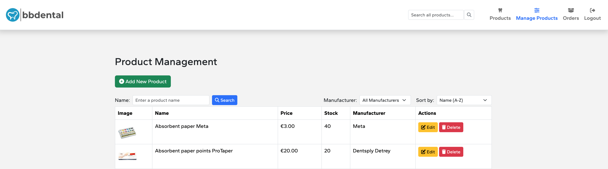

## **Add New Product**  
- The **form renders correctly** and **validation works as expected**.  
- After entering all required details and submitting the form, the new product is **saved in the database in the correct format**.  
- A **confirmation message** is displayed upon successful product entry.  

<br>

| Manual test case - 52 | Add New Product Button Functionality |
|------------------------|---------------------------------------------------------------|
| **Expected** | When the "Add new product" button is clicked on the Manage Products page, it should open the product creation form at `/products/add/`. |
| **Testing**  | I clicked the "Add new product" button while on the Manage Products page. It redirected me to the correct URL: `https://bbdental-4f6c524824c2.herokuapp.com/products/add/`. The form for adding a new product was displayed, including all required input fields and options. |
| **Result**   | The redirection and form display worked as expected. The page loaded the new product form correctly. |
| **Fix**      | No fix required – everything works as it should. |

<br>

| Manual test case - 53 | Submitting Empty Add Product Form |
|------------------------|---------------------------------------------------------------|
| **Expected** | If the Add Product form is submitted without filling in any required fields, it should not be processed. Instead, an error message should appear at the top saying: "Error occurred while adding the product. Please check the entered details are valid." Additionally, each required field should display a validation message saying: "This field is required." |
| **Testing**  | I opened the Add Product form (https://bbdental-4f6c524824c2.herokuapp.com/products/add/) and clicked the "Add product" button without filling in any fields. The page stayed on the same form, displayed a red error message at the top, and each required input was marked with "This field is required." |
| **Result**   | The form handled empty submission correctly, showed the general and field-specific error messages, and nothing was saved. |
| **Fix**      | No fix needed – validation is working as it should. |

<br>

| Manual test case - 54 | Submitting Add Product Form with Spaces |
|------------------------|---------------------------------------------------------------|
| **Expected** | If the Add Product form is submitted with spaces (entered by pressing the spacebar) in any required fields, the form should not be processed. It should display an error message at the top saying: "Error occurred while adding the product. Please check the entered details are valid." Additionally, the required fields with only spaces should show the validation message: "This field is required." |
| **Testing**  | I opened the Add Product form from the Manage Products page, inserted spaces into the required fields 'Product name', 'Description', 'Price', 'In stock', selected 'manufacturer' (3M) from the dropdown, selected 'Subcategory' (Amalgams), and clicked the "Add product" button. The page remained on the same form, displayed a red error message at the top, and each required field with only spaces showed the message "This field is required." |
| **Result**   | The form handled spaces correctly, showing the general error message and marking the required fields with "This field is required." No data was saved. |
| **Fix**      | No fix needed – validation is working as expected. |

<br>

| Manual test case - 55 | Submitting Add Product Form with Invalid 'Price' Value |
|------------------------|---------------------------------------------------------------|
| **Expected** | If the 'Price' field is submitted with an invalid value (e.g., negative number, zero, or non-numeric), the form should not be processed. It should display an error message at the top saying: "Error occurred while adding the product. Please check the entered details are valid." Additionally, the 'Price' field should show the validation message: "Ensure this value is greater than or equal to 0.01." |
| **Testing**  | I opened the Add Product form from the Manage Products page and entered a negative number (-10) in the 'Price' field, inserted valid data for other required fields, and clicked the "Add product" button. The page remained on the same form, displayed a red error message at the top, and the 'Price' field showed the message "Ensure this value is greater than or equal to 0.01.". I have repeat same steps for zero and non-numeric value |
| **Result**   | The form correctly handled the invalid 'Price' value, displaying the appropriate error message and not saving any data. |
| **Fix**      | No fix needed – validation for 'Price' is working as expected. |

<br>

| Manual test case - 56 | Submitting Add Product Form with Invalid 'In Stock' Value |
|------------------------|---------------------------------------------------------------|
| **Expected** | If the 'In Stock' field is submitted with an invalid value (e.g., a negative number or a non-numeric value), the form should not be processed. It should display an error message at the top saying: "Error occurred while adding the product. Please check the entered details are valid." Additionally, the 'In Stock' field should show the validation message: "Ensure this value is greater than or equal to 0." |
| **Testing**  | I opened the Add Product form from the Manage Products page and entered a negative number (-5) in the 'In Stock' field, entered valid data for other required fields, and clicked the "Add product" button. The page remained on the same form, displayed a red error message at the top, and the 'In Stock' field showed the message "Ensure this value is greater than or equal to 0." I repear same steps for non-numeric value |
| **Result**   | The form correctly handled the invalid 'In Stock' value, displaying the appropriate error messages and not saving any data. |
| **Fix**      | No fix needed – validation for 'In Stock' is working as expected. |

<br>

| Manual test case - 57 | Submitting Add Product Form with Default 'Select Manufacturer' Option |
|------------------------|---------------------------------------------------------------|
| **Expected** | If the 'Select Manufacturer' option is left as the default in the Manufacturer dropdown and the form is submitted, it should not be processed. Instead, an error message should appear at the top: "Error occurred while adding the product. Please check the entered details are valid." The 'Manufacturer' field should show a validation message: "This field is required." |
| **Testing**  | I opened the Add Product form from the Manage Products page, left the 'Manufacturer' dropdown as "Select Manufacturer," filled in the other required fields with valid data, and clicked the "Add product" button. The page stayed on the form, showed a red error message at the top, and marked the 'Manufacturer' field with "This field is required." |
| **Result**   | The form correctly showed the error message and did not allow submission when the default 'Select Manufacturer' option was left unchanged. No data was saved. |
| **Fix**      | No changes needed – the validation for the 'Manufacturer' field works as expected. |

<br>

| Manual test case - 58 | Submitting Add Product Form with Default 'Select Subcategory' Option |
|------------------------|---------------------------------------------------------------|
| **Expected** | If the 'Select Subcategory' option is left as the default in the Subcategory dropdown and the form is submitted, it should not be processed. Instead, an error message should appear at the top: "Error occurred while adding the product. Please check the entered details are valid." The 'Subcategory' field should show a validation message: "This field is required." |
| **Testing**  | I opened the Add Product form from the Manage Products page, left the 'Subcategory' dropdown as "Select Subcategory," filled in the other required fields with valid data, and clicked the "Add product" button. The page stayed on the form, showed a red error message at the top, and marked the 'Subcategory' field with "This field is required." |
| **Result**   | The form correctly showed the error message and did not allow submission when the default 'Select Subcategory' option was left unchanged. No data was saved. |
| **Fix**      | No changes needed – the validation for the 'Subcategory' field works as expected. |

<br>

| Manual test case - 59 | Uploading Image in Add Product Form |
|----------------------------|------------------------------------|
| **Expected**               | The 'Image' field is optional. If an image is uploaded, it should be accepted successfully. After the product is added, the message "Product added successfully!" should appear, and the user should be redirected to the Manage Products page. If no image is uploaded, the product should still be added correctly. |
| **Testing**                | I opened the Add Product form, chose an image file (.jpg) for the 'Image' field, filled in all required fields (Product Name, Description, Price, In Stock, Manufacturer, Subcategory), and clicked "Add product." After submission, I confirmed that the success message "Product added successfully!" was displayed and I was redirected to the Manage Products page. |
| **Result**                 | The product was successfully added, the success message appeared, and I was redirected to the Manage Products page with the details of the new product. |
| **Fix**                    | No fix needed – everything worked as expected. |

<br>

| Manual test case - 60 | Submitting Add Product Form with All Valid Values |
|----------------------------|--------------------------------------------------|
| **Expected**               | When all required fields (Product Name, Description, Price, In Stock, Manufacturer, Subcategory) are filled with valid data, and an optional image is uploaded, the product should be successfully added. After submission, the message "Product added successfully!" should appear, and the user should be redirected to the Manage Products page with the new product listed. |
| **Testing**                | I opened the Add Product form, filled in all required fields with valid data (Product Name, Description, Price, In Stock, Manufacturer, Subcategory). I also uploaded a valid image (optional) and clicked the "Add product" button. After submitting the form, I confirmed that the success message "Product added successfully!" was displayed, and I was redirected to the Manage Products page where the new product was listed. |
| **Result**                 | The product was successfully added, the success message appeared, and I was redirected to the Manage Products page where the new product was listed. |
| **Fix**                    | No fix needed – everything worked as expected. |

<br>

| Manual test case - 61 |  'Back to All Products' Button |
|----------------------------|----------------------------------------|
| **Expected**               | Clicking the 'Back to All Products' button should take the user back to the Manage Products page (https://bbdental-4f6c524824c2.herokuapp.com/products/manage/). |
| **Testing**                | I opened the Add Product form, filled in all required fields, and clicked the "Back to All Products" button. The page should navigate to the Manage Products page without any changes being made. |
| **Result**                 | Clicking the 'Back to All Products' button successfully navigated me back to the Manage Products page. No changes were made, and the form was not submitted. |
| **Fix**                    | No fix needed – the button works as expected. |

<br>

## **Edit Product**  
- The **edit page correctly displays** the product’s existing details within the form.  
- Submitting changes **updates the database successfully**.  

<br>

| Manual test case - 62 | Edit Button Functionality  on Manage Products Page |
|------------------------|--------------------------------------------------------------|
| **Expected** | When clicking the "Edit" button next to a product on the Manage Products page, the system should open the correct Edit Product page. The URL should reflect the ID of the selected product, like: `/products/edit/179/`. |
| **Testing**  | From the Manage Products page, I clicked on the "Edit" button next to a product ‘Absorbend paper’. I checked that the page redirected to the correct URL and that the form was populated with the selected product's details. |
| **Result**   | Clicking the button opened the correct Edit Product page. The URL contained the right product ID, and the form showed the expected product details. |
| **Fix**      | No changes needed – it worked just fine. |

<br>

| Manual test case - 63 | Edit Product Page – Form and Clear Image Functionality |
|------------------------|--------------------------------------------------------------|
| **Expected** | The Edit Product page should display a form pre-filled with the existing product details. This includes fields for Product Name, Description, Price, In Stock, Manufacturer, Subcategory, and a preview of the current image. There should be a "Clear" checkbox for removing the image. After making edits, clicking "Update Product" should save changes, refresh the page, display a success message, and return the user to the Manage Products page. |
| **Testing**  | I opened the edit page for the product with ID 233. All fields were correctly pre-filled with current data. I updated the product name, description, price, in stock, Manufacturer, and Subcategory. I also tested the image handling—first by clearing the existing image using the "Clear" checkbox, and then by uploading a new one. After clicking "Update Product", the page refreshed, and a message appeared at the top: “Product: updated successfully!”. I also tested the "Back To All Products" button, and it returned to the product list without saving. I returned to the Manage Products page where the changes were visible |
| **Result**   | The form worked as expected. All updates were applied correctly, and the confirmation message appeared after saving. Both image removal and replacement worked. Manufacturer and Subcategory were also saved properly. |
| **Fix**      | No fix needed – everything is functioning as it should. |

<br>

| Manual test case - 64 | Edit Product – Submitting with Required Fields Left Blank |
|------------------------|--------------------------------------------------------------|
| **Expected** | If any of the required fields (like Product Name, Description, Price, In Stock) are left blank and the user tries to save the changes, the form should not be submitted and details not saved to database. Instead, an error message should appear: “Error updating product. Please check that the entered details are valid.” |
| **Testing**  | I opened the Edit Product page for product ID 233 and removed the values from the required fields—Product Name, Description, and Price. After clicking the "Update Product" button, the page stayed on the same form, and a message appeared at the top saying: “Error updating product. Please check that the entered details are valid.” I also checked the database and confirmed that no changes were saved. |
| **Result**   | The form correctly prevented submission with missing required fields. No data was saved, and the appropriate error message was displayed. |
| **Fix**      | No fix needed – the form validation is working properly. |

<br>

| Manual test case - 65 | Edit Product – Empty or Invalid Fields Validation |
|------------------------|--------------------------------------------------------------|
| **Expected** | If any required fields (Product Name, Description) are left blank or contain only spaces, the form should not be submitted. An error message should be displayed: “Error updating product. Please check that the entered details are valid.” |
| **Testing**  | I opened the Edit Product page for product ID 233. I left the Product Name and Description fields blank and clicked "Update Product". The form should not submit, and an error message should appear. |
| **Result**   | The form was not submitted, and the error message appeared as expected: "Error updating product. Please check that the entered details are valid." |
| **Fix**      | No fix needed – validation is working as intended. |

<br>

| Manual test case - 66 | Edit Product – Invalid In Stock Value (Negative or String) |
|------------------------|--------------------------------------------------------------|
| **Expected** | The "In Stock" field must accept only **zero or positive** integers. If a tex or negative number is entered, the form should not submit, and an error message should be displayed: “Error updating product. Please check that the entered details are valid.” |
| **Testing**  | I opened the Edit Product page for product ID 233. I entered a negative number for "In Stock", then clicked "Update Product". I also entered random text into the "In Stock" field later. The form should not submit, and the error message should appear. |
| **Result**   | The form was not submitted, and the error message appeared as expected. |
| **Fix**      | No fix needed – validation is working as intended. |

<br>

| Manual test case - 67 | Edit Product – Invalid Price Value (Zero or Negative) |
|------------------------|--------------------------------------------------------------|
| **Expected** | The "Price" field must accept only **positive values greater than zero**. If a zero or negative value is entered, the form should not submit, and an error message should be displayed: “Error updating product. Please check that the entered details are valid.” |
| **Testing**  | I opened the Edit Product page for product ID 233. I entered a zero value for "Price", then clicked "Update Product". The form should not submit, and the error message should appear. |
| **Result**   | The form was not submitted, and the error message appeared as expected. |
| **Fix**      | No fix needed – validation is working as intended. |

<br>

| Manual test case - 68 | Edit Product – Valid Values for "In Stock" and "Price" |
|------------------------|--------------------------------------------------------------|
| **Expected** | The "In Stock" field must accept zero or positive integers, and the "Price" field must accept positive values greater than zero. If these fields are correctly filled with valid values, the form should submit, and the product details should be updated. |
| **Testing**  | I opened the Edit Product page for product ID 233. I entered valid values: `0` for "In Stock" and a positive number for "Price", then clicked "Update Product". The form should submit, and page should refresh with updated details. |
| **Result**   | The form was successfully submitted, and the product details were updated as expected. |
| **Fix**      | No fix needed – validation and submission are working as expected. |

<br>

| Manual test case - 69 | Manufacturer dropdown on Edit Product page |
|------------------------|---------------------------------------------------------------|
| **Expected** | The 'Manufacturer' dropdown should show a list of all available manufacturers. The currently assigned manufacturer should be selected by default. When a different manufacturer is chosen and the product is updated, the change should be saved, and a confirmation popup saying "Product: updated successfully!" should appear. The updated manufacturer should be reflected on the Manage Products page. |
| **Testing**  | I opened the edit page for product ID 233. The 'Manufacturer' dropdown had the current manufacturer selected. I picked another manufacturer ('Aliganty') from the list and hit "Update Product". A message popped up saying "Product: updated successfully!". I checked the Manage Products page and confirmed the manufacturer was updated. |
| **Result**   | The dropdown listed all options, showed the current selection, saved the new one, and displayed the confirmation popup. |
| **Fix**      | No fix needed – everything worked as expected. |

<br>

| Manual test case - 70 | Subcategory dropdown on Edit Product page |
|------------------------|---------------------------------------------------------------|
| **Expected** | The 'Subcategory' dropdown should show all available subcategories. The current one should be selected by default. When a new subcategory is selected and changes are saved, the confirmation popup "Product: updated successfully!" should appear, and the update should be reflected on the Manage Products page. |
| **Testing**  | I went to the edit page for product ID 233. The 'Subcategory' dropdown was pre-selected with the correct value. I picked another subcategory ('Cements') and hit "Update Product". I saw the message "Product: updated successfully!" and verified the product's subcategory was updated on the Manage Products page. |
| **Result**   | Everything worked as it should – from default selection, saving changes, to showing the confirmation message. |
| **Fix**      | No fix needed – everything worked as expected. |

<br>

| Manual test case - 71 | Trying to update product with "Select Manufacturer" |
|------------------------|----------------------------------------------------------------------------------------------------|
| **Expected** | If the default option "Select Manufacturer" is selected from the Manufacturer dropdown when submitting the form, the product should not be updated. Instead, an error message should appear: "Error updating product. Please check that the entered details are valid." |
| **Testing**  | I opened the edit product page for item ID 233. I made sure all required fields were filled in, but I left the Manufacturer dropdown on its default value: "Select Manufacturer". After clicking "Update Product", I checked to see whether the form submitted. |
| **Result**   | The product was not updated. The expected error message appeared on the screen: "Error updating product. Please check that the entered details are valid." |
| **Fix**      | No fix needed – the validation worked correctly. |

<br>

| Manual test case - 72 | Trying to update product with "Select Subcategory" |
|------------------------|----------------------------------------------------------------------------------------------------|
| **Expected** | If the default option "Select Subcategory" is selected from the Subcategory dropdown when submitting the form, the product should not be updated. Instead, an error message should appear: "Error updating product. Please check that the entered details are valid." |
| **Testing**  | On the edit page for product ID 233, I filled out all required fields correctly but left the Subcategory dropdown on its default: "Select Subcategory". I clicked "Update Product" to test if the validation catches it. |
| **Result**   | As expected, the form did not save, and the error message was shown: "Error updating product. Please check that the entered details are valid." |
| **Fix**      | No fix required – the validation works as intended. |

<br>

## **Delete Product** 

<br>

| Manual test case - 73 | "Delete" Button and Confirmation Modal Functionality |
|----------------------------|----------------------------------------------------------------------------------------------------|
| **Expected**               | When the "Delete" button is clicked on a product entry on the Manage Products page (https://bbdental-4f6c524824c2.herokuapp.com/products/manage/), a confirmation modal should appear with the message "Are you sure you want to delete?" and two options: "Cancel" and "Yes, delete". Clicking "Cancel" should close the modal with no action taken. Clicking "Yes, delete" should permanently remove the product from the database, and it should no longer appear on the Manage Products page. After deletion, a pop-up message "Product: deleted successfully!" should be displayed. |
| **Testing**                | I went to the Manage Products page and clicked the "Delete" button on one of the product entries (ID 233). A modal appeared with the correct confirmation message and options. First, I clicked "Cancel" to check if the product remained – the modal closed, and no changes occurred. Then, I repeated the process and clicked "Yes, delete". The product was removed, the page refreshed, and it was no longer listed. A pop-up message "Product: deleted successfully!" appeared after deletion. |
| **Result**                 | Everything worked as expected. The modal appeared correctly, the cancel button dismissed it without deleting, and confirming the deletion removed the product from the list. The "Product: deleted successfully!" message appeared as expected. |
| **Fix**                    | No changes needed – the delete functionality works correctly. |

<br>

## **404 Error Page**  
Entering an **invalid URL** correctly triggers a **404 error message**, ensuring proper error handling.  

<br>

| Manual test case - 74 | Handling of Invalid URLs |
|------------------------|---------------------------------------------------------------|
| **Expected** | When a user enters an invalid or non-existent URL, the site should not crash or display a broken page. Instead, it should return a proper 404 error message letting the user know the page doesn't exist. |
| **Testing**  | I manually typed a random, non-existent URL like `https://bbdental-4f6c524824c2.herokuapp.com/should-not-exist` into the browser while logged out and also while logged in. In both cases, the page displayed a clear 404 error message, confirming that the site is handling missing routes properly. |
| **Result**   | The 404 error page appeared as expected, and there was no site breakage or confusing output. |
| **Fix**      | No fix needed – error handling for invalid URLs is working as intended. |

<br>

## Deployment

### Forking the GitHub Repository

Forking a repository on GitHub lets you create your own copy of someone else’s project. This is useful when you want to experiment with changes or contribute without affecting the original codebase. Here is how you can fork a repository:

1. Go to [GitHub](https://github.com/) and make sure you are signed in.
2. Navigate to the repository you want to fork.
3. Click the “Fork” button at the top right of the page
4. Select owner and name your forked repository as you like and click ‘Create Fork’

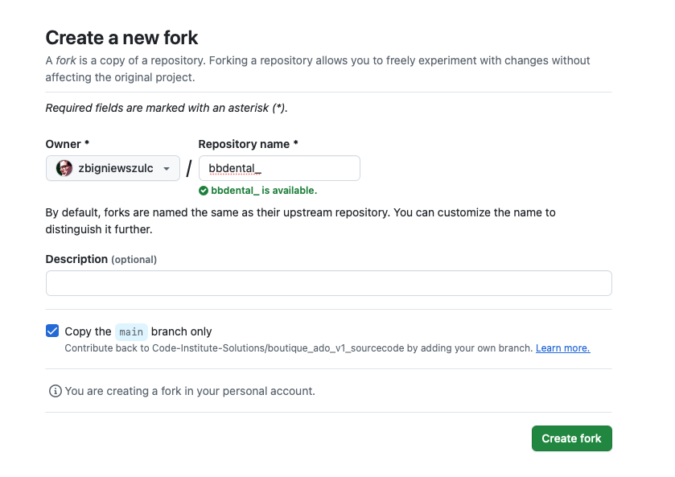

5. GitHub will create a copy of the repository under your account.
6. You can now clone it to your local machine and start working on it.

If you are looking for more information on forking, you can refer to GitHub's official documentation [Fork a repository](https://docs.github.com/en/pull-requests/collaborating-with-pull-requests/working-with-forks/fork-a-repo)

### Making a Local Clone

After forking a repository on GitHub, the next step is to create a local copy on your machine. This allows you to work with the code, make changes, and run the project locally.

1. On your forked GitHub repository page, click the "Code" button
2. Copy the HTTPS
3. Open your terminal or command prompt.
4. Navigate to the directory where you want to place the project.
5. Run the following command to clone the repo: `git clone`, and then paste the URL you copied in Step 2.

```
$ git clone https://github.com/your-username/repo-name.git
```

6. Once cloning is done, navigate into the project folder:

```
cd repo-name
```

You now have the full project on your machine and can begin editing, testing, or building it as needed. To make changes to the project files, you will need a code editor or an IDE (Integrated Development Environment). I have used Visual Studio Code - it is easiest to get started with. You can download it using this link https://code.visualstudio.com

If you are looking for more information on cloning, you can refer to GitHub's official documentation [Cloning a repository](https://docs.github.com/en/repositories/creating-and-managing-repositories/cloning-a-repository)

### Running the Project Locally

Create and activate a virtual environment:

```bash
python3 -m venv .venv
source .venv/bin/activate
```

Install the required packages:

```bash
pip3 install -r requirements.txt
```

Set the required environment variables using your own values:

```bash
export SECRET_KEY="your-secret-key"
export DEBUG="True"
export DATABASE_URL="your-database-url"
export CLOUDINARY_URL="your-cloudinary-url"
export EMAIL_HOST_USER="your-email-address"
export GMAIL_APP_PASSWORD="your-gmail-app-password"
export DEFAULT_FROM_EMAIL="your-email-address"
export STRIPE_PUBLIC_KEY="your-stripe-public-key"
export STRIPE_SECRET_KEY="your-stripe-secret-key"
export STRIPE_WH_SECRET="your-local-webhook-secret"
```

More information about obtaining these values is provided in the setup sections below. Secrets and passwords should never be committed to GitHub.

Apply the database migrations:

```bash
python manage.py migrate
```

Start the development server:

```bash
python manage.py runserver
```

The website should then be available at:

```text
http://127.0.0.1:8000/
```

### Heroku

Heroku is a cloud service that simplifies the process of hosting and managing apps. It handles the infrastructure for you, so you can focus on building and deploying your application.
To deploy the project to Heroku, the following steps were taken:

1. Log in to Heroku at [Heroku Login Page](https://id.heroku.com/login)
2. Go to [Dashboard](https://dashboard.heroku.com/apps)
3. Click 'New' followed by 'Create New App'. Give it meaningful name (I called it *bbdental*), choose appropriate runtime region and press 'Create App'.

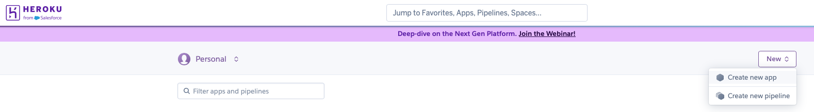

4. Once the app is created, go to settings and find 'Config vars' section. Press 'Reveal config vars' button and set the following environment variables:
   - SECRET_KEY (your random string, you can use [secret key generator](https://djecrety.ir))
   - CLOUDINARY_URL (refer to [Setting Up a Cloudinary Account](#setting-up-a-cloudinary-account))
   - DATABASE_URL (refer to [Setting up a PostreSQL from Code Institute](#setting-up-a-postresql-from-code-institute))
   - DEFAULT_FROM_EMAIL (default email address from which the app sends emails, e.g. my-email@gmail.com)
   - GMAIL_APP_PASSWORD (refer to [Setting Up Gmail SMTP](#setting-up-gmail-smtp))
   - STRIPE_PUBLIC_KEY (refer to [Setting Up a Stripe Account](#setting-up-a-stripe-account))
   - STRIPE_SECRET_KEY (refer to [Setting Up a Stripe Account](#setting-up-a-stripe-account))
   - STRIPE_WH_SECRET (refer to [Setting Up a Stripe Account](#setting-up-a-stripe-account))
   - EMAIL_HOST_USER (the Gmail address used to send project emails)
   - DEBUG (set to False)

5. Deploy by going to the 'Deploy' section and connecting to the project's repository on GitHub. Press 'Connect' once everything is set up. Finally, press 'Deploy Branch' main and wait for the process to complete. Youe should see 'Your app was successfully deployed'

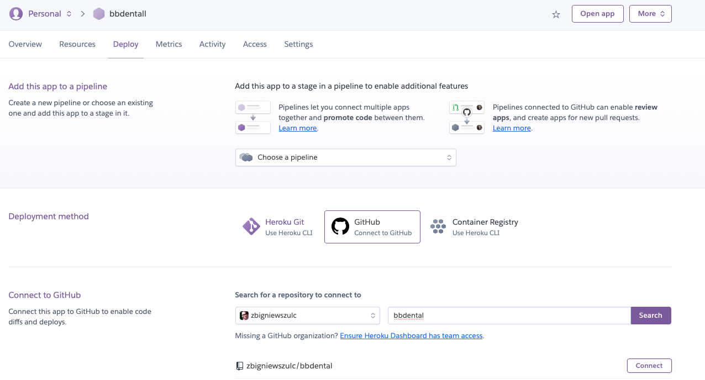

### Setting Up a Cloudinary Account

This project uses Cloudinary to manage images. If you plan to use it, you will need to create an account first. The process is straightforward:

1. Head over to [cloudinary.com](https://cloudinary.com) in your browser.
2. Click “Sign Up” in the top right corner.
3. You can register using your email and a password, or simply sign up using a GitHub or Google account if that is easier.
4. Once you are in, you will be taken to your dashboard. This is where you will find your API environment variable - this corresponds to your environment variable CLOUDINARY_URL.

### Setting Up a Stripe Account

Stripe is used in test mode to process test payments. No real money is taken.
To get Stripe working in your project, you will first need an account:

1. Head over to [stripe.com](https://stripe.com/) and hit “Start now” or “Sign in”.
2. You will need an email, and password to create your account. You can use Google login if that is easier.
3. Once you are signed in, you will land on your dashboard.
4. Within the 'dashboard', go to 'Developers' section (bottom left), click on 'API Keys' and note down your API keys: Secret Key and Publishable Key. These correspond to your environment variables: STRIPE_SECRET_KEY and STRIPE_PUBLIC_KEY, respectively.

#### Testing Webhooks Locally

Stripe CLI is used to forward test webhook events to the local Django server.

1. Install Stripe CLI and log in using:

   `stripe login`

2. Start the local Django server.
3. In a separate terminal, run:

   `stripe listen --events payment_intent.succeeded,payment_intent.payment_failed --forward-to http://127.0.0.1:8000/checkout/wh/`

4. Stripe CLI will display a webhook signing secret beginning with `whsec_`.

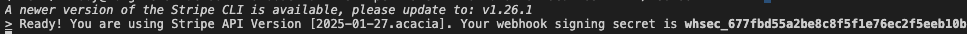

5. Save this value as `STRIPE_WH_SECRET` in the local environment used by Django.

<br>
<em>If you wish to listen to all events you can run these commands instead:</em>
<br>
<br>

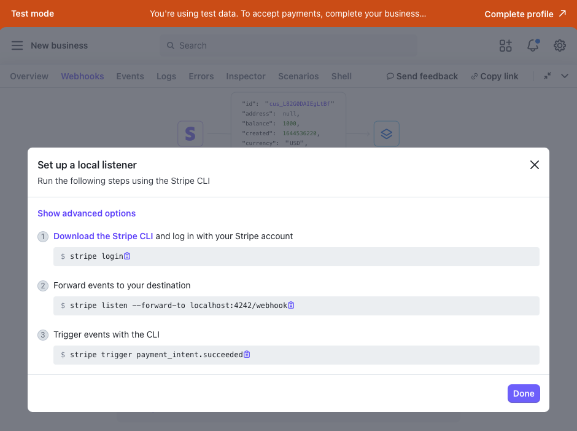

#### Setting Up the Heroku Webhook

The deployed website uses a separate Stripe webhook destination.

1. In Stripe Workbench, open Webhooks and create a new event destination.

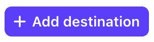

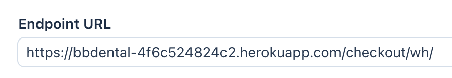

2. Select the `payment_intent.succeeded` and `payment_intent.payment_failed` events.

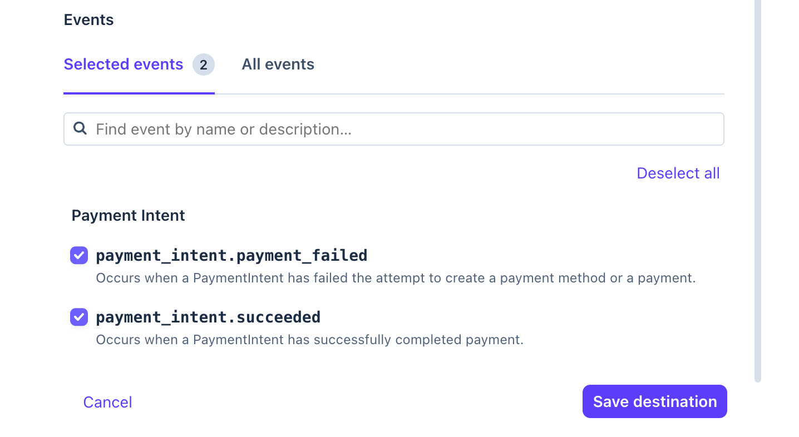

3. Use the following endpoint URL:

   `https://bbdental-4f6c524824c2.herokuapp.com/checkout/wh/`

4. After creating the destination, open its signing secret.
5. Save this secret as the `STRIPE_WH_SECRET` Config Var in Heroku.

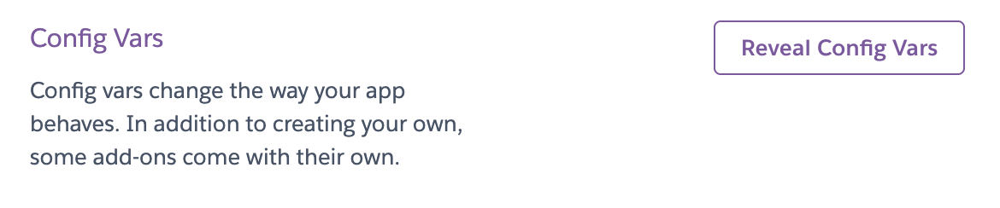

<br>

The local Stripe CLI listener and the Heroku webhook destination use different signing secrets. Each environment must use the secret created for its own webhook.

### Setting Up Gmail SMTP

Gmail SMTP is used to send account, contact form and order confirmation emails.

1. Sign in to the [Google Account](https://myaccount.google.com/) used for sending project emails.
2. Enable 2-Step Verification for the account at https://myaccount.google.com/security.
3. Open the [App Passwords section](https://myaccount.google.com/apppasswords) and create an app password for the project.
4. Save the Gmail address as the `EMAIL_HOST_USER` environment variable.
5. Save the generated password as the `GMAIL_APP_PASSWORD` environment variable.
6. Set `DEFAULT_FROM_EMAIL` to the same email address.

The app password must belong to the Gmail account set as `EMAIL_HOST_USER`. App passwords and other email credentials must not be added to GitHub.

### Setting up a PostreSQL from Code Institute

You can use any database you prefer which supports ORM (Object-Relational Mapping) with Python objects. For this project, I have opted for [PostgreSQL from Code Institute](https://dbs.ci-dbs.net). The process is pretty straightforward - just provide your email address and click ‘Submit’ to receive the database details via email. Once you have those, set the DATABASE_URL using an environment variable. Note that you will need to be a registered student at Code Institute to access this database.

⚠️ **Important:** Make sure to keep your secret keys secure — it's best to store them in a `.env.py` file at the root of your local project or as environment variables — and never push them to GitHub. For instructions on setting environment variables in Heroku, refer to [this section](#heroku)

### List of Python packages the project depends on: 

* asgiref==3.8.1
* certifi==2024.12.14
* cffi==1.17.1
* charset-normalizer==3.4.1
* cloudinary==1.36.0
* crispy-bootstrap5==0.7
* cryptography==44.0.0
* defusedxml==0.7.1
* dj-database-url==0.5.0
* dj3-cloudinary-storage==0.0.6
* Django==5.1.5
* django-allauth==65.4.0
* django-countries==7.6.1
* django-crispy-forms==2.3
* gunicorn==20.1.0
* idna==3.10
* oauthlib==3.2.2
* pillow==11.0.0
* psycopg2-binary==2.9.10
* pycparser==2.22
* PyJWT==2.9.0
* python3-openid==3.2.0
* pytz==2024.1
* requests==2.32.3
* requests-oauthlib==2.0.0
* setuptools==75.8.0
* six==1.17.0
* sqlparse==0.5.1
* stripe==11.5.0
* typing_extensions==4.12.2
* urllib3==1.26.20
* whitenoise==6.5.0

The details of the above dependecies are stores at the root of this project in the file named `requirements.txt`.
To install everything in that list, all you need to do is to run this command:
```
pip3 install -r requirements.txt
```
More detailed information on installing packages you can find [here](https://packaging.python.org/en/latest/tutorials/installing-packages/)

This project has been run and tested on Python 3.12.2.
If you need to install Python you can find installation instructions at https://www.python.org. 

# Credits
1. https://docs.djangoproject.com/en/5.1/ref/contrib/messages/
2. https://css-tricks.com/almanac/properties/t/transition/
3. https://developer.mozilla.org/en-US/docs/Web/CSS/transform-function/translateY
4. https://medium.com/python-in-my-pajamas/3.using-os-environ-to-manage-your-django-settings-the-easy-way-d2db96e73ab9#4c79
5. https://www.twilio.com/docs/sendgrid/for-developers/sending-email/django
6. https://medium.com/@verdyevantyo/authentication-system-using-django-allauth-121f47a6641e
7. https://getbootstrap.com/docs/5.3/components/card/#images
8. https://docs.djangoproject.com/en/5.1/ref/models/fields/#imagefield
9.  https://medium.com/@iamalisaleh/how-to-get-the-current-url-within-a-django-template-8270b977f280
10. https://simpleisbetterthancomplex.com/tips/2016/07/20/django-tip-7-how-to-get-the-current-url-within-a-django-template.html
11. https://docs.djangoproject.com/en/5.1/ref/templates/builtins/
12. https://docs.djangoproject.com/en/5.1/ref/templates/builtins/#json-script
13. https://docs.djangoproject.com/en/5.1/topics/db/queries/
14. https://docs.djangoproject.com/en/5.1/topics/db/optimization/
15. https://docs.djangoproject.com/en/5.1/topics/db/optimization/#use-queryset-select-related-and-prefetch-related
16. https://www.w3.org/WAI/ARIA/apg/patterns/breadcrumb/examples/breadcrumb/
17. https://docs.djangoproject.com/en/5.1/topics/pagination/
18. https://docs.djangoproject.com/en/5.1/ref/paginator/#django.core.paginator.Paginator
19. https://getbootstrap.com/docs/5.3/components/pagination/
20. https://www.w3schools.com/bootstrap5/bootstrap_tooltip.php
21. https://getbootstrap.com/docs/5.3/components/collapse/
22. https://getbootstrap.com/docs/5.3/components/navbar/#toggler
23. https://getbootstrap.com/docs/5.3/utilities/flex/
24. https://developer.mozilla.org/en-US/docs/Web/API/Document/querySelectorAll
25. https://developer.mozilla.org/en-US/docs/Web/API/Window/innerWidth
26. https://developer.mozilla.org/en-US/docs/Web/API/EventTarget/addEventListener
27. https://developer.mozilla.org/en-US/docs/Web/API/Window/resize_event
28. https://stackoverflow.com/questions/5150363/onchange-open-url-via-select-jquery
29. https://docs.djangoproject.com/en/5.1/ref/models/database-functions/
30. https://docs.djangoproject.com/en/5.1/ref/models/database-functions/#truncmonth - used to group orders by month for the sales dashboard
31. https://docs.djangoproject.com/en/5.1/topics/db/queries/
32. https://docs.djangoproject.com/en/5.1/ref/templates/builtins/#urlencode
33. https://docs.djangoproject.com/en/5.1/ref/templates/builtins/#floatformat
34. https://www.youtube.com/watch?v=65RVPDOhRIc&t=73s
35. https://www.w3schools.com/django/ref_filters_default.php
36. https://www.youtube.com/watch?v=rqYXCuXbs2s&t=3s
37. https://www.youtube.com/watch?v=2G9j34jz42Q&t=5s
38. https://docs.djangoproject.com/en/5.1/topics/http/sessions/
39. https://docs.djangoproject.com/en/5.1/ref/validators/#:~:text=MinValueValidator
40. https://docs.djangoproject.com/en/5.1/ref/models/fields/#:~:text=MinValueValidator%20and
41. https://studygyaan.com/django/how-to-implement-validators-in-django-models
42. https://www.w3schools.com/jsref/obj_inputevent.asp
43. https://www.w3schools.com/tags/att_inputmode.asp
44. https://sklep.andan.com.pl/
45. https://molarr.pl/
46. https://pypi.org/project/django-countries/
47. https://www.youtube.com/watch?v=0cGRqIHvSf8&t=109s
48. https://www.youtube.com/watch?v=l1Z9Aau0V08&t=296s
49. https://www.youtube.com/watch?v=eAja_pKhiCM&t=376s
50. https://developer.mozilla.org/en-US/docs/Web/API/Element/scrollIntoView
51. https://developer.mozilla.org/en-US/docs/Web/API/Document/DOMContentLoaded_event
52. https://developer.mozilla.org/en-US/docs/Web/HTML/Element/script
53. https://www.youtube.com/watch?v=eUcMh5s_27I&t=327s
54. https://developer.mozilla.org/en-US/docs/Web/API/Node/textContent
55. https://www.w3schools.com/python/ref_func_round.asp
56. https://www.youtube.com/watch?v=AU0F2wnrbEs&t=2s
57. https://www.youtube.com/watch?v=lg8p1vD9-Bs
58. https://www.youtube.com/watch?v=j9mLOyjd_KY
59. https://www.pythontutorial.net/django-tutorial/django-exists/
60. https://www.programiz.com/python-programming/datetime/strftime
61. https://docs.djangoproject.com/en/5.1/ref/forms/fields/
62. https://docs.djangoproject.com/en/5.1/ref/forms/fields/#django.forms.ModelChoiceField
63. [ChatGPT](https://openai.com/index/chatgpt/) - used mainly for translation and for explaining errors during development
64. https://docs.djangoproject.com/en/5.1/topics/http/file-uploads/
65. https://docs.djangoproject.com/en/5.1/topics/i18n/timezones/
66. https://www.geeksforgeeks.org/how-to-set-the-timezone-in-django/
67. https://docs.djangoproject.com/en/5.1/ref/contrib/admin/
68. https://docs.djangoproject.com/en/5.1/ref/contrib/admin/#django.contrib.admin.views.decorators.staff_member_required
69. https://docs.djangoproject.com/en/1.8/_modules/django/test/testcases/
70. https://docs.python.org/3/library/sqlite3.html#sqlite3.IntegrityError
71. https://www.w3schools.com/python/python_decorators.asp
72. https://docs.python.org/3/library/functools.html#functools.wraps
73. https://mofidtech.fr/articles/custom-decorators-in-django/
74. https://www.edureka.co/community/81432/how-can-i-unit-test-django-messages
75. https://docs.djangoproject.com/en/5.1/topics/templates/
76. https://docs.djangoproject.com/en/5.1/ref/signals/
77. https://medium.com/@anwar.basha7070/conditional-logic-made-simple-ternary-operator-in-python-list-comprehensions-45d98525cb55
78. https://docs.djangoproject.com/en/5.1/topics/testing/tools/
79. https://docs.djangoproject.com/en/5.1/topics/testing/tools/#django.test.SimpleTestCase.assertRedirects
80. https://docs.python.org/3.12/library/uuid.html
81. https://docs.stripe.com/api/payment_intents
82. https://docs.stripe.com/payments/payment-intents
83. https://docs.stripe.com/payments/payment-intents/verifying-status
84. https://docs.stripe.com/payments/payment-intents/verifying-status#webhooks
85. https://docs.stripe.com/webhooks/signature
86. https://docs.stripe.com/webhooks
87. https://docs.stripe.com/webhooks#handle-duplicate-events
88. https://docs.stripe.com/metadata
89. https://docs.stripe.com/api/payment_intents/update
90. https://docs.stripe.com/js/payment_intents/confirm_card_payment
91. https://github.com/stripe/stripe-cli/wiki
92. https://docs.stripe.com/stripe-cli
93. https://docs.python.org/3.12/library/json.html
94. https://coddy.tech/learn/courses/python_json/jsondumps
95. https://learn.jquery.com
96. https://api.jquery.com/jQuery/
97. https://api.jquery.com/jQuery.post/
98. https://developer.mozilla.org/en-US/docs/Web/JavaScript/Reference/Global_Objects/Promise/then
99. https://docs.djangoproject.com/en/5.1/ref/models/querysets/
100. https://docs.djangoproject.com/en/5.1/ref/models/class/#django.db.models.Model.DoesNotExist
101. https://docs.python.org/3/library/unittest.html
102. https://docs.djangoproject.com/en/5.1/ref/validators/
103. https://docs.djangoproject.com/en/5.1/ref/forms/validation/
104. https://docs.djangoproject.com/en/5.1/ref/models/instances/#validating-objects
105. https://docs.djangoproject.com/en/5.1/ref/models/instances/#django.db.models.Model.get_FOO_display
106. https://docs.djangoproject.com/en/5.1/ref/urlresolvers/
107. https://docs.python.org/3.12/tutorial/inputoutput.html#formatted-string-literals
108. https://docs.djangoproject.com/en/5.1/topics/http
109. https://docs.allauth.org
110. https://django-crispy-forms.readthedocs.io/en/latest/
111. Your Europe - [Setting up a business website](https://europa.eu/youreurope/business/growing/digitalising/setting-up-business-website/index_en.htm) - used to check what business, contact and legal information should be displayed on an online shop
112. EUR-Lex - [Directive 2000/31/EC on electronic commerce](https://eur-lex.europa.eu/legal-content/EN/TXT/?uri=CELEX%3A02000L0031-20240217) - used to understand what information an online shop should provide and how online orders and terms should be presented
113. EUR-Lex - [Directive 2011/83/EU on consumer rights](https://eur-lex.europa.eu/legal-content/EN/TXT/?uri=CELEX%3A02011L0083-20220528) - Article 2 was used to understand who is considered a consumer and to distinguish consumers from people acting for business or professional purposes
114. [Stripe Documentation](https://docs.stripe.com/testing) - Testing - used to confirm that test transactions simulate payments without moving real money
115. EUR-Lex - [GDPR Article 13](https://eur-lex.europa.eu/eli/reg/2016/679/art_13/oj/eng) - used to understand what information should be included in a privacy policy, including contact details, reasons for using personal data, data sharing, retention and user rights
116. [Data Protection Commission - Right to be informed](https://www.dataprotection.ie/en/individuals/know-your-rights/right-be-informed-transparency-article-13-14-gdpr) - used as practical guidance for organising the privacy policy and presenting the information in clear and simple language
117. [Data Protection Commission - Cookies guidance](https://www.dataprotection.ie/en/dpc-guidance/guidance-cookies-and-other-tracking-technologies) - used to understand what information should be provided about cookies and when cookie consent may be required
118. [Data Protection Commission - GDPR rights](https://www.dataprotection.ie/en/individuals/rights-individuals-under-general-data-protection-regulation) - used as a reference for the personal data rights described in the policy
119. [Data Protection Commission - International data transfers](https://www.dataprotection.ie/en/organisations/international-transfers/transfers-personal-data-third-countries-or-international-organisations) - used to understand how personal information may be protected when it is processed outside the European Economic Area
120. [Stripe Privacy Policy](https://stripe.com/ie/privacy) - used to understand what personal and payment information Stripe may handle
121. [Stripe Cookie Policy](https://stripe.com/ie/legal/cookies-policy) - used as a reference for cookies connected with Stripe payment features
122. [Stripe Integration Security Guide](https://docs.stripe.com/security/guide) - used to confirm that card details can be sent directly to Stripe without passing through the website server
123. [Google Privacy Policy](https://policies.google.com/privacy?hl=en-IE) - used as a reference for how Google handles information when Gmail is used to send project emails
124. [Heroku Security Policy](https://www.heroku.com/policy/security/) - used as a reference for how Heroku hosts and protects deployed applications
125. [Django Documentation - Password management](https://docs.djangoproject.com/en/5.1/topics/auth/passwords/) - used to confirm that Django stores password hashes instead of readable passwords
126. [Django Documentation - CSRF protection](https://docs.djangoproject.com/en/5.1/ref/csrf/) - used to understand how Django uses a CSRF cookie to protect submitted forms
127. Django Documentation - [SESSION_COOKIE_AGE](https://docs.djangoproject.com/en/5.1/ref/settings/#session-cookie-age) and [CSRF_COOKIE_AGE](https://docs.djangoproject.com/en/5.1/ref/settings/#csrf-cookie-age) - used to confirm the default lifetime of the session and CSRF cookies
128. [Google Account Help - Sign in with app passwords](https://support.google.com/accounts/answer/185833) - used to set up an app password for sending project emails through Gmail SMTP
129. [DBeaver Documentation - ER Diagrams](https://dbeaver.com/docs/dbeaver/ER-Diagrams/) - used to create and export the database schema diagram
130. [Microsoft Support - Crow's Foot database notation](https://support.microsoft.com/en-us/visio/create-a-diagram-with-crow-s-foot-database-notation) - used to understand the relationship and cardinality symbols shown in the database diagram
131. https://www.freecodecamp.org/news/crows-foot-notation-relationship-symbols-and-how-to-read-diagrams/
132. [Django Allauth Documentation - Custom Signup Forms](https://docs.allauth.org/en/dev/account/configuration.html#account-signup-form-class) - used to add the Business name field to the signup form and save it to the user's profile
133. https://docs.djangoproject.com/en/5.1/ref/models/querysets/#count
134. https://peps.python.org/pep-0008/#imports
135. https://isort.readthedocs.io/en/latest/ - used to organise Python imports across the project
136. https://docs.python.org/3/library/decimal.html
137. https://docs.djangoproject.com/en/5.1/topics/db/aggregation/ - used to calculate total revenue from customer orders and to calculate top selling products based on sold quantities
138. https://docs.python.org/3/reference/expressions.html#boolean-operations
139. https://docs.python.org/3/reference/expressions.html#subscriptions - accessing a dictionary value from a method’s return value
140. https://docs.python.org/3/library/stdtypes.html#truth-value-testing
141. https://docs.djangoproject.com/en/5.1/ref/utils/#django.utils.timezone
142. https://docs.python.org/3/library/datetime.html#strftime-and-strptime-format-codes
143. [Chart.js Documentation](https://www.chartjs.org/docs/latest/) - used for creating charts on the sales dashboard
144. https://docs.python.org/3/library/datetime.html#datetime.timedelta - used to define the previous sales period for calculating when a product is expected to run out of stock 
145. https://docs.python.org/3/library/math.html#math.ceil - used to round the estimated number of days until a product runs out of stock
146. https://docs.python.org/3/howto/sorting.html#key-functions

I came across many resources while working on this project, but the study materials from Code Institute played the biggest role. Huge thanks for the high-quality content and hands-on practical lessons – they made a real difference!
