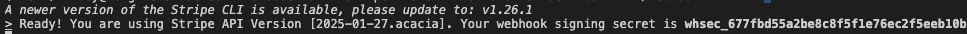

# Overview

The BB Dental website was designed to facilitate the online sale of dental products for B2B traders. As a digital platform, it allows customers to browse and purchase products directly over the internet. The website displays a comprehensive listing of items available for purchase, organized into categories and subcategories for easy navigation. Each product subpage includes a detailed description, product image, price and stock count. 
To purchase the products, the customer will be prompted to log in or register first. Upon registration, the customer will be able to add products to the chart, update products in the chart, save contact details and complete the payment. Furthermore, a listing of previous orders and their details will be available to view on the Profile page. The personal details provided during the registration can also be amended there. 
The administrator profile has CRUD functionality, i.e. the administrator has the option to create, view, amend, and delete products. This is particularly useful for updating the number of products in the stock. Additionally, the stock quantity will be updated automatically every time an order is completed. 


Linkt to the live application can be found [here](https://bbdental-4f6c524824c2.herokuapp.com/)

# User stories 
### User register and login
As a user I can log in securely so that it will allow me to do shopping

**Acceptance criteria**

- Users can register a new account using an email, username, and password

- Users can log in using either their username or email along with their password

- User must be able to reset their own password

### Browsing Products
As a user I can browse products so that I can familiarise myself with what is available in the shop

**Acceptance criteria**

- Users should be able to view products categorised by type

- Users should be able to filter products based on specific criteria, such as category, subcategory or manufacturer

- Users should be able to sort products by price, alphabetically, or by manufacturer

### Individual product display
As a user I can view indivudual product details so that I can make purchasing decision based on the product's specifications, availability, and price

**Acceptance criteria**

- I can see the product name, description, price, manufacturer, and available stock

- If the product has an image, it needs to be displayed

- There is "Add to Bag" button that allows me to add the selected quantity to my cart. I cannot add more than the available stock. Also, "Add to Bag" should be available for logged in users only.

- There are three additional buttons: "Keep Shopping" to return to the product list, "Shopping Bag" and "Go to Checkout" to proceed with the purchase. Same as above, this should be available for logged in users only.

### Search Functionality
As a user I can search for products globally so that I can quickly find items for faster shopping experience

**Acceptance criteria**

- Search button must be clearly visible, ideally on every page and in the header

- Given search results should be possible to sort and filter by manufacturer

- Search term should be case-insensitive for better results

### Shopping bag
As a logged-in user I can view my shopping bag so that I can easily review my selected items, check my order summary, and make any necessary adjustments before completing my purchase

**Acceptance criteria**

- The shopping bag should easly accessible, allowing the user to review items they’ve added.

- Users must be able to update item quantities or remove products from the bag as needed

- The order summary should clearly display item details, prices, and the total cost

- If the user’s order qualifies for free delivery, a message should be displayed encouraging them to take advantage of the offer

- There should be an easy way to continue shopping and add more products to the order

### Making a Purchase
As a logged-in user I can complete my purchase through a smooth checkout so that I can securely finalise my order

**Acceptance criteria**

- The checkout page should display a summary of the order, including product names, total cost, and any applicable delivery charges.

- Before confirming payment, users must be able to enter their shipping information

- Payments should be securely processed using Stripe

- After a successful payment, users should be redirected to an order confirmation page and receive a confirmation email

### User's Profile
As a user I can manage and review my order hostory so that I can keep track of my purchases and enhance my overal shopping experience

**Acceptance criteria**

- There needs to be a page where users can easly access and view all their past and current orders

- User's shopping data needs to be stored in users profile to facilitate smoother and faster shooping experince

- The stored users data should be used to autopopulate checkout form

### Product Management
As a staff member I can manage all products so that the store's inventory stays current and accurate

**Acceptance criteria**

- Staff members must have the ability to view, edit, add, and delete products

- The number of items in stock should be manageable to reflect actual availability

- When user makes a purchase, the system should automatically reduce the available stock

- The product management section should be easily accessible, ideally through the navbar menu

- Only authorised staff should have access to this section, and it should be hidden from shoppers

- If there are many products, they should be split across multiple pages to make navigation easier

User stories were managed via Kanban Board on github:


# Design 

## Wireframes
### Login

### Register

### Password Reset

### Landing Page

### Display Page of the All Products

### Product Details Page

### Shopping bag page

### Checkout

### Purchase order

### User Profile

### Product Management - Staff Only

### Adding Product

### Edititng Product

### Product Deletion


# Database Schema Diagram and Model


# Typography
Font - https://fonts.googleapis.com/css2?family=Gantari:ital,wght@0,100..900;1,100..900&display=swap 

Font Awesome, used on many pages accross the whole website.

# Graphics side

Photo used for purpose creation of Facebook Business Page https://www.istockphoto.com/photos/dental-equipment

[](https://www.pngaaa.com/detail/1887013) - image pleaceholder used across all web page, will show as deafault when there was no image uploaded in first place

https://unsplash.com/photos/text-TtJ0CLjLi6w - used on page 'terms of service'

https://www.pexels.com/photo/close-up-photo-of-a-paper-on-a-vintage-typewriter-4152513/ - used on page 'privacy policy'

[Fotor](https://www.fotor.com/) - to enhance bad image quality

[Cloudinary mage-to-web](https://cloudinary.com/tools/image-to-webp) - for image conversion to web

[Emojipedia](https://emojipedia.org/) - used to populate number of flags which are present on the website.

There are 198 images used across the product section, but I don’t remember where they came from. I downloaded them a long time ago with the idea of using them for a project like this, but only now got the chance to put everything together. Since it’s just a college project, I don’t think using them is an issue, especially since the original shop doesn’t seem to exist anymore. The images weren’t great quality, but Fotor was a lifesaver for fixing them up.

# Features 

### Navigation Bar
The navigation bar appears on all pages, with different links displayed depending on the page and the user. It allows the user to easily navigate between pages across all devices without the need to use the "back" button to return to the previous page.
The navigation bar includes various links depending on the page and user:
To the Home Page, Login, and Register for users who have not signed in.
To the Home Page, Products, My Profile, Shopping Chart and Logout for signed-in customers.
To the Home Page, All Products and Logout for signed-in administrator.

### The Footer
The footer bar appears on all pages, allowing the user to easily access the company's Terms of Services, Privacy Policy and Contact Details. The relevant documents are available to view and download in a PDF format. The Contact Details Page includes interactive phone and email address links. 

### The Landing Page - Welcome Page
The landing page displays the navigation bar, the footer, the advertising materials and a listing of shipping destinations. The link to the listing of products is positioned in multiple locations to encourage customers to click the link. 

### Product Listing Page
The product listing page includes a navigation bar at the top of the page and search functions. The search menu is very advanced, offering various search and sorting options, including:
- sort by name (A to Z) and (Z to A),
- sort by price (Low to High) and (High to Low)
- sort by manufacturer name (A to Z) and (Z to A)
- search by manufacturer.
The page also includes a side menu which displays the main groups of products and subgroups, giving the customer a clear listing of the main product categories. Upon clicking on a main category bar, the subcategory listing is displayed. Then, upon clicking on the subcategory line, the relevant products within that subcategory are displayed on the page. The side menu is responsive and will adjust to various displays. For example, the subcategories listing will be scaled down for easier browsing. 
If the client wants to return to the main page showing all products, he can click on the Home button or the Products button. Furthermore, if the client wants to go back to the previous group of products, he/she can click on the desired group in the heading breadcrumb trail.  
The products are displayed in separate boxes and a photo and a brief description of the product is given. The customer can view further details by clicking the "View Details" button.
There is a standard footer at the bottom of the page. When the products are displayed on more than one page, a listing of pages with links to particular page numbers is displayed above the footer (pagination function).

### Product Page
Each product displayed in the shop has a link to its own page. Upon clicking the "View Details" button, the product page will open. The page displays the photo, description, price, stock quantity and the manufacturer information. If the customer is not logged in, a warning will be displayed prompting the customer to log in to continue with the purchase. 
There is a standard navigation bar and a standard footer. 

### Login Page
Upon opening, the sign-in form is displayed. The customer or administrator is required to provide their username and password to sign in. An error message will be displayed if an incorrect username or password is entered. Upon signing in, a small green confirmation box will appear in the top right corner, confirming the successful sign-in. Additionally, there is an option to click the "Remember Me" box for future sign-ins and a link to open the Registration page.
The navigation bar includes links to the Home Page, Log In and Register.  The footer includes links to the company's Terms of Services, Privacy Policy and Contact Details.

### Registration Page
The sign-up form is displayed. A reminder to sign in for clients who are already registered is shown at the top of the form. Fields highlighted with an asterisk are mandatory, and a warning will appear if they are left blank. There is additional information regarding password requirements at the bottom of the form. Once all fields are completed correctly and the "Sign Up" box is ticked, the system will send an account verification email to the address provided by the customer. To access the account, the customer must first confirm the email address.
The navigation bar includes links to the Home Page, Login, and Register. The footer includes links to the company's Terms of Services, Privacy Policy and Contact Details.

### Customer Login 
Landing Page – a listing of all products is displayed. Customers can navigate through the products using the search and sort functions at the top of the page and the side menu is on the left side of the page.
Upon clicking on a desired product, a product page will be displayed, giving the customer an option to add the product to the shopping basket. The customer can amend the quantity before adding the product to the basket. The system will limit the amount available to add to the basket to the number of products in stock. An orange warning box will appear on the screen if the client tries to add an excessive amount of products (i.e. more than is available in the stock) or enter a negative amount in the quantity box. A green box will appear confirming that the desired quantity was added to the basket. 
Three additional links are displayed on the bottom part of the product page, allowing the client to easily navigate through the website:
- Keep Shopping - will take the user one step back,
- Shopping Bag - will open the Shopping Bag Page and 
- Go to Checkout - will open the Checkout Page
The navigation bar includes links to the Home Page, Products, Shopping Bag and Logout. The Footer is standard.  
The Shopping Bag Page - the listing of products in the basket is displayed. A photo, name, quantity and price are displayed for each product in the basket. The customer has an option to update the quantity and remove the entire product. Subtotal and the delivery cost is displayed under the products listing. If the subtotal is below the "Free delivery" threshold, a message is displayed encouraging the client to add some products to be eligible for a free delivery. There is a link to add more items or proceed to Checkout. 
The Checkout Page - The order form is displayed. Fields highlighted with an asterisk are mandatory, and a warning will appear if they are left blank. Once all fields are completed correctly and the "Complete Order" box is ticked, the Order Confirmation Page will be displayed. There is an option to save the client details, so those are pre-filled automatically the next time an order is completed. 
If the Shopping Bag is empty, the system will prevent the user from accessing the Checkout Page. There will be a small red dot and amount displayed next to the Shopping Bag icon once an item is placed in the Shopping Bag.
The Order Confirmation Page - the order confirmation summary will display the order details, the delivery address, the items purchased and the total cost.  Additionally, a small green confirmation box will be displayed in the top right corner of the page. 
Logout Page - Upon clicking the "Logout" link, a sign-out window will appear, and the client will be prompted to confirm if they wish to log out

### Administrator Login 
All Products Page – a listing of all products is displayed in a working table. The administrator can create, update and delete products in the table. Upon clicking on the Home Page button, a listing of products is displayed in the same way as the one visible to the client. 
Add New Product - the new product form is displayed. Fields highlighted with an asterisk are mandatory, and a warning will appear if they are left blank. There is an option to add a photo of a product, but it's not mandatory. If a photo was not added, a default "No Image Available" image will be displayed. Once all fields are completed correctly and the "Add Product" box is ticked, the new product will be added to the database. A green confirmation box will appear in the top right corner. 
The navigation bar includes links to the Home Page, All Products working table and Logout. There is a standard footer and the pagination functionality at the bottom of the All Products Page. 

## Technologies Used

- **Django** - A free and open-source Python web framework following the MTV pattern.  
- **Python** - A versatile, high-level programming language.  
- **Bootstrap 5** - A front-end framework for responsive web development.  
- **HTML** - The standard markup language for structuring web pages.  
- **CSS** - A stylesheet language for styling and designing web content.  
- **JavaScript** - A lightweight programming language for interactivity.  
- **jQuery** - A JavaScript library that simplifies DOM manipulation.  
- **Balsamiq** - A tool for creating wireframes and UI mockups.  
- **GitHub** - A platform for version control and collaborative coding.  
- **PostgreSQL from Code Institute** - A cloud-hosted relational database system.  
- **Heroku** - A cloud platform for deploying and managing applications. 
- **SendGrid** - A cloud-based email service used for sending transactional and marketing emails.  
- **Cloudinary** - A cloud-based service for managing and optimizing images and videos.  

## E-commerce business model 
The business will operate on a Business to Business model (B2B).  
The online shop will sale dental products (such as tools, equipment, consumables, and other related items) directly to other businesses, typically dental practices, clinics and hospitals. It is not foreseen that any Business to Customer (B2C) sale will occur. The company will focus on building strong, long-term relationships with clients, providing competitive pricing, consistent product quality, and reliable customer service.
Key features of this model include:
- Product Catalog - the online shop provides a comprehensive range of dental products that can be browsed and promptly ordered online.
- Account Management - in order to place orders, the customers are required to  create an accounts by registering on the shop website. The personalized features such as order history is available on the website. 
- Payment methods - currently the shop offers payment by card at the time of placing the order. Going forward, the business will introduce an option to buy on credit for registered and verified clients. 
- Customer Support -  dedicated support is ready to  answer any queries or to provide technical assistance and product recommendations. Contact details are accessible through the link in the footer. 
- Shipping - the business engaged fast and reliable logistic partner. Additionally, a free standard shipping is available for customers who place orders with a net value over €50.

# Newsletter Subscription
The company started small but has grown fast, focusing on simple and effective ways to reach customers. That’s why a business page was launched on Facebook, along with a newsletter – to share updates, offers, and important news more easily.
## Mailchimp
- Banner installed:
  
- Subscription overview:
- 

## Facebook Business Page


## Optimized Keyword List for B2B Dental Supply Website
### Mix of short-tail and long-tail keywords optimized for search volume, relevance, and purchasing intent

#### Short-Tail Keywords (Broad, High Volume):
1. Dental supplies
2. Dental equipment supplier
3. Wholesale dental products
4. Dental instruments distributor
5. Dental shop

#### Long-Tail Keywords (Higher Intent, More Targeted):
1. Wholesale dental supplies
2. Buy dental equpment
3. Professional dental products supplier
4. Best dental practice supplies
5. Top-rated dental suppliers for clinics
6. B2B dental equipment distributor
7. Fast shipping dental supplies

- Keywords That Were Removed:
  - "Best electric toothbrush supplier" - More relevant to retailers & supermarkets
  - Buy toothpaste in bulk" - Dental practices don’t typically buy toothpaste in bulk
  - "Home dental care products" - Clinics buy professional materials
  - "Dental floss wholesale supplier" - More relevant to supermarkets
  - "Local dentist supply store" - Most B2B dental buyers prefer wholesale suppliers


# Testing & debugging

### Python code: issues found


The issue above has been resolved.


### stripe_element.js - no issues found 


### script.js in products app - issues found 


Issue resolved:


### script.js in static - issues found 


Issue resolved:


### checkout.css in checkout folder - no issues found


### management.css in products app - no issues found 


### base.css main stylesheet - no issues found


### html - landing page - issue found


Issue has been fixed


# **Testing Summary – Automatic & Manual Checks**  

## **Landing Page**  
The **Jumbotron** contains two buttons: one navigates to the content below the screen, while the other directs to the product page. Both buttons function correctly, and the entire page renders well on both large and small screens.  


| Manual test case - 1 | Start Shopping button on Jumbotron |
|----------------------|------------------------------------|
| **Expected** | When the "Start Shopping" button is clicked on the Jumbotron, it should open the All Products page (`https://bbdental-4f6c524824c2.herokuapp.com/products/all/`) in the same tab. |
| **Testing**  | Clicked the "Start Shopping" button to see if it takes me to the correct page without opening a new tab. |
| **Result**   | The browser loaded the correct products page in the same browser's tab, just as expected. |
| **Fix**      | No changes needed – everything works as it should. |

<br>

| Manual test case - 2 | Angles Down button on Jumbotron |
|----------------------|------------------------------------|
| **Expected** | When the Angles Down button is clicked on the Jumbotron, it should scroll down to Shipping Destinations section on the bottom of the page|
| **Testing**  | Clicked the Angles Down button to see if it takes me to the Shipping Destination section of the page |
| **Result**   | The page scrolled down to the Shipping Destination section, just as expected. |
| **Fix**      | No changes needed – everything works as it should. |

<br>

At the footer of each page, there are links to **Terms of Service, Privacy Policy, Contact, and Follow us on Facebook**. All links open their intended pages, and the Facebook button correctly opens a new window in the browser.  

<br>

| Manual test case - 3 | 'Terms of Service' link in the footer |
|----------------------|------------------------------------|
| **Expected** | When the 'Terms of Service' link is clicked, it should open the 'Terms of Service' page (`https://bbdental-4f6c524824c2.herokuapp.com/terms-of-service/`) in the same tab.  |
| **Testing**  | Clicked the 'Terms of Service' link to see if it takes me to the correct page without opening a new tab. |
| **Result**   | The browser loaded the correct 'Terms of Service' page in the same browser's tab, just as expected. |
| **Fix**      | No changes needed – everything works as it should. |

<br>

| Manual test case - 4 | 'Privacy Policy' link in the footer |
|----------------------|------------------------------------|
| **Expected** | When the 'Privacy Policy' link is clicked, it should open the 'Privacy Policy' page (`https://bbdental-4f6c524824c2.herokuapp.com/privacy-policy/`) in the same tab.  |
| **Testing**  | Clicked the 'Privacy Policy' link to see if it takes me to the correct page without opening a new tab. |
| **Result**   | The browser loaded the correct 'Privacy Policy' page in the same browser's tab, just as expected. |
| **Fix**      | No changes needed – everything works as it should. |

<br>

| Manual test case - 5 | Contact link in the footer |
|----------------------|------------------------------------|
| **Expected** | When the Contact link is clicked, it should open the Contact page (`https://bbdental-4f6c524824c2.herokuapp.com/privacy-policy/`) in the same tab.  |
| **Testing**  | Clicked the Contact link to see if it takes me to the correct page without opening a new tab. |
| **Result**   | The browser loaded the correct Contact page in the same browser's tab, just as expected. |
| **Fix**      | No changes needed – everything works as it should. |

<br>

| Manual test case - 6 | 'Follow us on Facebook' link in the footer |
|----------------------|------------------------------------|
| **Expected** | When the 'Follow us on Facebook' link is clicked, it should open a Facebook page (`https://www.facebook.com/StomatologiaSpecjalistycznaPawelZimny`) in the new tab.  |
| **Testing**  | Clicked the 'Follow us on Facebook' link to see if it takes me to the correct page and it opened in a new tab. |
| **Result**   | The browser loaded the correct Facebook page in the new browser's tab, just as expected. |
| **Fix**      | No changes needed – everything works as it should. |

<br>

At the top of the page, there are buttons for **Products, My Profile, Shopping Bag, Logout, and Search**. Just like before, all links navigate to the correct pages, and the search button properly processes queries and renders search results accordingly.  

<br>

| Manual test case - 7 | 'Products' link in the navigation menu |
|----------------------|------------------------------------|
| **Expected** | When the 'Products' link is clicked, it should open the all Products page (`https://bbdental-4f6c524824c2.herokuapp.com/products/all/`) in the same tab.  |
| **Testing**  | Clicked the 'Products' link to see if it takes me to the correct page without opening a new tab. |
| **Result**   | The browser loaded the correct 'Products' page in the same browser's tab, just as expected. |
| **Fix**      | No changes needed – everything works as it should. |

<br>

| Manual test case - 8 | 'My Profile' link in the navigation menu |
|----------------------|------------------------------------|
| **Expected** | When the 'My Profile' link is clicked, it should open the 'My Profile' page (`https://bbdental-4f6c524824c2.herokuapp.com/profile/`) in the same tab.  |
| **Testing**  | Clicked the 'My Profile' link to see if it takes me to the correct page without opening a new tab. |
| **Result**   | The browser loaded the correct 'My Profile' page in the same browser's tab, just as expected. |
| **Fix**      | No changes needed – everything works as it should. |

<br>

| Manual test case - 9 | Shopping Cart link in the navigation menu |
|----------------------|------------------------------------|
| **Expected** | When the Shopping Cart link is clicked, it should open the Shopping Cart page (`https://bbdental-4f6c524824c2.herokuapp.com/bag/`) in the same tab.  |
| **Testing**  | Clicked the Shopping Cart link to see if it takes me to the correct page without opening a new tab. |
| **Result**   | The browser loaded the correct Shopping Cart page in the same browser's tab, just as expected. |
| **Fix**      | No changes needed – everything works as it should. |

<br>

| Manual test case - 10 | 'Logout' link in the navigation menu |
|----------------------|------------------------------------|
| **Expected** | When the 'Logout' link is clicked, it should load page (`https://bbdental-4f6c524824c2.herokuapp.com/accounts/logout/`) with the message 'Are you sure you want to sign out?'.  |
| **Testing**  | Clicked the 'Logout' link to see if it takes me to the correct page and that it is displaying 'Are you sure you want to sign out?' message. |
| **Result**   | The browser loaded the correct page in the same browser's tab with expected 'Are you sure you want to sign out?' message |
| **Fix**      | No changes needed – everything works as it should. |

<br>

| Manual test case - 11 | 'Logout' link in the navigation menu |
|----------------------|------------------------------------|
| **Expected** | When the 'Logout' link is clicked, it should load page (`https://bbdental-4f6c524824c2.herokuapp.com/accounts/logout/`) with the message 'Are you sure you want to sign out?'.  |
| **Testing**  | Clicked the 'Logout' link to see if it takes me to the correct page and that it is displaying 'Are you sure you want to sign out?' message. |
| **Result**   | The browser loaded the correct page in the same browser's tab with expected 'Are you sure you want to sign out?' message |
| **Fix**      | No changes needed – everything works as it should. |

<br>

| Manual test case - 12 | Sign out confirmation (as result of test case 11 above) |
|----------------------|------------------------------------|
| **Expected** | When the 'Sign Out' button is clicked, it should load landing page (`https://bbdental-4f6c524824c2.herokuapp.com`) and sign out the logged in user.  |
| **Testing**  | Clicked the 'Sign Out' button to see if it takes me to the correct page and that the currently log in user has been sign out. |
| **Result**   | The browser loaded the correct page in the same browser's tab with expected result |
| **Fix**      | No changes needed – everything works as it should. |

<br>

| Manual test case - 13 | Search all product feature |
|------------------------|--------------------------------------------------------------|
| **Expected** | When the search criteria is entered and the search button is clicked, the page should load to show all matching products. The results should include products where the search phrase appears in either the title or description. |
| **Testing**  | Entered the word “water” in the search bar and pressed the search button to check if it filters and displays only relevant products. |
| **Result**   | The page updated correctly, showing a list of products that matched the search term either in their titles or descriptions. |
| **Fix**      | No changes needed – everything works as it should. |

<br>

| Manual test case - 14 | Search all product feature |
|------------------------|--------------------------------------------------------------|
| **Expected** | When the search criteria is entered and the search button is clicked, the page should load to show all matching products. The results should include products where the search phrase appears in either the title or description. |
| **Testing**  | Entered the word “Gutta-percha” in the search bar and pressed the search button to check if it filters and displays only relevant products. |
| **Result**   | The page updated correctly, showing a list of products that matched the search term either in their titles or descriptions. |
| **Fix**      | No changes needed – everything works as it should. |

<br>

| Manual test case - 15 | Search all product feature |
|------------------------|--------------------------------------------------------------|
| **Expected** | If the search field is left empty and the search button is clicked, the page should display all products. Additionally, a message should appear stating: 'Search field empty. Showing all products.' |
| **Testing**  | I left the search bar empty and clicked the search button to verify that all products were displayed and the message appeared. |
| **Result**   | The page loaded all available products, and the correct message ('Search field empty. Showing all products.') appeared as expected. |
| **Fix**      | No changes needed – the feature works as intended. |

<br>

| Manual test case - 16 | Search for a non-existent product (using $ as search criteria) |
|------------------------|---------------------------------------------------------------|
| **Expected**           | When the search field contains a symbol like "$" that isn't found in any product details, the page should show a message saying no results were found. |
| **Testing**            | I entered "$" in the search bar and pressed the search button to see if the system would display the "No results found" message. |
| **Result**             | The page didn't show the expected "No results found" message. Instead, it just displayed an empty results page. |
| **Fix**                | The issue was fixed by updating the `all_products` method in the products app to display the correct "No results found" message. |

## **Products Page**  
The page displays correctly on both large and small screens. **Pagination** at the bottom works as expected, ensuring smooth navigation. No visible or obvious errors were found. 


| Manual test case - 17 | Pagination at the bottom of product results |
|------------------------|---------------------------------------------------------------|
| **Expected**           | When there are more than 20 products, pagination links should appear at the bottom of the page. Clicking on the next page link should show the next set of products, with each page displaying 20 products. |
| **Testing**            | I navigated to the products page which display results for all 195 items. I confirmed that pagination links appeared, then clicked the "next" button to ensure the next set of 20 products loaded correctly. |
| **Result**             | Pagination links appeared as expected, and clicking "next" successfully displayed the next set of 20 products. |
| **Fix**                | No changes needed – everything works as it should. |

<br>

| Manual test case - 18 | Clicking on pagination button number 5 |
|------------------------|---------------------------------------------------------------|
| **Expected** | When the the pagination button for page number 5 is clicked while displaying all products, it should show the next set of 20 products, since pagination is set to 20 per page. |
| **Testing**  | I clicked on the "5" button in the pagination at the bottom of the all product list to check if the system correctly navigates to page 5 and displays the appropriate products. |
| **Result**   | The system successfully displayed the products for page 5, showing the next 20 items as expected. |
| **Fix**      | No changes needed – everything works as it should. |

<br>

| Manual test case - 19 | Clicking on the "Last Page" pagination button |
|------------------------|---------------------------------------------------------------|
| **Expected** | When the "Last Page" button is clicked, it should navigate to the last page of the product list. The button should not be displayed if the user is already on the last page. |
| **Testing**  | I clicked on the "Last Page" button to check if it navigated to the final page of the product list. I also checked that the "Last Page" button was hidden if I was already on the last page. |
| **Result**   | The "Last Page" button worked as expected, navigating to the final page. When I was already on the last page, the button was hidden as expected. |
| **Fix**      | No changes needed – everything works as it should. |

<br>

| Manual test case - 20 | Clicking on the "First Page" pagination button |
|------------------------|---------------------------------------------------------------|
| **Expected** | When the "First Page" button is clicked, it should navigate to the first page of the product list. The button should not be displayed if the user is already on the first page. |
| **Testing**  | I clicked on the "First Page" button to check if it navigated to the first page of the product list. I also checked that the "First Page" button was hidden if I was already on the very first page. |
| **Result**   | The "First Page" button worked as expected, navigating to the first page. When I was already on the first page, the button was hidden as expected. |
| **Fix**      | No changes needed – everything works as it should. |


The **left-side menu expands and collapses** when clicking the header.  
- **Sorting options** display all data from the database and sort correctly when a selection is made.  
- **Filtering by Manufacturer** functions as expected.  
- Clicking **"View Details"** correctly redirects to the detailed product page.  


| Manual test case - 21 | Left-side menu expands and collapses when clicking the header |
|------------------------|-------------------------------------------------------------------|
| **Expected** | Clicking the header or menu toggle should either expand the left-side menu if it’s collapsed, or collapse it if it’s expanded. |
| **Testing**  | I clicked the header/menu toggle to test the expand/collapse feature of the left-side menu. I verified that the menu expanded when collapsed and collapsed when expanded. |
| **Result**   | The left-side menu expanded when I clicked it while collapsed, and collapsed when clicked again. The feature worked as expected. |
| **Fix**      | No changes needed – everything works as it should. |

<br>

| Manual test case - 22 | Left-side menu is not expanded by default on mobile devices |
|------------------------|----------------------------------------------------------------|
| **Expected** | On mobile devices, the left-side menu should be collapsed by default when the page loads. It should expand only when the menu toggle button is clicked. |
| **Testing**  | I accessed the page on a mobile device and confirmed that the menu was collapsed by default. I clicked the toggle button to verify that the menu could expand and collapse as expected. |
| **Result**   | The menu was collapsed by default on mobile devices, and it expanded/collapsed correctly when the toggle button was clicked. |
| **Fix**      | No changes needed – everything works as it should. |

<br>

| Manual test case - 23 | Sorting products by Name (A-Z) |
|------------------------|---------------------------------|
| **Expected** | When the "Name (A-Z)" option is selected, the product list should be sorted alphabetically from A to Z by product name. |
| **Testing**  | I selected "Name (A-Z)" from the sorting options and confirmed that the products are listed in alphabetical order from A to Z by product name. |
| **Result**   | The products were sorted correctly in alphabetical order from A to Z by product name. |
| **Fix**      | No changes needed – everything works as it should. |

<br>

| Manual test case - 24 | Sorting products by Name (Z-A) |
|------------------------|---------------------------------|
| **Expected** | When the "Name (Z-A)" option is selected, the product list should be sorted alphabetically from Z to A by product name. |
| **Testing**  | I selected "Name (Z-A)" from the sorting options and confirmed that the products are listed in reverse alphabetical order from Z to A by product name. |
| **Result**   | The products were sorted correctly in reverse alphabetical order from Z to A by product name. |
| **Fix**      | No changes needed – everything works as it should. |

<br>

| Manual test case - 25 | Sorting products by Price (Low to High) |
|------------------------|-------------------------------------------|
| **Expected** | When the "Price (Low to High)" option is selected, the product list should be sorted from the lowest price to the highest price. |
| **Testing**  | I selected "Price (Low to High)" from the sorting options and confirmed that the products were listed in order from the lowest price to the highest price. |
| **Result**   | The products were sorted correctly from the lowest price to the highest price. |
| **Fix**      | No changes needed – everything works as it should. |

<br>

| Manual test case - 26 | Sorting products by Price (High to Low) |
|------------------------|--------------------------------------------|
| **Expected** | When the "Price (High to Low)" option is selected, the product list should be sorted from the highest price to the lowest price. |
| **Testing**  | I selected "Price (High to Low)" from the sorting options and confirmed that the products were listed in order from the highest price to the lowest price. |
| **Result**   | The products were sorted correctly from the highest price to the lowest price. |
| **Fix**      | No changes needed – everything works as it should. |

<br>

| Manual test case - 27 | Sorting products by Manufacturer (A-Z) |
|------------------------|-------------------------------------------|
| **Expected** | When the "Manufacturer (A-Z)" option is selected, the product list should be sorted alphabetically from A to Z by manufacturer name. |
| **Testing**  | I selected "Manufacturer (A-Z)" from the sorting options and confirmed that the products were listed in alphabetical order from A to Z by manufacturer name. |
| **Result**   | The products were sorted correctly in alphabetical order from A to Z by manufacturer name. |
| **Fix**      | No changes needed – everything works as it should. |

<br>

| Manual test case - 28 | Sorting products by Manufacturer (Z-A) |
|------------------------|-------------------------------------------|
| **Expected** | When the "Manufacturer (Z-A)" option is selected, the product list should be sorted in reverse alphabetical order from Z to A by manufacturer name. |
| **Testing**  | I selected "Manufacturer (Z-A)" from the sorting options and confirmed that the products were listed in reverse alphabetical order from Z to A by manufacturer name. |
| **Result**   | The products were sorted correctly in reverse alphabetical order from Z to A by manufacturer name. |
| **Fix**      | No changes needed – everything works as it should. |

<br>

| Manual test case - 29 | Filter products by '3M' manufacturer |
|---------------------------|----------------------------------------------|
| **Expected** | When the "3M" manufacturer is selected from the filter options, only the products made by "3M" should be displayed on the page. |
| **Testing**  | I chose "3M" from the manufacturer filter and confirmed that the list only showed products from that manufacturer. |
| **Result**   | After applying the "3M" filter, all listed products were from "3M." No products from other manufacturers appeared in the list. |
| **Fix**      | No changes needed – everything works as it should. |

<br>

| Manual test case - 30 | Filter products by 'All Manufacturers' |
|---------------------------|--------------------------------------------|
| **Expected** | When the "All Manufacturers" option is selected, the product list should display products from all available manufacturers without any filtering applied. |
| **Testing**  | I selected the "All Manufacturers" option from the filter menu to ensure the page displayed all available products, regardless of manufacturer. |
| **Result**   | After selecting "All Manufacturers," the page showed a complete list of products from various manufacturers, as expected. |
| **Fix**      | No changes needed – everything works as it should. |

<br>

| Manual test case - 31 | Clicking "View Details" button on product card |
|---------------------------|------------------------------------|
| **Expected** | When the "View Details" button is clicked, the user should be redirected to the product's detailed page, displaying more information about the selected product. |
| **Testing**  | I clicked on the "View Details" button for a specific product ('Adhesor') to check if it opened the correct product details page. |
| **Result**   | Upon clicking the "View Details" button, the product detail page opened correctly with all relevant product information displayed. |
| **Fix**      | No changes needed – everything works as it should. |

<br>

## **Product Details Page**  
All displayed information corresponds correctly to the selected product, and all product data matches the database records. The **image on the left side renders correctly**, and in cases where a product has no image in the database, a **placeholder image is displayed** instead.  

### **Functional Buttons:**
- **"Add to Bag"**  
- **"Keep Shopping"**  
- **"Shopping Bag"**  
- **"Go to Checkout"**  


Additionally, all navigation links at the top of the page, including **"Products," "My Profile," "Cart," and "Logout,"** work as intended.  

<br>

| Manual test case - 32 | Product Details Page – Default Image Display |
|------------------------|-------------------------------------------------|
| **Expected** | When no image is uploaded for a product, the product details page should display a default "No Image Available" placeholder. |
| **Testing**  | I navigated to the product details page of a product that does not have an image uploaded and checked if the default placeholder image appeared in place of the missing product image. |
| **Result**   | The product details page displayed the default "No Image Available" placeholder as expected for a product without an image. |
| **Fix**      | No changes needed – everything works as it should. |

<br>

| Manual test case - 33 | Add to Bag Button |
|---------------------------|----------------------------------------|
| Expected | When the "Add to Bag" button is clicked, the selected product should be added to the shopping bag, and a confirmation message should be displayed. |
| Testing | I clicked the "Add to Bag" button for a product ('Adaper Single Bond 2 6ml') to check if the product was successfully added to the shopping bag. I also verified if the confirmation message appeared. |
| Result | The "Add to Bag" button added the product to the shopping bag, and the confirmation message ('Adaper Single Bond 2 6ml has been added to the shopping bag.') was displayed correctly. |
| Fix | No changes needed – everything works as it should. |

<br>

| Manual test case - 34 | Keep Shopping Button  |
|---------------------------|----------------------------------------|
| Expected | When the "Keep Shopping" button is clicked, the user should be taken back to the product list page without losing any added items in the shopping bag. |
| Testing | I clicked on the "Keep Shopping" button after adding an item to the bag to confirm that the user was redirected back to the product list, and the items were still in the shopping bag. |
| Result | The "Keep Shopping" button worked as expected. The user was returned to the product list, and the items remained in the shopping bag. |
| Fix | No fix required – everything works as it should. |

<br>

| Manual test case - 35 | Shopping Bag Button
|---------------------------|----------------------------------------|
| Expected | When the "Shopping Bag" button is clicked, the user should be taken to the shopping bag page (`https://bbdental-4f6c524824c2.herokuapp.com/bag/`) where they can review the products added to the bag. |
| Testing | I clicked the "Shopping Bag" button to ensure that it redirected to the shopping bag page with the correct products. |
| Result | The "Shopping Bag" button worked correctly, redirecting to the shopping bag page, displaying all the items added to the bag. |
| Fix | No fix required – everything works as it should. |

<br>

| Manual test case - 36 | Go to Checkout Button |
|---------------------------|----------------------------------------|
| Expected | When the "Go to Checkout" button is clicked, the user should be redirected to the checkout page where they can review their order and proceed with payment. |
| Testing | I clicked the "Go to Checkout" button to check if it redirected to the checkout page. I also verified that the items in the shopping bag were displayed on the checkout page. |
| Result | The "Go to Checkout" button worked as expected, taking the user to the checkout page with the correct order details. |
| Fix | No fix required – everything works as it should. |

<br>

## **Shopping Bag**  
The shopping bag should be **not accessible when a user is not logged in** and when there are **no items in the cart**—this condition is correctly met.  

Only after adding at least one product does the user gain access to the **checkout process**, ensuring correct functionality.  


| Manual test case - 37 | Shopping Bag Accessibility for Unauthenticated Users |
|-----------------------|---------------------------------------------------------|
| **Expected**          | When the user is not logged in, attempting to access the shopping bag should redirect to the login page. The user should be redirected to the login page with the appropriate URL path (e.g., https://bbdental-4f6c524824c2.herokuapp.com/accounts/login/?next=/bag/). |
| **Testing**           | I opened the shopping bag page (https://bbdental-4f6c524824c2.herokuapp.com/bag/) without being logged in to verify that it correctly redirects to the login page. |
| **Result**            | The page redirected to the login page as expected, with the correct URL: https://bbdental-4f6c524824c2.herokuapp.com/accounts/login/?next=/bag/. |
| **Fix**               | No fix needed – everything works as it should. |

<br>

| Manual test case - 38 | Shopping Bag Accessibility with Empty Cart and logged in user |
|-----------------------|-----------------------------------------------|
| **Expected**          | When the shopping bag is accessed without any items in the cart and user is logged in, the page should open with the content 'Your shopping bag is empty.' Even if the URL (https://bbdental-4f6c524824c2.herokuapp.com/bag/) is directly accessed, the user should be able to see this message. |
| **Testing**           | I added no products to the shopping bag and opened the shopping bag page (https://bbdental-4f6c524824c2.herokuapp.com/bag/). I verified that the message 'Your shopping bag is empty.' was displayed on the page. |
| **Result**            | The shopping bag page opened successfully with the message 'Your shopping bag is empty. Browse Products.' displayed correctly when no items were in the cart. |
| **Fix**               | No fix needed – everything works as it should. |

<br>

| Manual test case - 39 | Verify if product details, subtotal, delivery, grand total, and free delivery information are displayed correctly |
|-----------------------|---------------------------------------------------------------------------------------------------------|
| **Expected**          | All relevant figures should be displayed on the product details page, including:                                                                                             |
|                       | - Product Details: Image, Item name, Quantity, Price, and Total for each product                                                                                                    |
|                       | - Subtotal (correct total based on selected products)                                                                                                               |
|                       | - Delivery (should display standard delivery cost, typically €15 - subject to Subtotal)                                                                                                                 |
|                       | - Grand Total (subtotal + delivery)                                                                                                                                |
|                       | - Additional Information: "Spend €X more to get free delivery!" should be shown when the total is less than €50.   |
| **Testing**           | I navigated to the product details page, verified the correct display of product details (Image, Item, Quantity, Price, and Total), subtotal, delivery, grand total, and the free delivery message. |
| **Result**            | All information was displayed correctly:                                                                                                                              |
|                       | - Each product displayed correct image, item name, quantity, price, and total.                                                                                                            |
|                       | - Subtotal matched the sum of the selected products.                                                                                                               |
|                       | - Delivery cost was calculated and shown as expected.                                                                                                                               |
|                       | - Grand total was the sum of the subtotal and delivery.                                                                                                           |
|                       | - When bag total was less than €50, the message "Spend €X more to get free delivery!" was displayed. |
| **Fix**               | No changes needed – correct details appear as they should.         

<br>

## **Checkout**  
If a **logged-in user** previously **saved their details**, the system attempts to pre-fill the checkout form. This works correctly—users who have stored their information in their profiles see the form **auto-filled with accurate data**.  

The **payment system functions properly**, and after a successful transaction, a **confirmation message** is displayed as per the project’s design. All links on this page work correctly.  


<br>

| Manual test case - 40 | Pre-filled Checkout Form for Logged-In Users |
|------------------------|---------------------------------------------------------------|
| **Expected** | If a user is logged in and has previously saved their details, the checkout form should be automatically pre-filled with accurate information (such as name, address, email, and phone number). Additionally, a popup should appear with the message “Profile details pre-filled for faster checkout.” |
| **Testing**  | I logged in with an account that has saved details, then navigated to the checkout page to check if the system auto-filled the checkout form with the correct information stored in the user's profile. I also checked if the popup with the correct message appeared. |
| **Result**   | The checkout form was correctly pre-filled with the user's saved details, including name, address, email, and phone number. The popup “Profile details pre-filled for faster checkout.” appeared as expected. |
| **Fix**      | No changes needed – everything works as it should. |

<br>

| Manual test case - 41 | Checkout Form for Users Without Saved Details |
|------------------------|------------------------------------------------|
| **Expected** | If a user is logged in but hasn’t saved their details to their profile, the checkout form should only have the email field pre-filled. All other fields like name, address, and phone number should be blank. Additionally, a popup should appear with the message “Profile details pre-filled for faster checkout.” |
| **Testing**  | I logged in with a test account that doesn't have saved profile info. After going to the checkout page, I checked if only the email was auto-filled and the rest of the form was empty. |
| **Result**   | The email field was pre-filled correctly, and all other fields were blank. The popup “Profile details pre-filled for faster checkout.” appeared as expected. |
| **Fix**      | No changes needed – everything works as it should. |

<br>

| Manual test case - 42 | Submitting Checkout Form with Blank Required Fields |
|------------------------|--------------------------------------------------------------|
| **Expected** | If any of the required fields (like full name, address, phone number, etc.) are left blank, the form should not submit. Instead, it should show clear validation messages indicating which fields need to be filled in. |
| **Testing**  | I left the payment details, full name, phone and address fields empty on the checkout form and tried to place the order to see how the form responds. |
| **Result**   | The form didn’t submit and displayed message above the empty fields saying they are required. In case of payment details it displayed 'Your card number is incomplete.'|
| **Fix**      | No changes needed – the form validation worked as intended. |

<br>

| Manual test case - 43 | Saving Checkout Details to User Profile |
|------------------------|--------------------------------------------------------------|
| **Expected** | When the "Save these details above to my profile" checkbox is ticked while placing the order, the system should store the entered delivery details (like full name, address, phone number, email) to the logged-in user's profile. These details should be available and auto-filled next time the user visits the checkout page. |
| **Testing**  | I filled out the checkout form with my shipping information, ticked the "Save these details above to my profile" checkbox, and completed the order. Then, I logged out and back in, added a new product to the bag, and went to the checkout page again to see if the form was auto-filled with the previously saved details. |
| **Result**   | The checkout form was automatically filled with the exact same information I had submitted earlier, confirming that the details were correctly saved to my profile. |
| **Fix**      | No changes needed – the feature worked like it should. |

<br>

| Manual test case - 44 | Payment Processing During Checkout |
|------------------------|--------------------------------------------------------------|
| **Expected** | After completing the checkout form and clicking the "Complete Order" button, the payment should be processed securely. If the card details are valid, the order should be confirmed, and a success message should appear. If the details are invalid or incomplete, the payment should be declined with a clear error message. |
| **Testing**  | I filled out all required fields on the checkout form with valid delivery details. Then I entered test card information (Stripe test card: 4242 4242 4242 4242 with a valid future expiry and CVC) and submitted the order. I also tested with invalid card details to see if an error would be returned. |
| **Result**   | With valid card details, the payment went through, and I was redirected to a confirmation page showing the order summary and order placement success message. With invalid card details, the system showed an error without proceeding. |
| **Fix**      | No changes needed – payment system is functioning as expected. |

<br>

## **Order Confirmation**  
After payment, an **order summary** is displayed, and the order details correctly match the actual purchase.  

All buttons on this page function properly, and clicking **"Order History"** correctly redirects the user to their profile page.  


<br>

| Manual test case - 45 | Order Confirmation Page Displays Accurate Details |
|------------------------|-------------------------------------------------------------------------------------------|
| **Expected** | After completing the checkout and payment, the confirmation page should display a unique order number. It should also show all delivery and contact details exactly as entered during checkout. The "Items Ordered" section should list the correct products, quantities, and prices. Additionally, the breakdown of Subtotal, Delivery Cost, and Grand Total should reflect what was shown on the checkout page. |
| **Testing**  | I placed an order by filling out the checkout form with test data and proceeded with payment using valid test card info. Once redirected to the confirmation page, I reviewed all displayed information and compared it to what I entered during checkout. I also verified that an order number was generated and that all product details matched the order. |
| **Result**   | Everything on the confirmation page matched the data entered during checkout. The correct order number was generated, delivery info was accurate, and all items, quantities, and prices were displayed properly. The totals were also correctly calculated and matched the checkout page. |
| **Fix**      | No fixes needed – the confirmation page reflects the order correctly. |

<br>

| Manual test case - 46 | "Order History" Button on Order Confirmation Page |
|------------------------|-------------------------------------------------------------------------------------------|
| **Expected** | Clicking the "Order History" button on the Order Confirmation page should take the user to their profile page at: https://bbdental-4f6c524824c2.herokuapp.com/profile/ where they can view their past orders. |
| **Testing**  | After completing a test order and landing on the Order Confirmation page, I clicked the "Order History" button to check if it redirected me to the profile page showing the full order history. |
| **Result**   | The button worked correctly—it redirected to the profile page and displayed the full order history for the logged-in user. |
| **Fix**      | No fixes needed – the button works as expected. |

<br>

## **User Profile**  
User profile information is displayed **accurately in the form**, matching the stored user details.  

If a user updates their information and clicks **"Update Profile,"** the new details are correctly saved and updated in the system.  

Clicking **"View Order Details"** displays the **correct order details** as expected.  


| Manual test case - 47 | Order History Lists All Placed Orders |
|------------------------|---------------------------------------------------------------------------------------------|
| **Expected** | The profile page at https://bbdental-4f6c524824c2.herokuapp.com/profile/ should list all previous orders made by the logged-in user. Each order should include basic info like order number, date, total amount, and a link to view order details. |
| **Testing**  | I logged in to a user account that had multiple past orders. Then I visited the profile page and checked whether each order I placed previously was shown in the order history list. |
| **Result**   | All previously placed orders appeared in the list with the correct details and links to their individual order confirmation pages. |
| **Fix**      | No fix needed – the order history displays correctly. |

<br>

| Manual test case - 48 | Profile Details Match Last Saved Checkout Info |
|------------------------|---------------------------------------------------------------------------------------------|
| **Expected** | When the "Save these details above to my profile" checkbox is ticked during checkout, the provided information (full address, phone number details) should be saved and  visible in the profile section. On returning to the profile, these saved details should appear exactly as they were entered during the last checkout. |
| **Testing**  | I placed an order and ticked the "Save these details above to my profile" checkbox on the checkout page, entering updated contact and address info. After completing the checkout, I navigated to the profile page to verify that the updated details were saved correctly. |
| **Result**   | The profile section reflected the latest data I entered at checkout, confirming it was saved properly when the checkbox was ticked. |
| **Fix**      | No fix needed – the profile updated as expected based on the most recent saved checkout data. |

<br>

## **Logout**  
The logout process functions correctly, requiring **confirmation** as per the project's intended design.  

<br>

| Manual test case - 49 | Logout Button Functionality |
|------------------------|------------------------------------------------------------------|
| **Expected** | Clicking the "Logout" button should log the user out of the session and redirect them to the [logout](https://bbdental-4f6c524824c2.herokuapp.com/accounts/logout/) page. The user should no longer have access to any authenticated pages such as the profile, bag or checkout. |
| **Testing**  | I clicked the "Logout" button from the navigation menu while logged in. After that, I tried to access the profile, bag and checkout pages by entering the URLs directly. |
| **Result**   | After logging out, I was redirected to the landing page, and any attempts to access authenticated pages also brought me back to the login screen. |
| **Fix**      | No fix necessary – logout functionality works correctly. |

<br>

# **For Store Employees:**  

## **Landing Page**  
The landing page is **almost identical** to that of regular users, with the difference that **employees** see additional menu options:  
- **"All Products"**  
- **"Log Out"**  


## **All Products**  
All **CRUD (Create, Read, Update, Delete) operations** work flawlessly.  
Employees can:  
- **View product data**  
- **Edit product information**  
- **Delete products from the database**  


## **Add New Product**  
- The **form renders correctly** and **validation works as expected**.  
- After entering all required details and submitting the form, the new product is **saved in the database in the correct format**.  
- A **confirmation message** is displayed upon successful product entry.  


## **Edit Product**  
- The **edit page correctly displays** the product’s existing details within the form.  
- Submitting changes **updates the database successfully**.  


## **404 Error Page**  
Entering an **invalid URL** correctly triggers a **404 error message**, ensuring proper error handling.  


## **Summary**  
All tested functionalities work as expected, ensuring a **smooth user experience** for both regular users and store employees. Minor **UI/UX improvements** could be considered, but **no critical issues** were found.  

## Deployment

### Forking the GitHub Repository

Forking a repository on GitHub lets you create your own copy of someone else’s project. This is useful when you want to experiment with changes or contribute without affecting the original codebase. Here is how you can fork a repository:

1. Go to [GitHub](https://github.com/) and make sure you are signed in.
2. Navigate to the repository you want to fork.
3. Click the “Fork” button at the top right of the page
4. Select owner and name your forked repository as you like and click ‘Create Fork’


5. GitHub will create a copy of the repository under your account.
6. You can now clone it to your local machine and start working on it.

If you are looking for more information on forking, you can refer to GitHub's official documentation [Fork a repository](https://docs.github.com/en/pull-requests/collaborating-with-pull-requests/working-with-forks/fork-a-repo)

### Making a Local Clone

After forking a repository on GitHub, the next step is to create a local copy on your machine. This allows you to work with the code, make changes, and run the project locally.

1. On your forked GitHub repository page, click the "Code" button
2. Copy the HTTPS
3. Open your terminal or command prompt.
4. Navigate to the directory where you want to place the project.
5. Run the following command to clone the repo: `git clone`, and then paste the URL you copied in Step 2.

```
$ git clone https://github.com/your-username/repo-name.git
```

6. Once cloning is done, navigate into the project folder:

```
cd repo-name
```

You now have the full project on your machine and can begin editing, testing, or building it as needed. To make changes to the project files, you will need a code editor or an IDE (Integrated Development Environment). I have used Visual Studio Code - it is easiest to get started with. You can download it using this link https://code.visualstudio.com

If you are looking for more information on cloning, you can refer to GitHub's official documentation [Cloning a repository](https://docs.github.com/en/repositories/creating-and-managing-repositories/cloning-a-repository)

### Heroku

Heroku is a cloud service that simplifies the process of hosting and managing apps. It handles the infrastructure for you, so you can focus on building and deploying your application.
To deploy the project to Heroku, the following steps were taken:

1. Log in to Heroku at [Heroku Login Page](https://id.heroku.com/login)
2. Go to [Dashboard](https://dashboard.heroku.com/apps)
3. Click 'New' followed by 'Create New App'. Give it meaningful name (I called it *bbdental*), choose appropriate runtime region and press 'Create App'.


4. Once the app is created, go to settings and find 'Config vars' section. Press 'Reveal config vars' button and set the following environment variables:
   - SECRET_KEY (your random string, you can use [secret key generator](https://djecrety.ir))
   - CLOUDINARY_URL (refer to [Setting Up a Cloudinary Account](#setting-up-a-cloudinary-account))
   - DATABASE_URL (refer to [Setting up a PostreSQL from Code Institute](#setting-up-a-postresql-from-code-institute))
   - DEFAULT_FROM_EMAIL (default email address from which the app sends emails, e.g. my-email@gmail.com)
   - SENDGRID_API_KEY (refer to [Setting up a SendGrid Account](#setting-up-a-sendgrid-account))
   - STRIPE_PUBLIC_KEY (refer to [Setting Up a Stripe Account](#setting-up-a-stripe-account))
   - STRIPE_SECRET_KEY (refer to [Setting Up a Stripe Account](#setting-up-a-stripe-account))
   - STRIPE_WH_SECRET (refer to [Setting Up a Stripe Account](#setting-up-a-stripe-account))
   - DISABLE_COLLECTSTATIC=1


1. Deploy by going to the 'Deploy' section and connecting to the project's repository on GitHub. Press 'Connect' once everything is set up. Finally, press 'Deploy Branch' main and wait for the process to complete. Youe should see 'Your app was successfully deployed'


### Setting Up a Cloudinary Account

This project uses Cloudinary to manage images. If you plan to use it, you will need to create an account first. The process is straightforward:

1. Head over to [cloudinary.com](https://cloudinary.com) in your browser.
2. Click “Sign Up” in the top right corner.
3. You can register using your email and a password, or simply sign up using a GitHub or Google account if that is easier.
4. Once you are in, you will be taken to your dashboard. This is where you will find your API environment variable - this corresponds to your environment variable CLOUDINARY_URL.

### Setting Up a Stripe Account

Stripe is used to serve payments. To get Stripe working in your project, you will first need an account:

1. Head over to [stripe.com](https://stripe.com/) and hit “Start now” or “Sign in”.
2. You will need an email, and password to create your account. You can use Google login if that is easier.
3. Once you are signed in, you will land on your dashboard.
4. Within the 'dashboard', go to 'Developers' section (bottom left), click on 'API Keys' and note down your API keys: Secret Key and Publishable Key. These correspond to your environment variables: STRIPE_SECRET_KEY and STRIPE_PUBLIC_KEY, respectively.
5. For the Webhook secret, go to 'Developers' > 'Webhooks'. Make sure you are in the 'Webhooks' tab and click 'Test with a local listener' and follow the instructions on screen. 


6. After you execute command `stripe listen` you should get in response `Your webhook signing secret is ..`. Use this secret as your environment variable STRIPE_WH_SECRET
   


### Setting up a SendGrid Account 

To send emails SendGrid was used. SendGrid is a great service for handling email delivery. Here is how you can set up an account and get your API key:

1. Go to [SendGrid](https://sendgrid.com/) website.
2. Click “Start For Free” or “Sign In” at the top-right corner.
3. Sign up by entering your email, setting a password, and completing any necessary verification (you can also use Google to sign up if that is easier).
4. After signing up, check your email for a verification link, then you will be directed to your SendGrid Dashboard.
5. From the dashboard, go to 'Settings' in the left-hand sidebar and click 'API Keys'
6. Hit the 'Create API Key' button. You will be prompted to give it a name (e.g., “My App Email Key”) and choose the access level (full access is fine for most projects).
7. Once the key is created, make sure to copy it immediately because you will not be able to view it again. This will be the value you use for SENDGRID_API_KEY as environment variable.

### Setting up a PostreSQL from Code Institute

You can use any database you prefer which supports ORM (Object-Relational Mapping) with Python objects. For this project, I have opted for [PostgreSQL from Code Institute](https://dbs.ci-dbs.net). The process is pretty straightforward - just provide your email address and click ‘Submit’ to receive the database details via email. Once you have those, set the DATABASE_URL using an environment variable. Note that you will need to be a registered student at Code Institute to access this database.

⚠️ **Important:** Make sure to keep your secret keys secure — it's best to store them in a `.env.py` file at the root of your local project or as environment variables — and never push them to GitHub. For instructions on setting environment variables in Heroku, refer to [this section](#heroku)

### List of Python packages the project depends on: 

* asgiref==3.8.1
* certifi==2024.12.14
* cffi==1.17.1
* charset-normalizer==3.4.1
* cloudinary==1.36.0
* crispy-bootstrap5==0.7
* cryptography==44.0.0
* defusedxml==0.7.1
* dj-database-url==0.5.0
* dj3-cloudinary-storage==0.0.6
* Django==5.1.5
* django-allauth==65.4.0
* django-countries==7.6.1
* django-crispy-forms==2.3
* gunicorn==20.1.0
* idna==3.10
* oauthlib==3.2.2
* pillow==11.0.0
* psycopg2-binary==2.9.10
* pycparser==2.22
* PyJWT==2.9.0
* python3-openid==3.2.0
* pytz==2024.1
* requests==2.32.3
* requests-oauthlib==2.0.0
* setuptools==75.8.0
* six==1.17.0
* sqlparse==0.5.1
* stripe==11.5.0
* typing_extensions==4.12.2
* urllib3==1.26.20
* whitenoise==6.5.0

The details of the above dependecies are stores at the root of this project in the file named `requirements.txt`.
To install everything in that list, all you need to do is to run this command:
```
pip3 install -r requirements.txt
```
More detailed information on installing packages you can find [here](https://packaging.python.org/en/latest/tutorials/installing-packages/)

This project has been run and tested on Python 3.12.2.
If you need to install Python you can find installation instructions at https://www.python.org. 

# Credits
1. https://docs.djangoproject.com/en/5.1/ref/contrib/messages/
2. https://css-tricks.com/almanac/properties/t/transition/
3. https://developer.mozilla.org/en-US/docs/Web/CSS/transform-function/translateY
4. https://medium.com/python-in-my-pajamas/3.using-os-environ-to-manage-your-django-settings-the-easy-way-d2db96e73ab9#4c79
5. https://www.twilio.com/docs/sendgrid/for-developers/sending-email/django
6. https://medium.com/@verdyevantyo/authentication-system-using-django-allauth-121f47a6641e
7. https://getbootstrap.com/docs/5.3/components/card/#images
8. https://docs.djangoproject.com/en/5.1/ref/templates/builtins/
9. https://docs.djangoproject.com/en/5.1/ref/models/fields/#imagefield
10. https://medium.com/@iamalisaleh/how-to-get-the-current-url-within-a-django-template-8270b977f280
11. https://simpleisbetterthancomplex.com/tips/2016/07/20/django-tip-7-how-to-get-the-current-url-within-a-django-template.html
12. https://docs.djangoproject.com/en/5.1/ref/templates/builtins/
13. https://docs.djangoproject.com/en/5.1/topics/db/queries/
14. https://docs.djangoproject.com/en/5.1/topics/db/optimization/
15. https://docs.djangoproject.com/en/5.1/topics/db/optimization/#use-queryset-select-related-and-prefetch-related
16. https://www.w3.org/WAI/ARIA/apg/patterns/breadcrumb/examples/breadcrumb/
17. https://docs.djangoproject.com/en/5.1/topics/pagination/
18. https://docs.djangoproject.com/en/5.1/ref/paginator/#django.core.paginator.Paginator
19. https://www.w3schools.com/bootstrap5/bootstrap_tooltip.php
20. https://developer.mozilla.org/en-US/docs/Web/API/Document/querySelectorAll
21. https://developer.mozilla.org/en-US/docs/Web/API/Window/innerWidth
22. https://developer.mozilla.org/en-US/docs/Web/API/EventTarget/addEventListener
23. https://developer.mozilla.org/en-US/docs/Web/API/Window/resize_event
24. https://stackoverflow.com/questions/5150363/onchange-open-url-via-select-jquery
25. https://docs.djangoproject.com/en/5.1/ref/models/database-functions/
26. https://docs.djangoproject.com/en/5.1/topics/db/queries/
27. https://docs.djangoproject.com/en/5.1/ref/templates/builtins/#urlencode
28. https://www.youtube.com/watch?v=65RVPDOhRIc&t=73s
29. https://www.w3schools.com/django/ref_filters_default.php
30. https://www.youtube.com/watch?v=rqYXCuXbs2s&t=3s
31. https://www.youtube.com/watch?v=2G9j34jz42Q&t=5s
32. https://docs.djangoproject.com/en/5.1/topics/http/sessions/
33. https://docs.djangoproject.com/en/5.1/ref/validators/#:~:text=MinValueValidator
34. https://docs.djangoproject.com/en/5.1/ref/models/fields/#:~:text=MinValueValidator%20and
35. https://studygyaan.com/django/how-to-implement-validators-in-django-models
36. https://www.w3schools.com/jsref/obj_inputevent.asp
37. https://www.w3schools.com/tags/att_inputmode.asp
38. https://sklep.andan.com.pl/
39. https://molarr.pl/
40. https://pypi.org/project/django-countries/
41. https://www.youtube.com/watch?v=0cGRqIHvSf8&t=109s
42. https://www.youtube.com/watch?v=l1Z9Aau0V08&t=296s
43. https://www.youtube.com/watch?v=eAja_pKhiCM&t=376s
44. https://developer.mozilla.org/en-US/docs/Web/API/Element/scrollIntoView
45. https://developer.mozilla.org/en-US/docs/Web/API/Document/DOMContentLoaded_event
46. https://developer.mozilla.org/en-US/docs/Web/HTML/Element/script
47. https://www.youtube.com/watch?v=eUcMh5s_27I&t=327s
48. https://developer.mozilla.org/en-US/docs/Web/API/Node/textContent
49. https://www.w3schools.com/python/ref_func_round.asp
50. https://www.youtube.com/watch?v=AU0F2wnrbEs&t=2s
51. https://www.youtube.com/watch?v=lg8p1vD9-Bs
52. https://www.youtube.com/watch?v=j9mLOyjd_KY
53. https://www.twilio.com/docs/sendgrid/for-developers/sending-email/django
54. https://www.pythontutorial.net/django-tutorial/django-exists/
55. https://www.programiz.com/python-programming/datetime/strftime
56. https://docs.djangoproject.com/en/5.1/ref/forms/fields/
57. https://docs.djangoproject.com/en/5.1/ref/forms/fields/#django.forms.ModelChoiceField
58. [ChatGPT](https://openai.com/index/chatgpt/) - used for transtranslation mainly but great companion in explaing errors
59. https://docs.djangoproject.com/en/5.1/topics/http/file-uploads/
60. https://docs.djangoproject.com/en/5.1/topics/i18n/timezones/
61. https://www.geeksforgeeks.org/how-to-set-the-timezone-in-django/
62. https://docs.djangoproject.com/en/5.1/ref/contrib/admin/

I came across many resources while working on this project, but the study materials from Code Institute played the biggest role. Huge thanks for the high-quality content and hands-on practical lessons – they made a real difference!